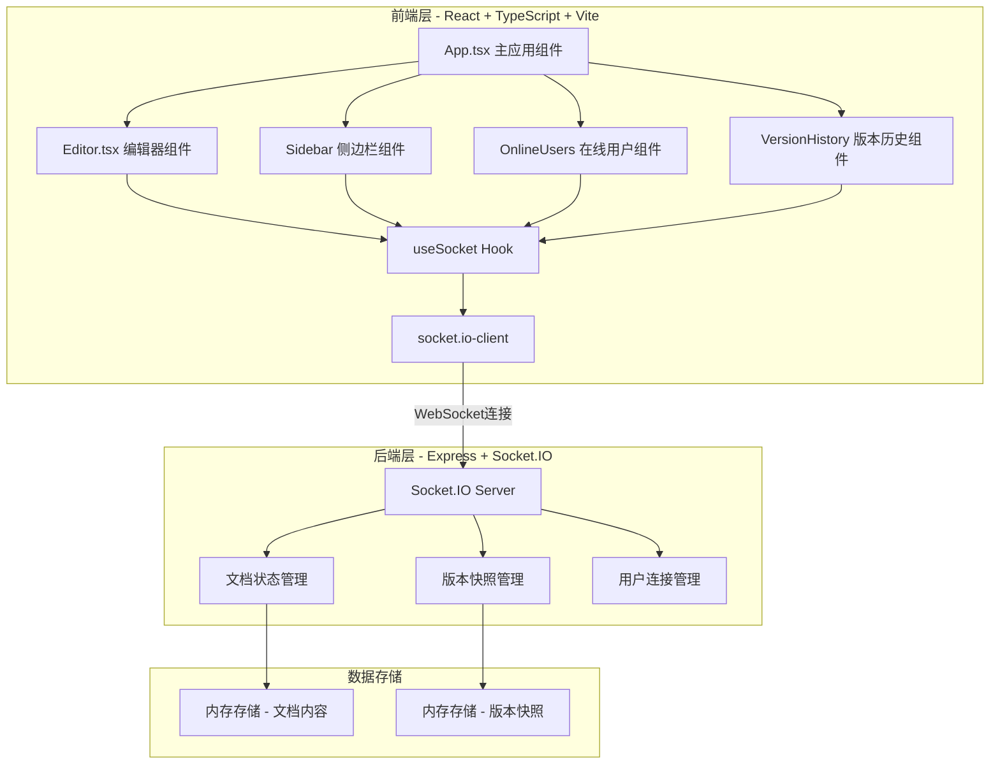
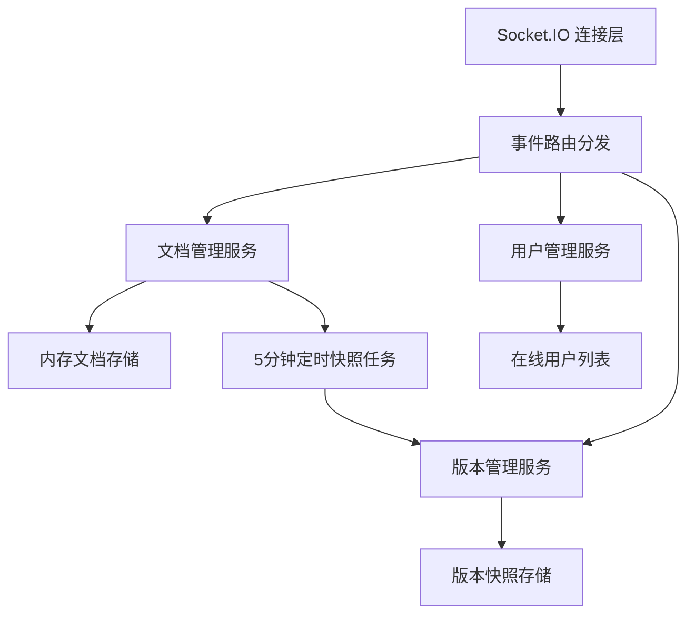
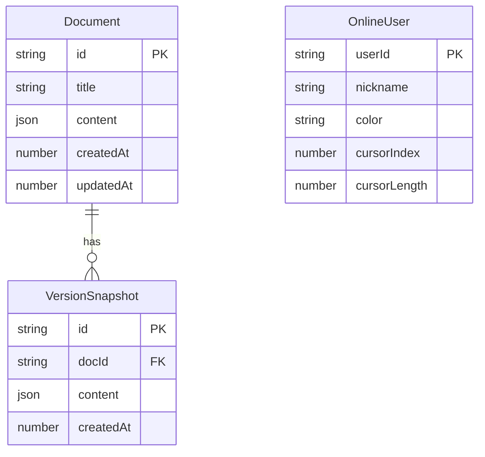
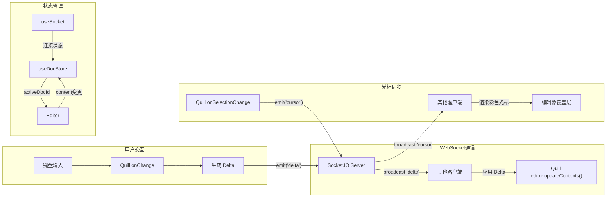

## 1. 架构设计



## 2. 技术说明

- **前端**：React@18 + TypeScript + Tailwind CSS@3 + Vite
- **初始化工具**：vite-init (react-ts 模板)
- **后端**：Express@4 + Socket.IO (内嵌于同一项目)
- **状态管理**：Zustand
- **数据存储**：内存存储（无需数据库，轻量级方案）
- **依赖库**：react-quill（富文本编辑器）、socket.io-client（WebSocket通信）、uuid（唯一ID生成）、lucide-react（图标）

## 3. 路由定义

| 路由 | 用途 |
|------|------|
| / | 主编辑器页面，包含侧边栏、编辑器、在线用户面板 |

## 4. API 定义

### 4.1 WebSocket 事件定义

```typescript
interface ServerToClientEvents {
  "delta": (data: { docId: string; delta: any; userId: string }) => void;
  "cursor": (data: { docId: string; cursor: CursorData; userId: string }) => void;
  "user-joined": (data: { userId: string; nickname: string; color: string }) => void;
  "user-left": (data: { userId: string }) => void;
  "document-created": (data: { docId: string; title: string }) => void;
  "document-renamed": (data: { docId: string; title: string }) => void;
  "document-deleted": (data: { docId: string }) => void;
  "document-list": (data: Document[]) => void;
  "document-content": (data: { docId: string; content: any }) => void;
  "version-saved": (data: { docId: string; version: VersionSnapshot }) => void;
  "online-users": (data: OnlineUser[]) => void;
}

interface ClientToServerEvents {
  "delta": (data: { docId: string; delta: any }) => void;
  "cursor": (data: { docId: string; cursor: CursorData }) => void;
  "join-document": (data: { docId: string }) => void;
  "leave-document": (data: { docId: string }) => void;
  "create-document": (data: { title: string }) => void;
  "rename-document": (data: { docId: string; title: string }) => void;
  "delete-document": (data: { docId: string }) => void;
  "set-nickname": (data: { nickname: string }) => void;
  "rollback-version": (data: { docId: string; versionId: string }) => void;
}
```

### 4.2 数据类型定义

```typescript
interface Document {
  id: string;
  title: string;
  content: any;
  createdAt: number;
  updatedAt: number;
}

interface CursorData {
  index: number;
  length: number;
}

interface OnlineUser {
  userId: string;
  nickname: string;
  color: string;
  cursor?: CursorData;
}

interface VersionSnapshot {
  id: string;
  docId: string;
  content: any;
  createdAt: number;
}
```

## 5. 服务端架构图



## 6. 数据模型

### 6.1 数据模型图



### 6.2 文件结构与调用关系

```
quickdoc/
├── package.json                    # 依赖管理，启动脚本
├── vite.config.ts                  # Vite配置，WebSocket代理
├── tsconfig.json                   # TypeScript严格模式配置
├── index.html                      # 入口HTML
├── api/                            # 后端代码
│   └── server.ts                   # Express + Socket.IO 服务端
├── src/
│   ├── main.tsx                    # 应用入口，挂载根组件
│   │   └──> 渲染 App.tsx
│   ├── App.tsx                     # 主应用，管理文档列表和activeDocId
│   │   └──> 调用 useSocket, useDocStore
│   │   └──> 渲染 Sidebar, Editor, OnlineUsers, VersionHistory
│   ├── Editor.tsx                  # 核心编辑器，Quill + WebSocket同步
│   │   └──> 调用 useSocket 获取socket实例
│   │   └──> 数据流: 用户输入 → socket.emit('delta') → socket.on('delta') 更新
│   ├── components/
│   │   ├── Sidebar.tsx             # 折叠侧边栏，文档列表管理
│   │   ├── OnlineUsers.tsx         # 在线用户列表面板
│   │   ├── VersionHistory.tsx      # 版本历史面板
│   │   ├── ConnectionToast.tsx     # WebSocket重连提示
│   │   └── JoinModal.tsx           # 用户加入时输入昵称的模态框
│   ├── hooks/
│   │   └── useSocket.ts            # WebSocket连接管理Hook
│   │       └──> 返回 socket 实例、连接状态、重连逻辑
│   │       └──> 被其他组件调用获取socket对象
│   ├── store/
│   │   └── useDocStore.ts          # Zustand状态管理
│   │       └──> 管理: documents, activeDocId, onlineUsers, versions
│   ├── types/
│   │   └── index.ts                # TypeScript类型定义
│   └── utils/
│       └── exportMarkdown.ts       # 导出Markdown工具函数
└── shared/
    └── types.ts                    # 前后端共享类型定义
```

### 6.3 数据流向


