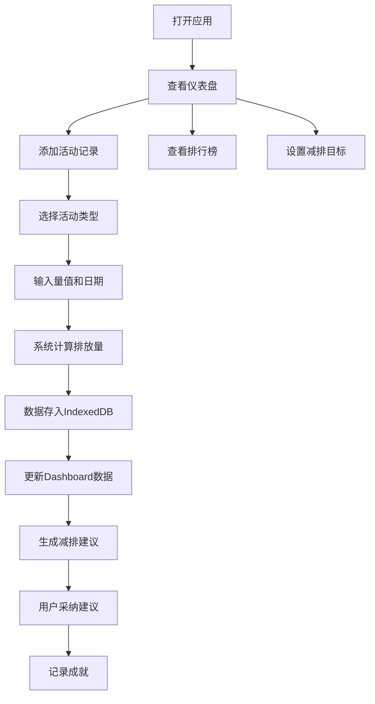

## 1. 产品概述

个人碳足迹追踪与减排建议应用，帮助用户记录日常活动碳排放、可视化碳足迹趋势、获取个性化减排建议，培养低碳生活习惯。
- 面向环保意识较强的个人用户，解决碳排放记录不直观、减排方法不明确的痛点
- 通过数据可视化和智能建议，激励用户持续践行低碳生活，助力碳中和目标

## 2. 核心 Features

### 2.1 用户角色
| 角色 | 注册方式 | 核心权限 |
|------|----------|----------|
| 普通用户 | 本地使用无需注册 | 记录活动、查看趋势、设置目标、获取建议 |

### 2.2 功能模块
1. **仪表盘主页**：碳排放指标卡片、趋势图表、减排建议
2. **活动记录管理**：添加/编辑/删除碳排放活动记录
3. **减排目标管理**：设置月度减排目标，追踪完成进度
4. **排放排行榜**：按活动类型展示碳排放排行
5. **设置页面**：减排目标设置、数据管理

### 2.3 页面详情
| 页面名称 | 模块名称 | 功能描述 |
|----------|----------|----------|
| 仪表盘 | 指标卡片 | 今日排放量、本月累计、减排目标完成百分比，带计数动画 |
| 仪表盘 | 趋势图表 | 近30天碳足迹折线图+堆叠柱状图，悬停显示详情 |
| 仪表盘 | 减排建议 | 3条个性化减排建议卡片，横向滑动动画，支持采纳/关闭 |
| 活动记录 | 活动表单 | 选择活动类型、输入量值、选择日期时间，表单验证 |
| 活动记录 | 记录列表 | 交替行背景色，类型颜色竖条，支持编辑删除 |
| 排行榜 | 类型排行 | 按排放量降序排列，背景色渐变，点击跳转详情 |
| 设置 | 目标设置 | 月度减排目标设置，环形进度条展示 |

## 3. 核心流程

用户打开应用 → 查看仪表盘碳排放指标和趋势 → 添加新的活动记录 → 系统自动计算排放量 → 查看减排建议并采纳 → 定期查看排行榜分析高排放类型 → 设置减排目标追踪进度

## 4. 用户界面设计

### 4.1 设计风格
- 主色调：#2E7D32（深绿），辅色：#A5D6A7（浅绿）、#FFCC80（橙黄），背景：#F5F5F5
- 卡片圆角12px，轻微阴影，悬停阴影加深+上浮2px
- 按钮主色填充，悬停亮度+10%，点击缩放95%
- 字体：标题使用Noto Sans SC Bold，正文使用Noto Sans SC Regular
- 图标：使用环保主题emoji或线性图标，与活动类型对应

### 4.2 页面设计概述
| 页面名称 | 模块名称 | UI元素 |
|----------|----------|--------|
| 仪表盘 | 指标卡片 | 渐变色背景（绿→黄），计数动画，环形进度条 |
| 仪表盘 | 趋势图表 | 半透明浅绿背景，细体坐标轴标签，折线+堆叠柱状图 |
| 仪表盘 | 减排建议 | 横向滑动卡片，关闭/采纳按钮，从左滑入动画 |
| 导航栏 | 顶部导航 | 固定顶部，滚动时阴影，Logo+页面链接+用户头像 |
| 活动记录 | 记录列表 | 交替行背景（白/浅绿），左侧类型颜色竖条 |

### 4.3 响应式设计
- 桌面端优先（≥768px）：多列卡片网格，完整导航栏
- 移动端（<768px）：抽屉式导航，单列卡片布局，图表尺寸缩小
- 触控优化：按钮最小尺寸48px，列表项足够点击区域

### 4.4 动画与交互
- 页面切换：0.3秒淡入淡出过渡
- 指标数字：计数动画（从0到目标值）
- 进度条：1.5秒缓出动画，颜色随百分比变化
- 建议卡片：从左向右滑动进入视图
- 按钮悬停：亮度增加，点击缩放
