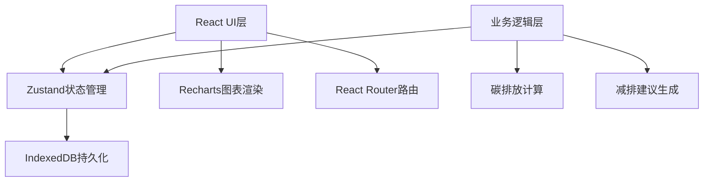
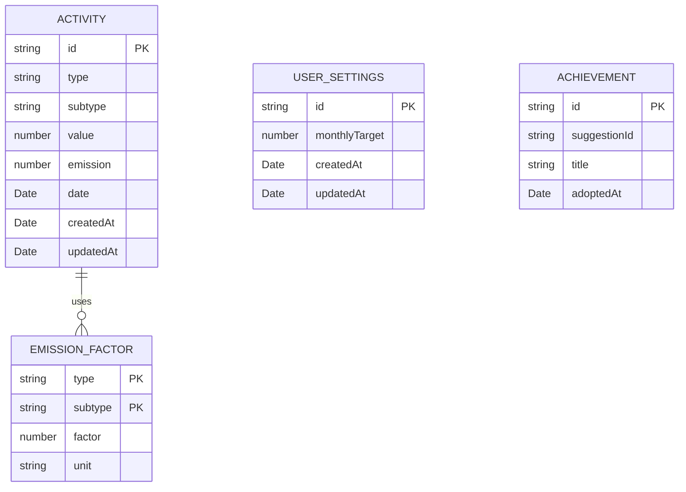

## 1. 架构设计



## 2. 技术描述
- 前端框架：React@18 + TypeScript + Vite
- 状态管理：Zustand
- 数据持久化：IndexedDB（idb-keyval）
- 图表库：Recharts
- 路由：React Router DOM@6
- 日期处理：date-fns
- 唯一ID：uuid

## 3. 路由定义
| 路由 | 页面 | 说明 |
|------|------|------|
| / | 仪表盘 | 首页，展示指标、图表、建议 |
| /activities | 活动记录 | 活动列表和添加表单 |
| /leaderboard | 排行榜 | 活动类型碳排放排行 |
| /settings | 设置 | 减排目标设置 |

## 4. 数据模型

### 4.1 数据模型定义



### 4.2 TypeScript 类型定义

```typescript
interface Activity {
  id: string;
  type: 'transport' | 'diet' | 'electricity';
  subtype: string;
  value: number;
  emission: number;
  date: string;
  createdAt: string;
  updatedAt: string;
}

interface EmissionFactor {
  type: string;
  subtype: string;
  factor: number;
  unit: string;
}

interface UserSettings {
  id: string;
  monthlyTarget: number;
  createdAt: string;
  updatedAt: string;
}

interface Suggestion {
  id: string;
  title: string;
  description: string;
  potentialSaving: number;
  activityType: string;
}

interface Achievement {
  id: string;
  suggestionId: string;
  title: string;
  adoptedAt: string;
}

interface DailyEmission {
  date: string;
  total: number;
  transport: number;
  diet: number;
  electricity: number;
}
```

## 5. 项目文件结构

```
├── package.json
├── vite.config.js
├── tsconfig.json
├── index.html
└── src/
    ├── main.tsx
    ├── App.tsx
    ├── types/
    │   └── index.ts
    ├── constants/
    │   └── emissionFactors.ts
    ├── store/
    │   └── carbonStore.ts
    ├── utils/
    │   ├── calculations.ts
    │   └── suggestions.ts
    ├── components/
    │   ├── Layout/
    │   │   ├── Navbar.tsx
    │   │   └── Sidebar.tsx
    │   ├── Dashboard/
    │   │   ├── MetricCard.tsx
    │   │   ├── TrendChart.tsx
    │   │   └── SuggestionCard.tsx
    │   ├── Activities/
    │   │   ├── ActivityForm.tsx
    │   │   └── ActivityList.tsx
    │   ├── Leaderboard/
    │   │   └── LeaderboardItem.tsx
    │   └── common/
    │       └── ProgressRing.tsx
    ├── pages/
    │   ├── Dashboard.tsx
    │   ├── Activities.tsx
    │   ├── Leaderboard.tsx
    │   └── Settings.tsx
    └── styles/
        └── global.css
```

## 6. 性能优化策略
- 数据缓存：Zustand store 作为内存缓存，减少 IndexedDB 读取
- 按需渲染：React.memo 优化图表和列表项渲染
- 虚拟滚动：活动记录超过100条时启用虚拟列表
- 防抖处理：表单输入和搜索使用防抖
- 懒加载：路由级别的代码分割
- IndexedDB操作：使用批量读写，减少IO次数
