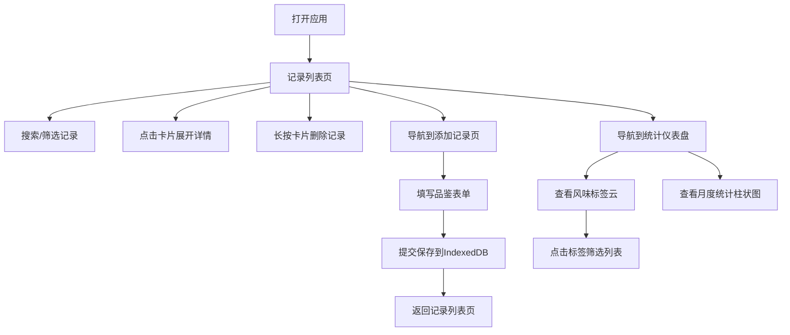

## 1. 产品概述

CoffeePassport是一款面向独立咖啡馆常客的在线咖啡品鉴记录与可视化应用。用户可以记录每次品尝的咖啡品种、风味笔记和烘焙日期，形成个人的咖啡风味地图。

- 目标用户：独立咖啡馆常客、咖啡爱好者
- 核心价值：系统化记录咖啡品鉴体验，通过可视化展示探索个人风味偏好

## 2. 核心功能

### 2.1 用户角色

| 角色 | 注册方式 | 核心权限 |
|------|---------|---------|
| 普通用户 | 无需注册，本地使用 | 添加/删除品鉴记录、浏览列表、查看统计 |

### 2.2 功能模块

1. **品鉴记录管理**：添加记录表单、记录列表卡片展示、记录详情展开、删除确认
2. **风味标签云**：动态标签云（字号/颜色与频次正相关）、标签悬停动画、标签筛选过滤
3. **品鉴统计图表**：月度品鉴数量柱状图、数据自动更新、交互式悬浮显示
4. **搜索与筛选**：关键字搜索（咖啡名称/笔记）、冲泡方式筛选、评分区间筛选、过渡动画

### 2.3 页面详情

| 页面名称 | 模块名称 | 功能描述 |
|---------|---------|---------|
| 记录列表页 | 搜索与筛选区 | 搜索框实时过滤、冲泡方式下拉、评分区间下拉 |
| 记录列表页 | 记录卡片网格 | 卡片展示（名称/评分/时间）、点击展开详情、长按删除确认 |
| 添加记录页 | 品鉴表单 | 咖啡名称输入、品种下拉、烘焙日期、冲泡方式单选、风味标签多选、评分滑动条、笔记文本框 |
| 统计仪表盘页 | 风味标签云 | 动态生成标签云、悬停显示计数、点击筛选、旋转角度与阴影效果 |
| 统计仪表盘页 | 月度统计图表 | 柱状图展示月度品鉴数、颜色渐变、柱顶数值显示 |

## 3. 核心流程

用户打开应用后，默认进入记录列表页，可浏览所有品鉴记录。用户可以通过导航切换到添加记录页或统计仪表盘页。添加记录时填写表单并提交，数据保存到IndexedDB。统计页根据所有记录实时计算标签频率和月度统计数据。

## 4. 用户界面设计

### 4.1 设计风格

- 主色调：暖色调，米白色背景(#F5F0EB)，奶白色卡片(#FFF8F0)，咖啡色(#6F4E37)边框和阴影
- 按钮风格：圆角按钮，咖啡色填充，悬停时加深
- 字体：标题使用复古手写风格字体（Dancing Script），正文使用无衬线字体（Nunito）
- 布局风格：卡片式布局，顶部导航栏，响应式网格
- 图标：使用咖啡相关emoji（☕、📝、📊）

### 4.2 页面设计概述

| 页面名称 | 模块名称 | UI元素 |
|---------|---------|--------|
| 记录列表页 | 搜索与筛选区 | 圆角搜索框、下拉筛选器、聚焦时边框渐变咖啡色（0.3s过渡） |
| 记录列表页 | 记录卡片网格 | 卡片悬停上浮+阴影加深、展开详情平滑高度动画、淡出淡入过渡 |
| 添加记录页 | 品鉴表单 | 堆叠式表单布局、滑动条评分、多选标签芯片、提交按钮 |
| 统计仪表盘页 | 风味标签云 | 字号颜色与频次正相关、随机旋转(-15°到15°)、散射阴影、悬停放大+显示计数、点击高亮闪烁 |
| 统计仪表盘页 | 月度统计图表 | 浅棕到深棕渐变柱状、柱顶数值显示、Recharts渲染 |

### 4.3 响应式

- 桌面端：卡片多列网格，表单控件并排或分组
- 移动端：卡片单列，表单控件堆叠显示，标签云自动换行
- 所有页面切换使用淡入动画（0.2s）
- 触摸设备优化长按删除手势

### 4.4 性能指标

- 100条记录首次渲染 ≤ 500ms
- 标签云计算延迟 ≤ 100ms
- CSS动画帧率 ≥ 50FPS
