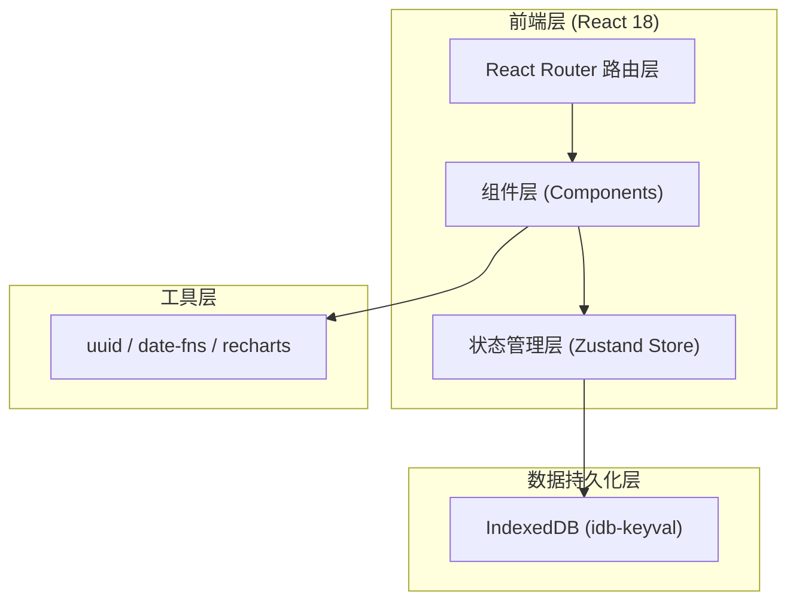
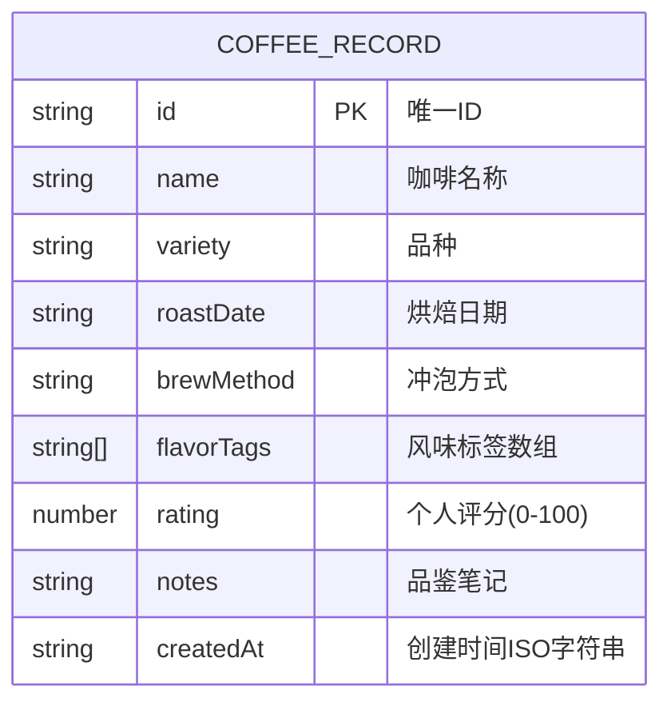

## 1. 架构设计



## 2. 技术说明

- 前端框架：React@18 + React DOM@18 + TypeScript
- 构建工具：Vite（vite.config.js配置React插件）
- 路由：react-router-dom@6
- 状态管理：zustand（全局store管理记录、标签频率、月度统计）
- 数据持久化：IndexedDB（idb-keyval封装）
- UI工具库：uuid（生成ID）、date-fns（日期处理）、recharts（图表渲染）
- 样式：CSS Modules + 全局CSS变量

## 3. 路由定义

| 路由 | 用途 |
|------|------|
| / | 记录列表页（CoffeeList） |
| /add | 添加品鉴记录页（CoffeeForm） |
| /dashboard | 统计仪表盘页（Dashboard） |

## 4. 文件结构与调用关系

```
src/
├── types.ts          # 类型定义（供store和所有组件引用）
├── store.ts          # Zustand全局store（依赖types.ts和idb-keyval）
├── main.tsx          # 应用入口（渲染App，配置Router）
├── App.tsx           # 根组件（配置路由，页面切换动画）
├── index.css         # 全局样式（CSS变量、字体、动画关键帧）
└── components/
    ├── CoffeeForm.tsx    # 添加记录表单（调用store.addRecord）
    ├── CoffeeList.tsx    # 记录列表（使用store.records, store.deleteRecord）
    └── Dashboard.tsx     # 统计仪表盘（使用store.records, store.tagFrequency, store.monthlyStats）
```

**数据流向：**
1. CoffeeForm提交 → store.addRecord() → 写入IndexedDB → 更新store.records
2. store.records变化 → 自动计算store.tagFrequency和store.monthlyStats
3. CoffeeList/Dashboard订阅store → 响应式重新渲染
4. 删除操作 → store.deleteRecord() → 从IndexedDB删除 → 更新store.records

## 5. 数据模型

### 5.1 数据模型定义



### 5.2 TypeScript类型定义

```typescript
interface CoffeeRecord {
  id: string;
  name: string;
  variety: string;
  roastDate: string;
  brewMethod: string;
  flavorTags: string[];
  rating: number;
  notes: string;
  createdAt: string;
}

interface TagFrequency {
  [tag: string]: number;
}

interface MonthlyStat {
  month: string;
  count: number;
}
```

## 6. 性能优化策略

- Zustand选择器：组件只订阅所需状态切片，避免不必要重渲染
- useMemo/useCallback：列表项、计算属性、事件处理函数缓存
- CSS transform + opacity 动画：保证标签云、卡片动效达到50+FPS
- IndexedDB异步读写：不阻塞UI线程
- 列表虚拟滚动预留（当前100条直接渲染，未来可扩展）
