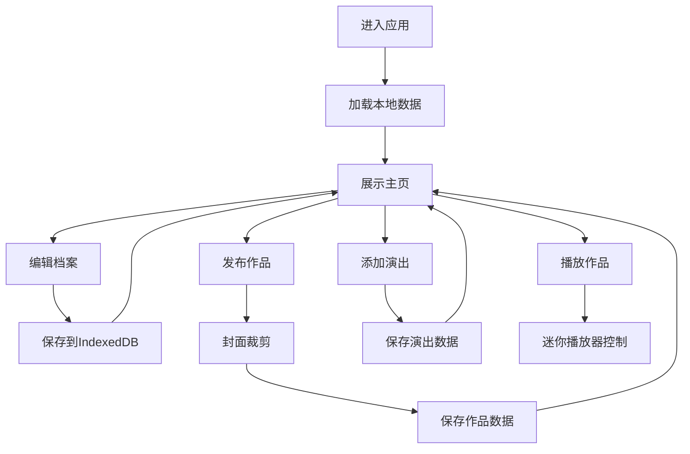

## 1. 产品概述

音乐人名片与社交推广应用是一款面向独立音乐人的个人品牌管理工具，帮助音乐人统一管理作品发布、演出日程和个人形象，解决多平台分散运营的痛点。

- 目标用户：独立音乐人、乐队主唱、音乐创作者
- 核心价值：提供统一的个人品牌主页，集中管理音乐作品和演出信息，提升粉丝触达效率
- 市场价值：填补音乐人在个人品牌管理领域的工具空白，降低多平台运营成本

## 2. 核心功能

### 2.1 用户角色

| 角色 | 注册方式 | 核心权限 |
|------|----------|----------|
| 音乐人用户 | 无需注册，本地使用 | 管理个人档案、发布音乐作品、管理演出日程 |

### 2.2 功能模块

1. **艺人档案管理**：头像上传、艺名设置、简介编辑（Markdown）、社交媒体链接、主题配色选择
2. **作品发布与播放**：作品上传、封面裁剪、作品墙展示、迷你播放器
3. **演出日程管理**：日程添加、时间轴展示、详情模态框、脉冲提醒

### 2.3 页面详情

| 页面名称 | 模块名称 | 功能描述 |
|---------|----------|----------|
| 主页 | 顶部导航栏 | 固定导航，包含Logo和功能切换 |
| 主页 | 艺人档案区 | 展示头像、艺名、简介、社交链接 |
| 主页 | 作品墙 | 瀑布流布局展示已发布作品，支持播放 |
| 主页 | 演出时间轴 | 横向时间轴展示即将到来的演出 |
| 主页 | 迷你播放器 | 底部固定播放器，支持播放控制 |
| 档案编辑页 | 表单模块 | 编辑个人信息、主题配色、社交链接 |
| 作品发布页 | 表单模块 | 上传作品、裁剪封面、设置发布状态 |
| 演出管理页 | 表单模块 | 添加演出、管理日程信息 |

## 3. 核心流程

### 3.1 用户使用流程

音乐人首次进入应用 → 设置个人档案（艺名、头像、简介）→ 选择主题配色 → 上传音乐作品（裁剪封面、添加歌词）→ 添加演出日程 → 主页展示完整个人名片 → 粉丝浏览作品墙 → 点击播放音乐 → 查看演出详情购票

### 3.2 核心流程图

## 4. 用户界面设计

### 4.1 设计风格

- 主背景色：#1a1a2e（深色夜空蓝）
- 强调色：根据主题配色方案变化（暗夜星空、复古棕调、极简灰白、赛博粉紫）
- 按钮风格：圆角8px，轻微阴影 box-shadow: 0 4px 12px rgba(0,0,0,0.3)
- 字体：主标题使用独特显示字体，正文使用现代无衬线字体
- 布局风格：卡片式布局，顶部固定导航，内容区分左右两栏
- 图标：使用lucide-react图标库，风格简洁现代

### 4.2 页面设计概述

| 页面名称 | 模块名称 | UI元素 |
|---------|----------|--------|
| 主页 | 顶部导航栏 | 深色背景，渐变Logo，导航链接hover效果，0.2s过渡动画 |
| 主页 | 艺人档案区 | 圆形头像（hover轻微放大），艺名渐变文字，Markdown渲染简介，社交图标按钮 |
| 主页 | 作品墙 | 瀑布流布局，卡片hover封面放大1.05倍，播放按钮淡入，0.3s过渡 |
| 主页 | 演出时间轴 | 横向滚动，卡片阴影，7天内演出脉冲红点，点击模态框淡入 |
| 主页 | 迷你播放器 | 底部滑入动画（0.3s ease-in-out），进度条可拖拽，音量控制 |
| 编辑页面 | 表单模块 | 输入框焦点动画，文件上传区域拖放效果，实时预览 |

### 4.3 响应式设计

- 桌面端（≥768px）：左侧2/3作品墙，右侧1/3演出时间轴和艺人简介
- 移动端（<768px）：单列纵向排列，艺人简介→作品墙→演出时间轴
- 触摸优化：增大可点击区域（≥44px），添加触摸反馈效果
- 横向滚动区域支持触摸滑动

### 4.4 动画与过渡

- 页面切换：淡入淡出 0.3s ease-in-out
- 卡片加载：交错上浮动画，animation-delay 递增
- 按钮hover：背景色渐变 + 轻微上浮 0.2s
- 模态框：缩放淡入 0.2s ease-out
- 脉冲红点：@keyframes pulse 1.5s infinite
- 播放器滑入：translateY(100%) → translateY(0) 0.3s ease-in-out

## 5. 性能要求

- 作品墙加载30个作品≤2秒（IndexedDB读取 + 渲染）
- 迷你播放器切歌延迟≤0.5秒
- 封面裁剪处理≤1秒/张
- 页面首屏加载≤3秒
