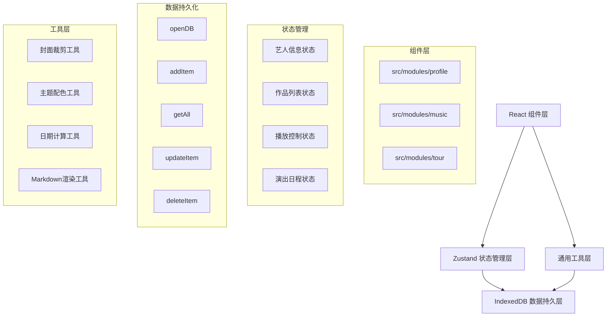
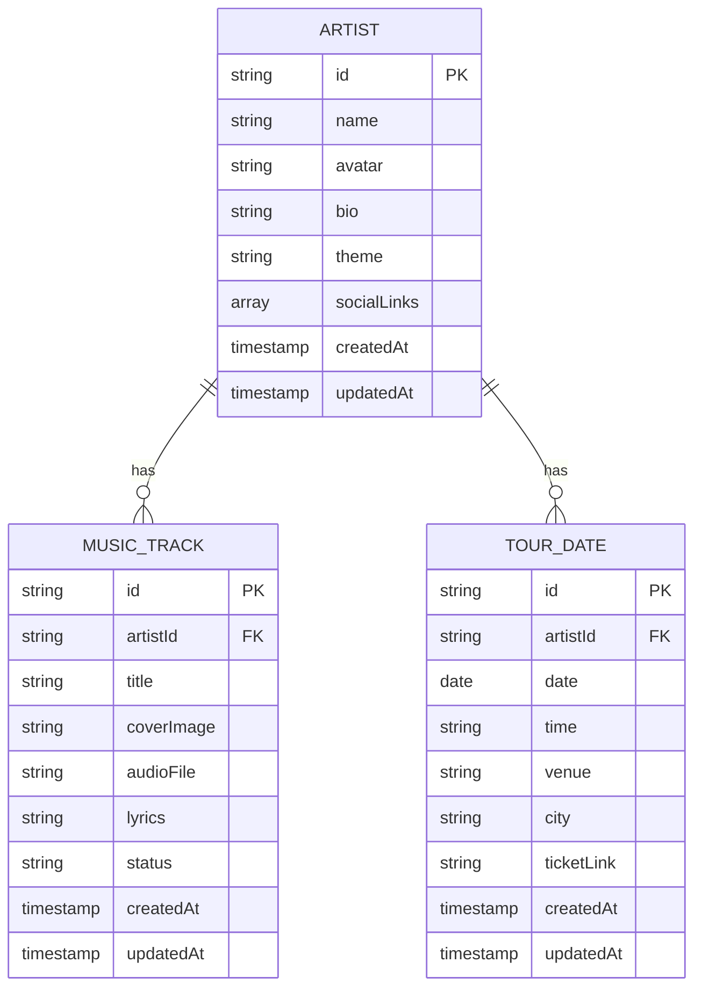

## 1. 架构设计



## 2. 技术描述

- **前端框架**：React@18 + TypeScript
- **构建工具**：Vite
- **状态管理**：Zustand
- **数据存储**：IndexedDB（idb-keyval 封装）
- **路由管理**：react-router-dom@6
- **样式方案**：CSS-in-JS（styled-components 或 CSS Modules）+ 全局CSS变量
- **图标库**：lucide-react
- **唯一ID**：uuid
- **HTTP客户端**：axios（预留API扩展）

## 3. 主题配色方案

| 主题名称 | 主色 | 渐变起始 | 渐变结束 | 强调色 |
|---------|------|---------|---------|--------|
| 暗夜星空 | #0f0c29 | #302b63 | #24243e | #00d4ff |
| 复古棕调 | #3c2a21 | #d5a473 | #e8d5b7 | #8b4513 |
| 极简灰白 | #2c2c2c | #f5f5f5 | #e0e0e0 | #666666 |
| 赛博粉紫 | #1a1a2e | #ff00ff | #00ffff | #ff0080 |

## 4. 数据模型

### 4.1 数据模型定义



### 4.2 IndexedDB Store 定义

```typescript
// Store 名称与主键
interface DBConfig {
  artist: { key: 'id', autoIncrement: false };
  musicTracks: { key: 'id', autoIncrement: false };
  tourDates: { key: 'id', autoIncrement: false };
}
```

## 5. 状态管理设计

### 5.1 Zustand Store 结构

```typescript
interface AppState {
  // 艺人信息
  artist: Artist | null;
  setArtist: (artist: Artist) => void;
  updateArtist: (updates: Partial<Artist>) => void;
  
  // 作品列表
  tracks: MusicTrack[];
  currentTrackIndex: number;
  addTrack: (track: MusicTrack) => void;
  updateTrack: (id: string, updates: Partial<MusicTrack>) => void;
  deleteTrack: (id: string) => void;
  setTracks: (tracks: MusicTrack[]) => void;
  
  // 播放控制
  isPlaying: boolean;
  currentTime: number;
  duration: number;
  volume: number;
  playTrack: (index: number) => void;
  pauseTrack: () => void;
  nextTrack: () => void;
  prevTrack: () => void;
  setCurrentTime: (time: number) => void;
  setVolume: (volume: number) => void;
  
  // 演出日程
  tourDates: TourDate[];
  addTourDate: (date: TourDate) => void;
  updateTourDate: (id: string, updates: Partial<TourDate>) => void;
  deleteTourDate: (id: string) => void;
  setTourDates: (dates: TourDate[]) => void;
  
  // 数据持久化
  loadFromDB: () => Promise<void>;
  saveToDB: () => Promise<void>;
}
```

## 6. 核心功能技术方案

### 6.1 封面裁剪方案

**技术选型**：使用原生Canvas API，无需引入cropper.js

**实现逻辑**：
1. 读取上传的图片File对象
2. 创建Image对象加载图片
3. 计算裁剪区域（居中裁剪为正方形）
4. 创建Canvas，设置目标尺寸（如300x300）
5. 使用drawImage进行裁剪和缩放
6. 转换为Base64或Blob存储

**性能优化**：
- 使用OffscreenCanvas（如浏览器支持）
- 限制最大输出尺寸，减少内存占用
- 异步处理，避免阻塞UI

### 6.2 迷你播放器状态管理

**技术选型**：Zustand + useRef + HTML5 Audio API

**实现逻辑**：
1. Zustand管理播放状态（isPlaying, currentTrack等）
2. useRef持有Audio实例，避免重渲染
3. 监听audio事件更新Zustand状态
4. 切歌时复用Audio实例，仅修改src

**性能优化**：
- 预加载下一首音频
- 使用audio.preload = 'auto'
- 状态更新防抖，避免频繁重渲染

### 6.3 脉冲动画实现

**技术选型**：纯CSS @keyframes动画

**实现参数**：
```css
@keyframes pulse-dot {
  0%, 100% {
    opacity: 1;
    transform: scale(1);
    box-shadow: 0 0 0 0 rgba(255, 0, 0, 0.7);
  }
  50% {
    opacity: 0.8;
    transform: scale(1.1);
    box-shadow: 0 0 0 8px rgba(255, 0, 0, 0);
  }
}

.pulse-dot {
  animation: pulse-dot 1.5s ease-in-out infinite;
}
```

### 6.4 响应式布局实现

**技术选型**：CSS Grid + Flexbox + Media Queries

**断点设计**：
- 桌面端：min-width: 768px，Grid布局 2fr 1fr
- 移动端：max-width: 767px，Flexbox column布局

## 7. 性能优化策略

### 7.1 作品墙加载优化

1. IndexedDB批量读取，使用getAll一次性获取
2. 图片懒加载：Intersection Observer API
3. 组件虚拟化：仅渲染可视区域（如超过50个作品）
4. CSS硬件加速：transform: translateZ(0)
5. 避免重排：使用DocumentFragment批量插入

### 7.2 切歌延迟优化

1. 音频预加载：提前设置nextTrack的src
2. 复用Audio实例：不销毁重建
3. 状态更新批量处理：setState合并更新
4. 缓存解码音频：AudioContext.decodeAudioData

### 7.3 数据持久化优化

1. 防抖保存：状态变化后500ms再写入
2. 增量更新：仅更新变化的字段
3. 索引优化：为常用查询字段创建索引
4. 事务合并：批量操作使用同一transaction

## 8. 目录结构

```
src/
├── modules/
│   ├── profile/
│   │   ├── index.tsx          # 艺人档案管理组件
│   │   ├── ProfileForm.tsx    # 档案编辑表单
│   │   ├── ThemeSelector.tsx  # 主题选择器
│   │   └── SocialLinks.tsx    # 社交链接管理
│   ├── music/
│   │   ├── index.tsx          # 作品发布与播放模块
│   │   ├── TrackUploader.tsx  # 作品上传表单
│   │   ├── TrackWall.tsx      # 作品墙展示
│   │   ├── MiniPlayer.tsx     # 迷你播放器
│   │   └── CoverCropper.tsx   # 封面裁剪组件
│   └── tour/
│       ├── index.tsx          # 演出日程管理
│       ├── TourForm.tsx       # 演出添加表单
│       ├── Timeline.tsx       # 时间轴展示
│       └── TourModal.tsx      # 详情模态框
├── store/
│   └── index.ts               # Zustand全局状态
├── utils/
│   ├── db.ts                  # IndexedDB封装
│   ├── image.ts               # 图片处理工具
│   ├── theme.ts               # 主题配色工具
│   └── date.ts                # 日期处理工具
├── types/
│   └── index.ts               # TypeScript类型定义
├── App.tsx
├── main.tsx
└── index.css
```

## 9. 关键性能指标验证

| 指标 | 验证方法 | 目标值 |
|-----|---------|-------|
| 作品墙加载30个作品 | console.time + IndexedDB getAll | ≤2000ms |
| 切歌延迟 | 点击下一首到canplay事件 | ≤500ms |
| 封面裁剪 | FileReader + Canvas处理 | ≤1000ms |
| 首屏加载 | Performance API | ≤3000ms |
