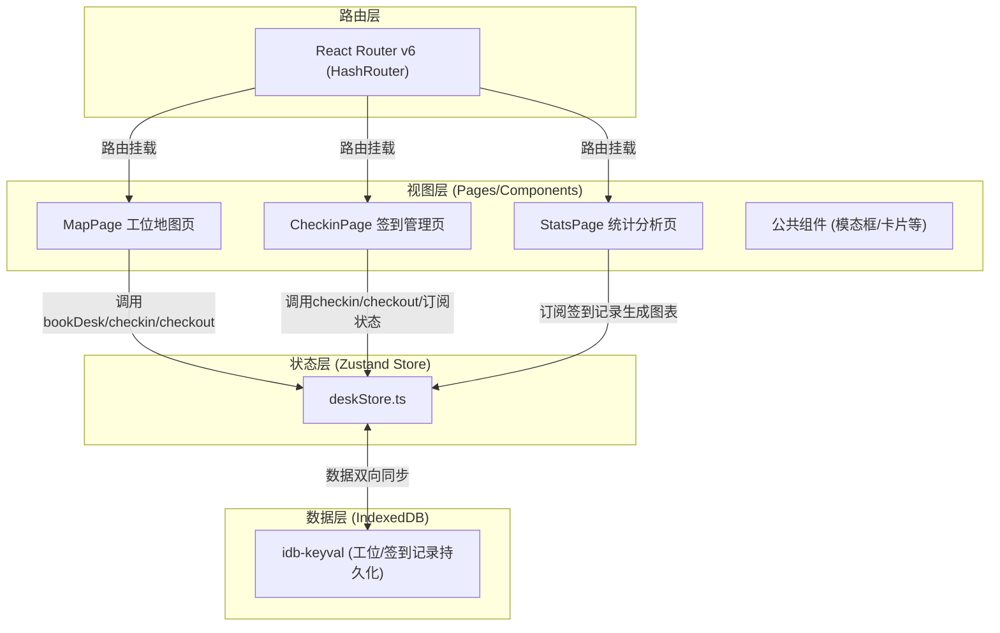
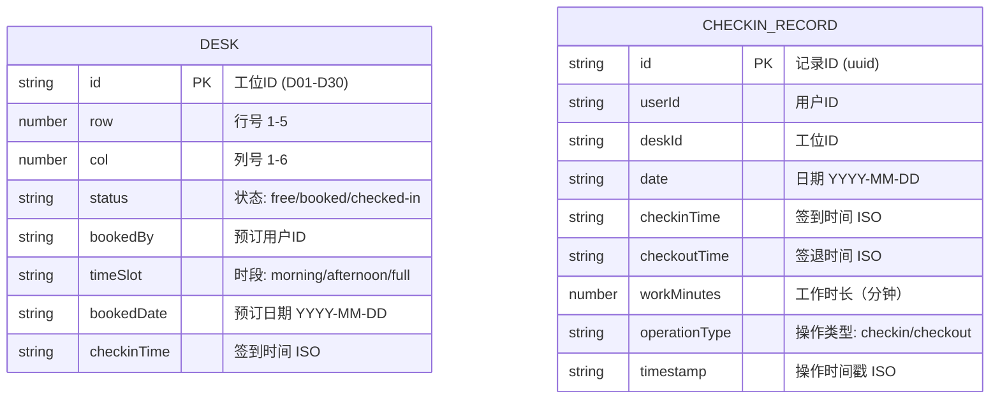

## 1. 架构设计

纯前端单页应用，状态集中管理，数据持久化至IndexedDB。



## 2. 技术描述

- **前端框架**：React@18 + React-DOM@18
- **构建工具**：Vite（端口3000）
- **语言**：TypeScript（严格模式）
- **状态管理**：Zustand
- **路由**：React Router DOM@6（HashRouter）
- **数据持久化**：IndexedDB（idb-keyval封装）
- **日期处理**：date-fns
- **图表库**：recharts
- **唯一ID**：uuid
- **样式方案**：原生CSS（CSS Modules风格，配合CSS变量）

## 3. 路由定义

| 路由路径 | 页面组件 | 用途 |
|----------|----------|------|
| `/` | MapPage | 工位地图与预约（首页） |
| `/checkin` | CheckinPage | 签到签退与时间线 |
| `/stats` | StatsPage | 工时统计可视化 |

## 4. 数据模型

### 4.1 数据模型定义



### 4.2 Zustand Store 数据结构

```typescript
interface DeskState {
  currentUserId: string;               // 当前用户ID
  desks: Desk[];                       // 30个工位列表
  checkinRecords: CheckinRecord[];     // 所有签到记录
  // Actions
  bookDesk(deskId, userId, date, timeSlot): Promise<void>;
  checkin(deskId, userId): Promise<void>;
  checkout(deskId, userId): Promise<void>;
  initializeData(): Promise<void>;
}
```

### 4.3 文件结构与调用关系

```
src/
├── App.tsx              路由根组件，读取store currentUserId，挂载三页面
│    └── 调用: deskStore.initializeData(), useLocation/useNavigate
├── stores/
│    └── deskStore.ts    全局状态管理
│         ├── 提供: bookDesk, checkin, checkout, initializeData
│         ├── 依赖: idb-keyval (持久化), uuid, date-fns
│         └── 被: App.tsx, MapPage, CheckinPage, StatsPage 调用
├── pages/
│    ├── MapPage.tsx     工位地图页
│    │    ├── 调用: store.desks, store.bookDesk
│    │    └── 子组件: BookingModal (内联实现)
│    ├── CheckinPage.tsx 签到管理页
│    │    ├── 调用: store.checkinRecords, store.checkin, store.checkout
│    │    └── 子组件: TimelineCard, EmptyState, DateSelector (内联实现)
│    └── StatsPage.tsx   统计分析页
│         ├── 调用: store.checkinRecords
│         └── 依赖: recharts (BarChart, LineChart 等)
├── utils/
│    └── dateUtils.ts    日期聚合工具函数（按天/周聚合工时）
│         └── 被: StatsPage.tsx, CheckinPage.tsx 调用
└── styles/
     └── global.css      全局样式 + CSS变量 + 动画关键帧
```

## 5. 性能设计

- **工位卡片渲染**：30个工位卡片直接渲染（<800ms约束），使用CSS transition而非JS动画
- **签到时钟**：`setInterval` 每秒更新一次展示组件局部状态，不触发store全量更新
- **数据持久化**：idb-keyval异步读写，UI状态先更新后落库（乐观更新），避免阻塞
- **图表数据**：StatsPage按需聚合，使用useMemo缓存聚合结果，避免重复计算
