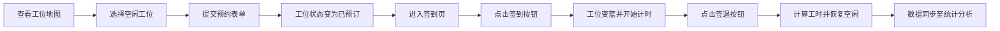

## 1. 产品概述

DeskHive是一个面向共享办公空间的智能工位预约与签到系统，为入驻成员提供便捷的工位预订、日常签到签退以及工时统计功能。

- **核心价值**：通过数字化方式管理工位资源，提升办公空间利用率，为成员提供透明、高效的工位预约体验
- **目标用户**：共享办公空间的入驻成员、运营管理人员

---

## 2. 核心功能

### 2.1 用户角色
| 角色 | 说明 | 核心权限 |
|------|------|----------|
| 入驻成员 | 已注册的办公空间使用者 | 预约工位、签到签退、查看个人统计 |

### 2.2 功能模块
1. **工位地图页**：办公区网格布局展示、工位状态标识、预约表单模态框
2. **签到管理页**：签到/签退操作、当日签到时间线、历史记录查询、空状态展示
3. **统计分析页**：本周每日工时柱状图、近4周到工率折线图

### 2.3 页面详情
| 页面名称 | 模块名称 | 功能描述 |
|----------|----------|----------|
| 工位地图页 | 工位网格 | 5行6列共30个工位，颜色区分状态（绿=空闲/橙=已预订/蓝=已签到），悬停显示详情 |
| 工位地图页 | 预约模态框 | 点击空闲工位弹出，选择日期（默认今天）和时段（上午/下午/全天），提交后更新工位状态 |
| 签到管理页 | 签到签退按钮 | 点击签到记录当前时间，工位变蓝开始计时；点击签退记录时间，工位恢复空闲，计算工时 |
| 签到管理页 | 时间线卡片 | 当日签到/签退记录，左右交替聊天式布局，每张带时间戳和操作类型，左侧绿色圆点引导线 |
| 签到管理页 | 日期选择器 | 限定最近30天内，切换日期更新时间线，无记录时显示空状态插画 |
| 统计分析页 | 工时柱状图 | 本周周一至周日每日工时（小时），柱状条圆角，顶部显示数值 |
| 统计分析页 | 到工率折线图 | 最近4周到工率（百分比），渐变填充区域，悬停显示数据提示 |

---

## 3. 核心流程

### 主流程：预约→签到→工时统计
成员首先在工位地图页选择空闲工位进行预约；预约成功后在签到页点击签到开始工作；工作结束后点击签退完成当日记录；所有签到数据自动聚合至统计页进行可视化展示。

---

## 4. 用户界面设计

### 4.1 设计风格
- **主色调**：森林绿 `#4CAF50`（成功/签到）、天蓝 `#2196F3`（信息/已签到）
- **背景色**：浅色主题 `#F5F7FA`
- **状态色**：空闲 `#4CAF50`、已预订 `#FF9800`、已签到 `#2196F3`
- **卡片样式**：圆角2px、轻微阴影 `box-shadow 0 2px 4px rgba(0,0,0,0.1)`
- **过渡动画**：状态切换0.3秒背景色过渡、模态框缩放弹入（scale 0.9→1，0.2s ease-out）、时间线卡片从下往上淡入（opacity 0→1，translateY 20px→0，0.4s）

### 4.2 页面设计概述
| 页面名称 | 模块名称 | UI元素 |
|----------|----------|----------|
| 工位地图页 | 工位网格 | 80%屏宽居中布局，60×60px工位卡片，网格间距16px，鼠标悬停上浮效果 |
| 签到管理页 | 时间线卡片 | 左侧竖线+绿色圆点锚点，卡片交替左右对齐，圆角8px，白底阴影 |
| 签到管理页 | 空状态插画 | SVG插画（打哈欠的小人坐在工位），居中展示，配文字提示 |
| 统计分析页 | 图表容器 | 卡片式容器，圆角8px，白底阴影，图表区域留足内边距，X轴标签12px灰色 |

### 4.3 响应式设计
- **桌面端（≥768px）**：工位卡片60×60px，6列布局
- **移动端（<768px）**：工位卡片40×40px，3列布局，签到卡片全宽排列
- 采用弹性布局 + CSS变量实现断点适配
