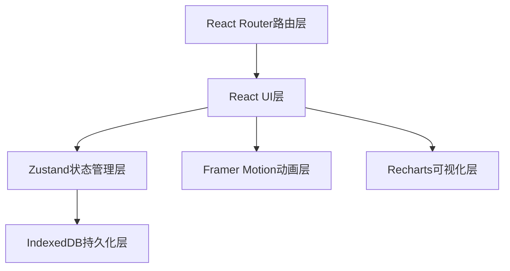
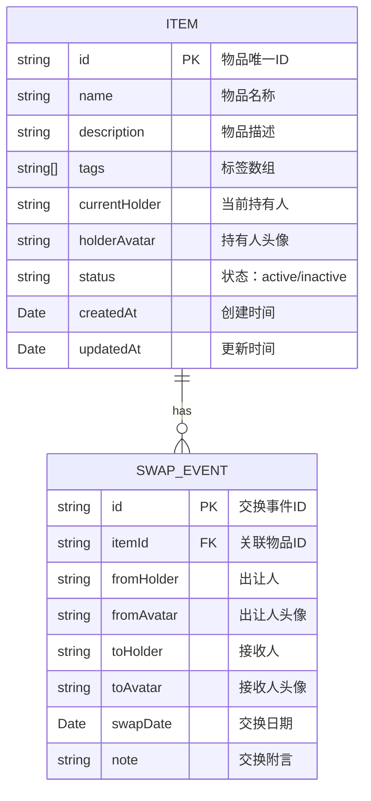

## 1. 架构设计



整体采用单向数据流架构：UI组件通过Zustand store的action修改状态，store自动同步到IndexedDB，状态变化驱动UI重新渲染。动画和可视化作为独立层与UI层交互。

## 2. 技术描述

- **前端框架**：React@18 + TypeScript + Vite
- **状态管理**：Zustand，轻量级且支持中间件
- **本地持久化**：IndexedDB（idb-keyval库封装）
- **路由**：react-router-dom@6
- **动画**：framer-motion
- **图表**：recharts
- **工具库**：uuid（生成唯一ID）、date-fns（日期处理）
- **构建工具**：Vite，配置路径别名@指向src

## 3. 目录结构

```
src/
├── components/          # 可复用组件
│   ├── ItemCard.tsx     # 物品卡片组件
│   ├── SwapTimeline.tsx # 交换时间线组件
│   ├── Navbar.tsx       # 导航栏组件
│   ├── SearchFilter.tsx # 搜索筛选组件
│   ├── Modal.tsx        # 模态框组件
│   └── StatsCard.tsx    # 统计卡片组件
├── pages/               # 页面组件
│   ├── Dashboard.tsx    # 仪表盘首页
│   ├── ItemList.tsx     # 物品列表页
│   └── ItemDetail.tsx   # 物品详情页
├── store/               # 状态管理
│   └── swapStore.ts     # Zustand store
├── types/               # TypeScript类型定义
│   └── index.ts         # 类型定义文件
├── utils/               # 工具函数
│   ├── db.ts            # IndexedDB操作封装
│   └── helpers.ts       # 通用辅助函数
├── App.tsx              # 根组件，路由配置
└── main.tsx             # 应用入口
```

### 文件调用关系

1. **数据流方向**：UI组件 → store action → IndexedDB → store state → UI重渲染
2. **组件依赖**：
   - `App.tsx` → 所有页面组件 + `Navbar`
   - `Dashboard.tsx` → `StatsCard` + Recharts图表组件
   - `ItemList.tsx` → `ItemCard` + `SearchFilter`
   - `ItemDetail.tsx` → `SwapTimeline` + `ItemCard`
3. **store依赖**：`swapStore.ts` → `types/index.ts` + `utils/db.ts`

## 4. 路由定义

| 路由路径 | 页面组件 | 用途 |
|---------|---------|------|
| `/` | Dashboard | 仪表盘首页，社区统计概览 |
| `/items` | ItemList | 物品列表页，浏览所有物品 |
| `/items/:id` | ItemDetail | 物品详情页，查看流转时间线 |

## 5. 数据模型

### 5.1 数据模型定义



### 5.2 TypeScript类型定义

```typescript
interface Item {
  id: string;
  name: string;
  description: string;
  tags: string[];
  currentHolder: string;
  holderAvatar: string;
  status: 'active' | 'inactive';
  createdAt: Date;
  updatedAt: Date;
}

interface SwapEvent {
  id: string;
  itemId: string;
  fromHolder: string;
  fromAvatar: string;
  toHolder: string;
  toAvatar: string;
  swapDate: Date;
  note: string;
}

interface SwapChain {
  item: Item;
  events: SwapEvent[];
}

interface CommunityStats {
  totalSwaps: number;
  activeItems: number;
  participants: number;
  monthlyTrend: { month: string; count: number }[];
}
```

## 6. Zustand Store设计

### Store Actions

| Action名称 | 参数 | 返回值 | 功能描述 |
|-----------|------|--------|---------|
| `addItem` | `Omit<Item, 'id' \| 'createdAt' \| 'updatedAt'>` | `Promise<Item>` | 添加新物品，自动生成ID和时间戳 |
| `updateItem` | `id: string, updates: Partial<Item>` | `Promise<Item>` | 更新物品信息 |
| `deleteItem` | `id: string` | `Promise<void>` | 删除物品及关联交换记录 |
| `recordSwap` | `Omit<SwapEvent, 'id'>` | `Promise<SwapEvent>` | 记录交换事件，更新物品当前持有人 |
| `getItemChain` | `itemId: string` | `Promise<SwapChain>` | 获取物品完整流转链条 |
| `getStats` | - | `Promise<CommunityStats>` | 获取社区统计数据 |
| `filterItems` | `keyword?: string, tag?: string` | `Item[]` | 根据关键词和标签筛选物品 |

## 7. 性能优化策略

1. **IndexedDB读取优化**：应用启动时预加载数据到内存，store初始化时完成
2. **列表虚拟化**：物品列表超过50项时采用虚拟滚动
3. **组件memo优化**：`ItemCard`、`StatsCard`使用React.memo避免不必要重渲染
4. **状态选择优化**：组件使用selector只订阅需要的state字段
5. **动画性能**：framer-motion使用transform和opacity属性，避免触发重排

## 8. 数据初始化

应用首次加载时，自动生成示例数据用于演示，包括：
- 10-15个示例物品，涵盖电子、书籍、衣物、家居等类别
- 20-30条交换记录，形成完整的流转链条
- 5-8个社区成员，每个成员有独特头像和名称
