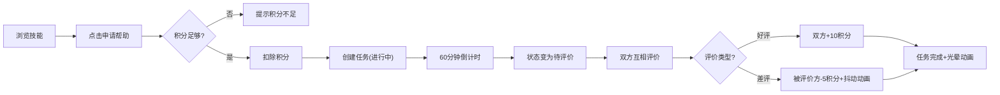

## 1. 产品概述

SkillGuild是一个微技能交换与互助任务管理平台，用户可以发布自己擅长的小技能（如修图、翻译、代码调试），并通过虚拟积分交换他人的帮助来完成任务。

- 核心目标：建立一个基于技能交换的互助社区，降低学习和求助门槛
- 目标用户：有一技之长且需要他人帮助的年轻群体、学生、自由职业者
- 市场价值：通过积分机制激励优质内容和互助行为，构建正向循环的社区生态

## 2. 核心功能

### 2.1 用户角色

| 角色 | 注册方式 | 核心权限 |
|------|----------|----------|
| 普通用户 | 自动生成匿名身份 | 发布技能、浏览技能、申请帮助、发起任务、完成任务、评价、赚取积分 |

### 2.2 功能模块

1. **首页（技能广场）**：搜索框、排序选择器、技能卡片网格、技能详情展开
2. **任务板**：任务列表、状态筛选器、环形倒计时、任务操作按钮
3. **积分系统**：积分余额显示、积分变动动画、积分流水记录
4. **评价系统**：星级评价、好评/差评积分奖惩、评价抖动动画

### 2.3 页面详情

| 页面名称 | 模块名称 | 功能描述 |
|----------|----------|----------|
| 首页 | 搜索与排序 | 实时搜索过滤技能、按积分/时间/评价数量排序 |
| 首页 | 技能卡片网格 | 响应式4/3/2列布局，卡片悬停上移动效 |
| 首页 | 技能详情展开 | 平滑展开动画，显示完整描述、星级评价、申请帮助按钮 |
| 任务板 | 任务列表 | 展示用户发起和参与的所有任务，支持状态筛选 |
| 任务板 | 任务倒计时 | SVG环形进度条，60分钟倒计时，颜色从绿色渐变到红色 |
| 任务板 | 任务完成反馈 | 绿色光晕脉冲动画、顶部提示条滑入动画 |
| 导航栏 | 积分显示 | 右上角实时显示积分，变动时放大弹跳动画 |
| TabBar | 底部导航 | 自定义图标，切换首页和任务板 |

## 3. 核心流程

### 3.1 技能申请与任务创建流程

用户浏览技能卡片 → 点击展开查看详情 → 点击"申请帮助" → 扣除积分 → 创建互助任务 → 任务进入"进行中"状态 → 60分钟倒计时 → 倒计时结束自动变为"待评价" → 双方互相评价 → 任务完成

### 3.2 积分流动流程

初始积分100 → 发布技能获赞 +5 → 完成任务好评 +10 → 完成任务差评 -5 → 申请帮助扣除对应积分 → 积分不足无法申请

### 3.3 Mermaid流程图

## 4. 用户界面设计

### 4.1 设计风格

- **主题色**：暖色渐变背景（#FFF5E6 → #FFE8CC），按钮渐变（#FF9A76 → #FFB088）
- **卡片风格**：白色背景、淡阴影、2px圆角、悬停时阴影加深+上移4px
- **按钮风格**：圆形微光渐变按钮，点击涟漪效果
- **导航栏**：固定顶部、半透明毛玻璃效果（backdrop-filter: blur(8px)）
- **字体**：标题使用圆润有温度的字体，正文使用清晰易读的无衬线字体
- **图标**：使用Lucide图标库，统一线性风格

### 4.2 页面设计概览

| 页面名称 | 模块名称 | UI元素 |
|----------|----------|--------|
| 首页 | 搜索区 | 圆角搜索框、下拉排序选择器 |
| 首页 | 技能卡片 | 随机动物头像、技能名称、简介、积分价格、展开动画 |
| 首页 | 技能详情 | 长描述、星级评价（实心/空心星星）、申请按钮 |
| 任务板 | 任务卡片 | 环形进度条、状态标签、操作按钮 |
| 任务板 | 筛选栏 | 进行中/待评价/已完成 状态筛选标签 |
| 通用 | 提示条 | 顶部滑入、3秒淡出、积分变动提示 |

### 4.3 响应式设计

- **大屏（>1024px）**：4列卡片网格
- **中屏（768-1024px）**：3列卡片网格
- **小屏（<768px）**：2列卡片网格，文字自适应缩小
- 所有状态变更0.3秒ease-out过渡动画

### 4.4 动画效果

1. **卡片展开**：高度从0到auto平滑过渡
2. **积分变动**：数字放大弹跳动画
3. **任务完成**：中心扩散绿色光晕脉冲（1秒）
4. **差评警告**：抖动动画
5. **提示条**：顶部滑入→3秒后淡出
6. **按钮点击**：涟漪效果
7. **卡片悬停**：上移4px+阴影加深
8. **搜索过滤**：列表平滑重排

## 5. 性能要求

- 页面首次渲染时间 ≤ 1秒
- 卡片列表滚动帧率 ≥ 60FPS
- 搜索过滤重新渲染延迟 ≤ 100ms
- IndexedDB读写操作异步非阻塞
