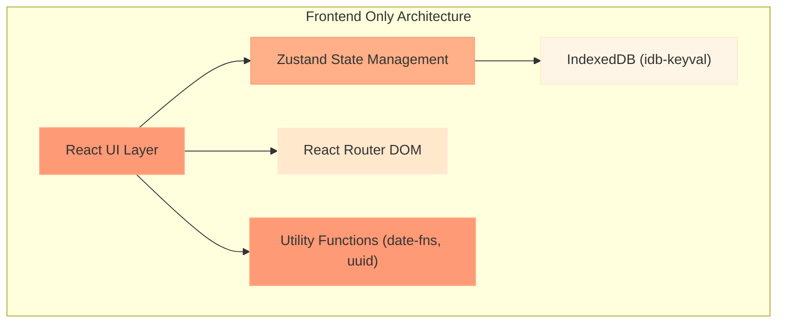
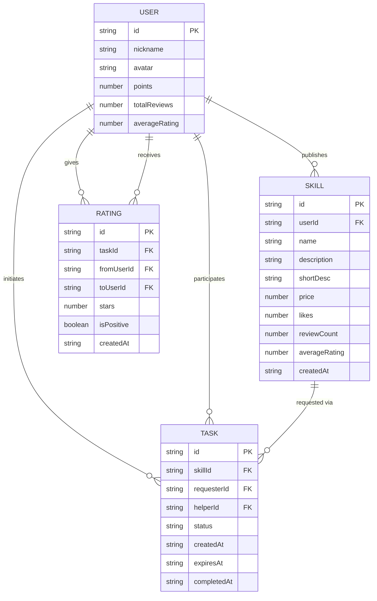

## 1. 架构设计



## 2. 技术描述

- **前端框架**：React@18 + TypeScript
- **构建工具**：Vite
- **状态管理**：Zustand
- **路由管理**：react-router-dom@6
- **数据持久化**：IndexedDB (idb-keyval)
- **工具库**：uuid（唯一ID生成）、date-fns（日期处理）
- **样式方案**：原生CSS + CSS Variables（无需Tailwind，按需求自定义样式）
- **图标库**：lucide-react

## 3. 项目结构

```
src/
├── main.tsx              # ReactDOM渲染入口
├── App.tsx               # 路由布局，导航栏和页面切换
├── types/
│   └── index.ts          # TypeScript类型定义
├── store/
│   └── skillStore.ts     # Zustand store，管理技能、任务、积分
├── components/
│   ├── SkillCard.tsx     # 技能发布卡片组件
│   ├── TaskBoard.tsx     # 任务板组件
│   ├── Navbar.tsx        # 顶部导航栏
│   ├── TabBar.tsx        # 底部TabBar
│   ├── Toast.tsx         # 提示条组件
│   ├── CountdownTimer.tsx # 倒计时环形进度条
│   └── StarRating.tsx    # 星级评价组件
├── pages/
│   ├── HomePage.tsx      # 首页（技能广场）
│   └── TasksPage.tsx     # 任务板页面
├── hooks/
│   └── useCountdown.ts   # 倒计时自定义Hook
├── utils/
│   ├── db.ts             # IndexedDB封装
│   ├── mockData.ts       # 模拟数据生成
│   └── helpers.ts        # 工具函数（随机头像、动画等）
└── styles/
    ├── global.css        # 全局样式
    ├── animations.css    # 动画关键帧
    └── variables.css     # CSS变量
```

## 4. 路由定义

| 路由 | 页面 | 功能说明 |
|------|------|----------|
| `/` | HomePage | 技能广场，展示所有技能卡片，支持搜索和排序 |
| `/tasks` | TasksPage | 任务板，展示用户的所有任务，支持状态筛选 |

## 5. 数据模型

### 5.1 Mermaid ER图



### 5.2 TypeScript类型定义

```typescript
// 实体类型
interface User {
  id: string;
  nickname: string;
  avatar: string;
  points: number;
  totalReviews: number;
  averageRating: number;
}

interface Skill {
  id: string;
  userId: string;
  name: string;
  description: string;
  shortDesc: string;
  price: number;
  likes: number;
  reviewCount: number;
  averageRating: number;
  createdAt: string;
}

interface Task {
  id: string;
  skillId: string;
  requesterId: string;
  helperId: string;
  status: 'in_progress' | 'pending_review' | 'completed';
  createdAt: string;
  expiresAt: string;
  completedAt?: string;
  requesterRated?: boolean;
  helperRated?: boolean;
}

interface Rating {
  id: string;
  taskId: string;
  fromUserId: string;
  toUserId: string;
  stars: number;
  isPositive: boolean;
  createdAt: string;
}

// Store状态
interface SkillStore {
  // 数据
  currentUser: User;
  skills: Skill[];
  tasks: Task[];
  ratings: Rating[];
  
  // UI状态
  searchQuery: string;
  sortBy: 'price' | 'time' | 'reviews';
  taskFilter: 'all' | 'in_progress' | 'pending_review' | 'completed';
  
  // 操作
  initializeData: () => Promise<void>;
  requestHelp: (skillId: string) => Promise<boolean>;
  completeTask: (taskId: string) => Promise<void>;
  submitRating: (taskId: string, toUserId: string, stars: number) => Promise<void>;
  likeSkill: (skillId: string) => Promise<void>;
  setSearchQuery: (query: string) => void;
  setSortBy: (sortBy: 'price' | 'time' | 'reviews') => void;
  setTaskFilter: (filter: 'all' | 'in_progress' | 'pending_review' | 'completed') => void;
  
  // 计算属性
  filteredSkills: Skill[];
  userTasks: Task[];
}
```

## 6. 核心技术实现方案

### 6.1 IndexedDB数据持久化

使用`idb-keyval`库简化IndexedDB操作，store初始化时从DB读取数据，数据变更时异步写入DB。

### 6.2 Zustand状态管理

- 使用`create`函数创建store
- 集成`persist`中间件（可选，主要用IndexedDB）
- 使用`immer`简化状态更新（可选）
- 计算属性使用派生状态selector

### 6.3 动画实现方案

- **CSS Transition**：用于状态切换的平滑过渡（0.3s ease-out）
- **CSS Animation**：用于脉冲、抖动、滑入等关键帧动画
- **React状态驱动**：通过className切换触发动画
- **SVG动画**：环形进度条使用stroke-dashoffset实现

### 6.4 性能优化方案

- **虚拟滚动**：技能卡片列表使用虚拟滚动（可选，根据数据量）
- **防抖搜索**：搜索输入使用300ms防抖减少重渲染
- **memo优化**：使用React.memo包装SkillCard等频繁重渲染组件
- **useMemo/useCallback**：合理使用减少不必要计算
- **IndexedDB异步**：所有DB操作异步执行，不阻塞UI

### 6.5 倒计时实现

- 自定义Hook `useCountdown` 管理倒计时状态
- 使用`requestAnimationFrame`保证动画流畅
- 任务过期自动更新状态（轮询检测）
