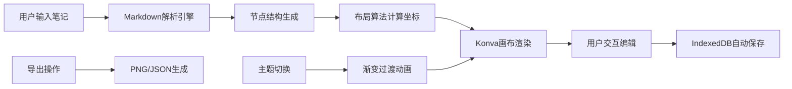

## 1. 产品概述

交互式思维导图工具，将复杂的文本笔记转化为结构化可视化导图，解决传统线性笔记难以理清概念关联、无法直观展示知识层次的痛点。

- 目标用户：学生、研究人员、知识工作者
- 核心价值：笔记可视化、概念关联梳理、知识结构管理

## 2. 核心功能

### 2.1 功能模块

1. **笔记输入与解析模块**：Markdown文本编辑器、自动标题层级识别、节点结构化预览
2. **可视化导图编辑模块**：Konva画布渲染、节点拖拽、贝塞尔曲线连接、框选多选、缩放平移
3. **主题样式模块**：4套预设配色主题、0.3秒渐变过渡、背景脉动动画
4. **数据持久化与导出模块**：IndexedDB自动存储、PNG图片导出、JSON文件导出
5. **工具栏操作模块**：添加/删除节点、撤销/重做、主题切换、导出功能

### 2.2 页面详情

| 模块名称 | 子模块 | 功能描述 |
|---------|--------|---------|
| 编辑器面板 | Markdown输入框 | 支持#、##、###标题和列表项语法高亮输入 |
| 编辑器面板 | 结构化预览 | 树形结构展示解析后的节点层级 |
| 编辑器面板 | 节点操作 | 手动添加、删除、重命名节点 |
| 画布区域 | 节点渲染 | 根节点180x80px渐变填充，子节点140x60px纯色填充 |
| 画布区域 | 交互操作 | 节点拖拽、内联编辑、框选多选、缩放平移 |
| 画布区域 | 连线渲染 | 贝塞尔曲线连接、悬停高亮 |
| 工具栏 | 操作按钮 | 添加、删除、撤销、重做、主题切换、导出 |
| 主题系统 | 配色方案 | 深空蓝、森林绿、暖阳橙、极简灰 |

## 3. 核心流程

## 4. 用户界面设计

### 4.1 设计风格

- **主基调**：深色模式（深空背景 #1a1a2e）
- **节点样式**：圆角矩形卡片，圆角半径12px，14px白色字体
- **选中效果**：外发光8px模糊，颜色与主题色一致
- **连线样式**：贝塞尔曲线2px线宽，半透明白rgba(255,255,255,0.3)，悬停0.6
- **工具栏**：画布左上角半透明固定
- **按钮动效**：悬停上浮0.3em + 阴影加深

### 4.2 主题配色

| 主题名称 | 根节点渐变 | 子节点层级色 | 背景色 | 发光色 |
|---------|-----------|------------|--------|--------|
| 深空蓝 | #667eea→#764ba2 | 蓝紫系饱和度递减 | #1a1a2e | #667eea |
| 森林绿 | #11998e→#38ef7d | 绿色系饱和度递减 | #1a1a2e | #11998e |
| 暖阳橙 | #f2994a→#f2c94c | 橙黄系饱和度递减 | #1a1a2e | #f2994a |
| 极简灰 | #636e72→#b2bec3 | 灰色系饱和度递减 | #1a1a2e | #636e72 |

### 4.3 页面布局

| 区域 | 位置 | 尺寸 | 元素 |
|-----|------|------|-----|
| 左侧编辑区 | 左边固定 | 25%宽度 | Markdown编辑器、节点预览列表 |
| 主画布区 | 右侧自适应 | 75%宽度 | Konva画布、网格纹理背景 |
| 工具栏 | 画布左上角 | 浮动层 | 操作按钮组 |

### 4.4 交互响应

- 拖拽节点/画布平移：≥30FPS
- 重新布局计算（50+节点）：≤200ms
- 操作反馈延迟：≤50ms
- 缩放范围：0.5-2.0，步长0.1
