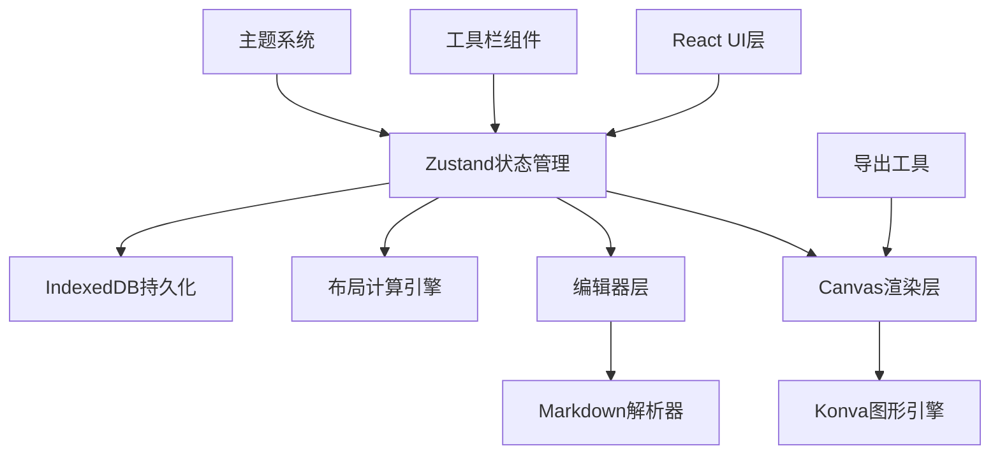

## 1. 架构设计



## 2. 技术选型

- **前端框架**：React@18 + TypeScript
- **构建工具**：Vite
- **状态管理**：Zustand
- **图形渲染**：react-konva@18 + konva
- **数据持久化**：idb-keyval（IndexedDB封装）
- **工具库**：uuid（ID生成）

## 3. 目录结构

```
src/
├── components/
│   ├── CanvasArea.tsx      # Konva画布主组件
│   ├── EditorPanel.tsx     # 左侧编辑面板
│   └── Toolbar.tsx         # 工具栏组件
├── store/
│   └── useMindMapStore.ts  # Zustand全局状态
├── utils/
│   ├── layoutEngine.ts     # 布局计算引擎
│   └── exportUtil.ts       # 导出工具函数
├── data/
│   └── themes.ts           # 主题配色配置
└── main.tsx                # 应用入口
```

## 4. 数据模型

### 4.1 节点数据结构

```typescript
interface MindMapNode {
  id: string;
  text: string;
  parentId: string | null;
  level: number;
  x: number;
  y: number;
  children: string[];
}

interface Connection {
  id: string;
  from: string;
  to: string;
}

interface ViewState {
  scale: number;
  offsetX: number;
  offsetY: number;
  selectedIds: string[];
}
```

### 4.2 主题配置结构

```typescript
interface Theme {
  name: string;
  background: string;
  rootGradient: [string, string];
  nodeColors: string[];
  lineColor: string;
  glowColor: string;
  gridColor: string;
}
```

## 5. 状态管理设计

Zustand Store包含以下状态切片：

| 状态项 | 类型 | 说明 |
|-------|------|------|
| nodes | MindMapNode[] | 节点列表 |
| connections | Connection[] | 连接关系 |
| selectedIds | string[] | 选中节点ID |
| currentTheme | string | 当前主题名 |
| viewState | ViewState | 缩放平移状态 |
| history | SnapShot[] | 撤销历史栈 |
| historyIndex | number | 历史指针 |

## 6. 核心算法

### 6.1 布局算法（layoutEngine.ts）

- 基于层级的径向树布局
- 根节点居中(0,0)
- 子节点按层级角度等分分布
- 同级节点间距随层级递增
- 超过50节点时使用Web Worker异步计算

### 6.2 Markdown解析规则

| 语法 | 映射规则 |
|-----|---------|
| # 标题 | Level 0 根节点（首个）/ Level 1 |
| ## 标题 | Level 1 / Level 2 |
| ### 标题 | Level 2 / Level 3 |
| - 列表项 | 当前层级子节点 |
| 普通段落 | 最近层级子节点 |

## 7. 性能优化策略

1. Konva节点使用完美抗锯齿（perfectDrawEnabled=false）
2. 拖拽使用requestAnimationFrame节流
3. 大节点列表虚拟化渲染（视口裁剪）
4. 布局计算防抖50ms
5. IndexedDB写入批量处理
