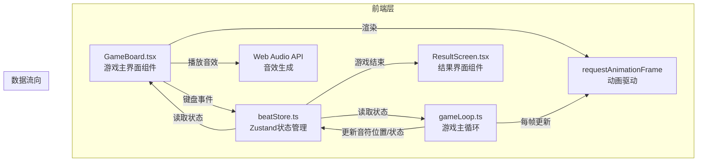

## 1. 架构设计



## 2. 技术描述

- **前端框架**：React@18 + TypeScript
- **构建工具**：Vite
- **状态管理**：Zustand
- **游戏循环**：requestAnimationFrame (60FPS)
- **音频系统**：Web Audio API（生成简单节拍音）
- **ID生成**：uuid
- **样式方案**：原生CSS + CSS变量（像素风格）

## 3. 项目结构与调用关系

```
src/
├── main.tsx              # 应用入口，渲染App组件
├── App.tsx               # 根组件，管理游戏/结果界面切换
├── index.css             # 全局样式，像素字体，CSS变量
├── gameLoop.ts           # 游戏主循环（被App.tsx调用，读取beatStore）
├── beatStore.ts          # Zustand状态管理（被所有组件调用）
├── GameBoard.tsx         # 游戏主界面（被App.tsx调用，调用beatStore）
├── ResultScreen.tsx      # 结果界面（被App.tsx调用，调用beatStore）
└── types.ts              # 类型定义（被所有模块引用）
```

**调用关系：**
- `main.tsx` → `App.tsx`
- `App.tsx` → `GameBoard.tsx` / `ResultScreen.tsx`，启动/停止 `gameLoop.ts`
- `gameLoop.ts` → 读取 `beatStore.ts` 状态，更新音符位置
- `GameBoard.tsx` → 订阅 `beatStore.ts`，触发击中判定，调用 Web Audio API
- `ResultScreen.tsx` → 订阅 `beatStore.ts` 显示结果，触发重置

## 4. 数据模型

### 4.1 核心类型定义

```typescript
// 方向类型
type Direction = 'up' | 'down' | 'left' | 'right';

// 判定结果
type JudgeResult = 'perfect' | 'good' | 'miss';

// 音符状态
type NoteState = 'active' | 'hit' | 'missed';

// 音符接口
interface Note {
  id: string;
  direction: Direction;
  targetTime: number;  // 应该到达判定线的时间戳
  y: number;           // 当前Y坐标
  state: NoteState;
  color: string;
}

// 粒子接口
interface Particle {
  id: string;
  x: number;
  y: number;
  vx: number;
  vy: number;
  color: string;
  life: number;
}

// 游戏状态
interface BeatState {
  // 游戏状态
  isPlaying: boolean;
  isPaused: boolean;
  isGameOver: boolean;
  startTime: number;
  currentTime: number;
  
  // 分数相关
  score: number;
  combo: number;
  maxCombo: number;
  
  // 生命值
  lives: number;
  
  // 音符数据
  notes: Note[];
  particles: Particle[];
  
  // 节奏序列
  rhythmPattern: RhythmNote[];
  
  // Actions
  startGame: () => void;
  pauseGame: () => void;
  resumeGame: () => void;
  resetGame: () => void;
  addNote: (note: Note) => void;
  hitNote: (noteId: string, result: JudgeResult) => void;
  missNote: (noteId: string) => void;
  updateNotePosition: (noteId: string, y: number) => void;
  addParticle: (particle: Particle) => void;
  removeParticle: (particleId: string) => void;
  decrementLife: () => void;
  setCurrentTime: (time: number) => void;
}

// 预定义节奏音符
interface RhythmNote {
  direction: Direction;
  time: number;  // 相对于开始时间的毫秒数
}
```

### 4.2 预定义节奏序列

```typescript
// 4个八拍共32个音符的节奏序列
const RHYTHM_PATTERN: RhythmNote[] = [
  { direction: 'up', time: 500 },
  { direction: 'down', time: 750 },
  { direction: 'left', time: 1000 },
  { direction: 'right', time: 1250 },
  // ... 共32个音符，按节奏分布
];
```

## 5. 核心算法

### 5.1 音符位置计算

```typescript
// 音符Y坐标 = (当前时间 - 目标时间 + 提前量) / 下落时间 * 画布高度
// 提前量 = 音符从顶部下落到判定线所需时间
const calculateNoteY = (currentTime: number, targetTime: number, fallDuration: number, canvasHeight: number): number => {
  const timeUntilHit = targetTime - currentTime;
  const progress = 1 - (timeUntilHit / fallDuration);
  return progress * canvasHeight;
};
```

### 5.2 击中判定算法

```typescript
const judgeHit = (hitTime: number, targetTime: number): JudgeResult => {
  const diff = Math.abs(hitTime - targetTime);
  if (diff < 100) return 'perfect';
  if (diff < 200) return 'good';
  return 'miss';
};
```

### 5.3 评级计算

```typescript
const calculateGrade = (score: number): string => {
  if (score > 4500) return 'S';
  if (score > 3500) return 'A';
  if (score > 2500) return 'B';
  if (score > 1500) return 'C';
  return 'D';
};
```

## 6. 性能优化

- **requestAnimationFrame**：确保60FPS稳定运行，与浏览器刷新率同步
- **状态订阅优化**：使用Zustand的selector避免不必要的重渲染
- **对象池化**：粒子和音符对象复用，减少GC压力
- **requestIdleCallback**：非关键操作（如日志）空闲时执行
- **CSS transforms**：音符动画使用transform而非top/left，启用GPU加速
- **内存管理**：及时移除已击中/过期的音符和粒子对象
