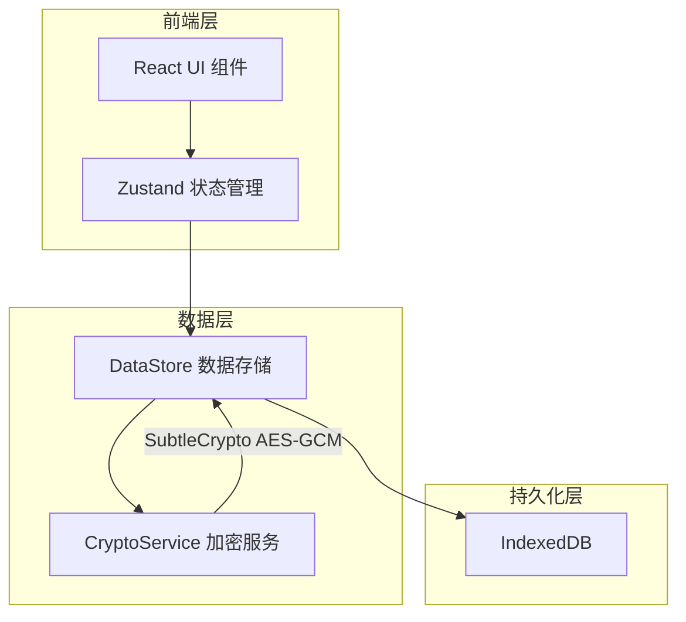

## 1. 架构设计



## 2. 技术说明

- **前端框架**：React@18 + TypeScript
- **构建工具**：Vite
- **状态管理**：Zustand
- **加密**：Web Crypto API（SubtleCrypto），AES-GCM + PBKDF2
- **数据存储**：IndexedDB（通过 idb-keyval 封装）
- **路由**：react-router-dom@6（单页应用，轻量路由）
- **工具库**：uuid（条目ID生成）、date-fns（日期格式化）、crypto-js（辅助加密）
- **CSS方案**：CSS Modules + CSS Variables（主题色与间距变量）
- **虚拟列表**：自实现 WindowedList 组件（超过50条目时启用）

## 3. 路由定义

| 路由 | 用途 |
|------|------|
| / | 主界面（含主密码验证模态） |

## 4. API定义

无后端API，所有数据操作通过本地 DataStore 层完成。

### 4.1 DataStore 接口定义

```typescript
interface VaultEntry {
  id: string;
  title: string;
  username: string;
  password: string;
  category: 'social' | 'finance' | 'work' | 'other';
  notes: string;
  createdAt: number;
  updatedAt: number;
}

interface CryptoKeyMaterial {
  salt: Uint8Array;
  iv: Uint8Array;
}

interface DataStore {
  init(): Promise<void>;
  saveEntry(entry: VaultEntry, key: CryptoKey): Promise<void>;
  getAllEntries(key: CryptoKey): Promise<VaultEntry[]>;
  deleteEntry(id: string, key: CryptoKey): Promise<void>;
  updateEntry(entry: VaultEntry, key: CryptoKey): Promise<void>;
  hasMasterKey(): Promise<boolean>;
  saveSalt(salt: Uint8Array): Promise<void>;
  getSalt(): Promise<Uint8Array | null>;
  saveVerificationData(encrypted: ArrayBuffer, iv: Uint8Array): Promise<void>;
  verifyMasterKey(key: CryptoKey): Promise<boolean>;
}
```

### 4.2 CryptoService 接口定义

```typescript
interface CryptoService {
  deriveKey(password: string, salt: Uint8Array): Promise<CryptoKey>;
  generateSalt(): Uint8Array;
  generateIV(): Uint8Array;
  encrypt(data: string, key: CryptoKey, iv: Uint8Array): Promise<ArrayBuffer>;
  decrypt(data: ArrayBuffer, key: CryptoKey, iv: Uint8Array): Promise<string>;
  generateRandomPassword(length: number): string;
}
```

### 4.3 Store 接口定义

```typescript
interface VaultStore {
  entries: VaultEntry[];
  category: 'all' | 'social' | 'finance' | 'work' | 'other';
  searchQuery: string;
  isUnlocked: boolean;
  isAddPanelOpen: boolean;
  editingEntry: VaultEntry | null;
  cryptoKey: CryptoKey | null;
  notification: string | null;

  setCategory: (category: VaultStore['category']) => void;
  setSearchQuery: (query: string) => void;
  unlock: (key: CryptoKey) => void;
  lock: () => void;
  addEntry: (entry: Omit<VaultEntry, 'id' | 'createdAt' | 'updatedAt'>) => Promise<void>;
  updateEntry: (entry: VaultEntry) => Promise<void>;
  deleteEntry: (id: string) => Promise<void>;
  loadEntries: () => Promise<void>;
  openAddPanel: () => void;
  closeAddPanel: () => void;
  setEditingEntry: (entry: VaultEntry | null) => void;
  showNotification: (msg: string) => void;
}
```

## 5. 服务器架构图

无后端服务器，纯前端应用。

## 6. 数据模型

### 6.1 数据模型定义

```mermaid
erDiagram
    "MasterKey" {
        "Uint8Array salt"
        "ArrayBuffer verificationEncrypted"
        "Uint8Array verificationIV"
    }
    "VaultEntry" {
        "string id PK"
        "string title"
        "string username"
        "string password_encrypted"
        "string category"
        "string notes_encrypted"
        "number createdAt"
        "number updatedAt"
        "Uint8Array iv"
    }
    "MasterKey" ||--o{ "VaultEntry" : "decrypts"
```

### 6.2 数据定义

IndexedDB 存储结构（使用 idb-keyval 简化操作）：

- `master_salt`: Uint8Array — PBKDF2盐值
- `verification_data`: { encrypted: ArrayBuffer, iv: Uint8Array } — 主密码验证数据
- `vault_entries`: Array<{ id, encryptedData: ArrayBuffer, iv: Uint8Array, category, createdAt, updatedAt }> — 加密条目列表

每个条目的敏感字段（username, password, notes）在保存前整体 JSON 序列化后 AES-GCM 加密，非敏感字段（category, createdAt）以明文存储以支持分类筛选和排序，无需解密全部数据。
