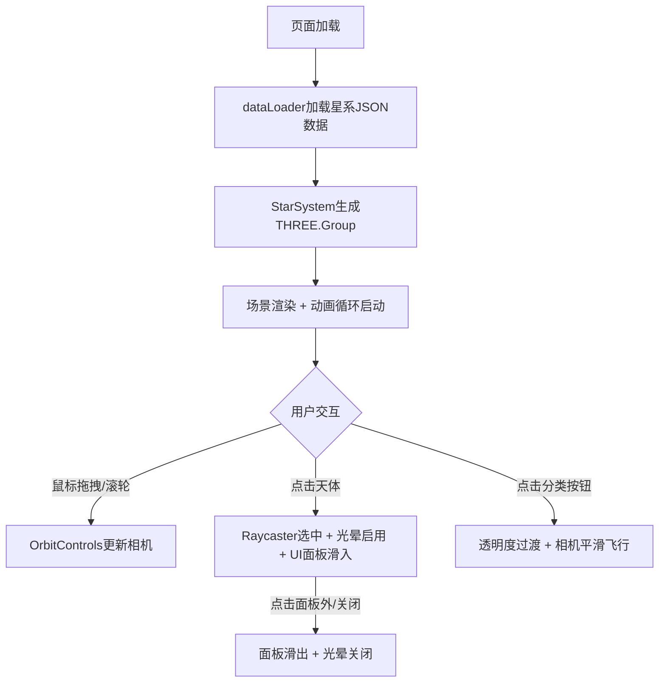

## 1. 产品概述

StarDrifter是一款面向天文爱好者的三维星系浏览与知识探索工具，用户可自由飞掠恒星、行星并查看天体详细信息。

- 核心目的：通过沉浸式3D体验让用户直观感受宇宙浩瀚，学习天文知识
- 目标用户：天文爱好者、学生、科普教育工作者
- 市场价值：填补Web端轻量化3D星系漫游工具的空白，无需安装即可使用

## 2. 核心功能

### 2.1 用户角色

| 角色 | 注册方式 | 核心权限 |
|------|----------|----------|
| 游客用户 | 无需注册，直接访问 | 完整浏览、交互、筛选、查看详情 |

### 2.2 功能模块

1. **三维星系场景**：恒星系统渲染、行星公转、星云背景、呼吸闪烁星空
2. **视角漫游交互**：鼠标拖拽旋转、滚轮缩放、分类聚焦平滑飞行
3. **天体选择交互**：Raycaster射线拾取、高亮光晕、详情面板弹出
4. **UI信息层**：顶部标题、底部分类筛选、右侧详情面板
5. **分类筛选系统**：恒星/行星/星云分类显示与透明度过渡

### 2.3 页面详情

| 页面名称 | 模块名称 | 功能描述 |
|----------|----------|----------|
| 主页面 | 3D渲染画布 | Three.js场景渲染，包含恒星、行星、轨道、星云、星空背景 |
| 主页面 | 顶部标题栏 | 居中显示"StarDrifter"，呼吸光效动画 |
| 主页面 | 底部筛选栏 | 恒星/行星/星云三个圆形按钮，点击高亮+视角飞行+透明度过滤 |
| 主页面 | 右侧详情面板 | 显示天体名称、类型、温度、距离、颜色5项信息，滑入/滑出动画 |
| 主页面 | 天体选中效果 | 脉动蓝色光晕，1秒周期 |

## 3. 核心流程

用户打开页面 → 3D场景加载完成（30+恒星、100+行星、8000+星空点）→ 用户可：
- 拖拽旋转视角 / 滚轮缩放
- 点击任意天体 → 选中高亮 + 右侧面板滑出显示详情
- 点击底部分类按钮 → 视角平滑飞行 + 非分类天体透明度0.2
- 点击面板外或关闭按钮 → 面板滑出收起

## 4. 用户界面设计

### 4.1 设计风格

- **主色调**：深空深蓝 #0a0e27（背景）、亮蓝 #4fc3f7（边框/高亮）、白色 #ffffff（文字）
- **视觉效果**：毛玻璃（backdrop-filter: blur(12px)）、半透明、文字阴影
- **按钮风格**：圆形直径40px，悬停scale(1.1) + 阴影，选中态高亮蓝色，非选中态灰暗半透明
- **字体**：无衬线粗体标题，正文清晰易读无衬线
- **动画**：所有交互0.2-0.3秒 ease-out 缓动，光晕1秒周期脉动，视角飞行2秒

### 4.2 页面设计概述

| 页面名称 | 模块名称 | UI元素 |
|----------|----------|--------|
| 主页面 | 3D画布 | 全屏渲染，#0a0e27背景，恒星行星公转动画，星空呼吸闪烁 |
| 主页面 | 顶部标题 | 居中，粗体无衬线，呼吸光效（亮度0.8-1.0循环），文字阴影 |
| 主页面 | 底部筛选 | 水平排列三个圆形按钮，底部居中，悬停放大1.1倍，选中高亮 |
| 主页面 | 右侧面板 | 宽280px，半透明毛玻璃，#4fc3f7细边框，行距1.8，浅灰分隔线 |

### 4.3 响应式设计

- 桌面优先（1920x1080基准）
- 宽度 < 1024px：自动调整上下留白，面板尺寸自适应
- 触控设备：支持触摸拖拽缩放

### 4.4 3D场景指南

- **环境氛围**：深空宇宙，冷色调蓝白色系，神秘深邃
- **光照设置**：各恒星自发光（MeshBasicMaterial/emissive），环境光微弱确保暗部细节
- **相机设置**：PerspectiveCamera，fov 60，初始位置原点附近(0,5,30)，看向原点
- **构图**：半径100球形空间均匀分布，多个星系团感的聚类分布
- **交互动画**：行星公转、选中光晕脉动、星空亮度呼吸、相机平滑飞行
- **后处理**：暂无需复杂后处理，优先性能保障
- **资源与性能**：内置JSON数据，粒子系统优化星空，目标≥40FPS
