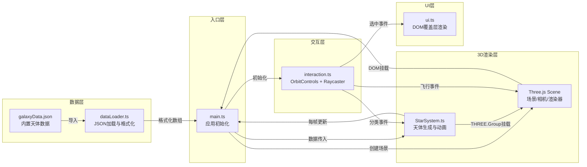

## 1. 架构设计



## 2. 技术描述

- **前端框架**：原生 TypeScript（无React/Vue，轻量级高性能3D场景）
- **3D引擎**：three@0.160.0
- **类型定义**：@types/three
- **构建工具**：Vite 5.x
- **语言**：TypeScript（严格模式 strict:true）
- **后端**：无，纯前端，内置JSON数据
- **数据**：src/data/galaxyData.json 内置静态数据
- **CSS**：内联样式 + 动态createElement（ui.ts模块内管理）

## 3. 文件结构与职责

| 文件路径 | 职责 | 输入 | 输出 / 暴露 |
|----------|------|------|-------------|
| package.json | 依赖与脚本 | - | three@0.160 / typescript / vite / @types/three |
| vite.config.js | Vite默认配置 | - | dev server + build |
| tsconfig.json | TS严格模式配置 | - | 编译规则 |
| index.html | 入口页面，挂载div#app | - | DOM容器 |
| src/main.ts | 初始化管线总控 | 导入各模块 | 启动动画循环，事件总线角色 |
| src/dataLoader.ts | 加载+格式化JSON | galaxyData.json | CelestialBody[] 数组 |
| src/StarSystem.ts | 生成天体Group+每帧动画 | CelestialBody[] | THREE.Group + update(delta) + setFilter(type) |
| src/interaction.ts | 控制器+射线拾取 | scene,camera,renderer | 选中回调 / 分类回调 / update() |
| src/ui.ts | DOM覆盖层创建与更新 | (通过回调接收数据) | 无返回，直接操作document |
| src/data/galaxyData.json | 天体原始数据 | - | 30+恒星，100+行星 |

## 4. 数据模型定义

### 4.1 天体数据结构

```typescript
interface CelestialBody {
  id: string;
  name: string;
  type: 'star' | 'planet' | 'nebula';
  position: [number, number, number]; // x, y, z
  color: string;                      // hex 颜色
  colorDesc: string;                  // 颜色描述
  size: number;                       // 半径
  temperature: number;                // 表面温度 K
  distanceFromSun: number;            // 距离太阳 光年
  parentStarId?: string;              // 行星所属恒星ID（公转中心）
  orbitRadius?: number;               // 行星公转轨道半径
  orbitSpeed?: number;                // 公转角速度 rad/s
  initialAngle?: number;              // 公转初始角度
}
```

### 4.2 交互状态

```typescript
interface SelectionState {
  selectedId: string | null;
  selectedType: 'star' | 'planet' | 'nebula' | null;
  activeFilter: 'all' | 'star' | 'planet' | 'nebula';
}
```

## 5. 关键实现要点

### 5.1 性能优化

- **星空背景**：8000点精灵使用单个 Points + ShaderMaterial 批量渲染，单Draw Call
- **恒星/行星**：同材质几何体尽可能合并，行星轨道使用 LineLoop
- **光晕效果**：选中时动态附加光环Mesh，缩放+透明度正弦脉动
- **透明度筛选**：修改 material.opacity，不销毁/重建对象
- **Raycaster**：限制检测对象池（仅恒星+行星），避免每帧全量遍历

### 5.2 平滑飞行

- 使用自定义相机插值：记录startPos/startLookAt与targetPos/targetLookAt
- 2秒持续时间，easeOutCubic缓动函数，每帧在update中 lerp
- OrbitControls 在飞行期间临时禁用target绑定，飞行结束后恢复

### 5.3 UI面板动画

- transform: translateX 驱动滑入/滑出，避免回流
- 初始 translate(100%,0)，展开 translate(0,0)，transition 0.3s ease-out
- backdrop-filter: blur(12px) + background rgba(10,14,39,0.6)

### 5.4 数据生成规则

- 恒星：30+ 颗，球面均匀分布（球坐标随机转换），半径100空间内
- 行星：每颗恒星 3-5 颗，合计 100+，围绕恒星半径2-8范围公转
- 温度：恒星 3000K-30000K，行星 100K-800K
- 距离太阳：0.1-100 光年
