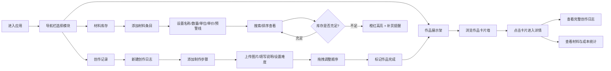

## 1. 产品概述

手工艺工作室管理应用是一款专为手工艺人设计的轻量级工具，帮助用户系统化记录创作过程、管理材料库存，并以精美的展示架形式呈现作品。解决手工艺人材料管理混乱、创作记录零散、缺乏统一作品展示渠道的核心痛点。

- **目标用户**：独立手工艺创作者、手工工作室从业者、手作爱好者
- **核心价值**：一站式创作管理 + 专业作品展示，提升创作效率与作品呈现品质

---

## 2. 核心功能

### 2.1 功能模块

1. **创作记录页**：创作日志列表、时间线步骤记录、图片上传、难度标签、筛选搜索、拖拽排序
2. **材料库存页**：材料表格管理、搜索排序、库存预警高亮、补货提醒
3. **作品展示架页**：卡片墙展示、交错飞入动画、悬停交互效果
4. **作品详情页**：完整创作日志、所用材料清单、成本统计汇总

### 2.2 页面详情

| 页面名称 | 模块名称 | 功能描述 |
|---------|---------|---------|
| 创作记录页 | 日志列表 | 新建/删除创作日志卡片，展示作品封面与基本信息 |
| 创作记录页 | 时间线步骤 | 时间线形式展示制作步骤，支持添加图片(JPG/PNG ≤5MB)、文字说明、难度标签(简单/中等/困难) |
| 创作记录页 | 筛选搜索 | 按日期范围筛选步骤、关键词搜索步骤内容 |
| 创作记录页 | 拖拽排序 | 步骤卡片支持拖拽调整顺序，实时更新时间线 |
| 材料库存页 | 材料表格 | 展示材料名称、现有数量、单位、单价、预警线，支持增删改 |
| 材料库存页 | 搜索排序 | 按材料名称搜索、按数量升序/降序排序 |
| 材料库存页 | 库存预警 | 数量低于预警线时行背景变柔和橙红色，显示补货图标 |
| 作品展示架页 | 卡片墙 | 网格布局展示已完成作品，含封面图、名称、创作耗时、简介 |
| 作品展示架页 | 交互动画 | 页面加载时卡片交错飞入，悬停时卡片上抬并加深阴影 |
| 作品详情页 | 创作日志 | 完整时间线展示，含所有步骤图片与说明 |
| 作品详情页 | 材料统计 | 所用材料列表、总量计算、成本合计展示 |

---

## 3. 核心流程

**用户主要操作流程：**
1. 用户首次使用时，在材料库存页录入常用材料与库存信息
2. 开始新作品时，在创作记录页创建日志，逐步记录每个制作步骤
3. 创作过程中消耗材料时更新材料库存数量
4. 作品完成后，标记日志状态为"已完成"，自动同步至作品展示架
5. 线下客户来访时，展示作品架卡片墙，点击可查看完整创作故事与材料成本

---

## 4. 用户界面设计

### 4.1 设计风格

- **主色调**：温暖木质棕色 #8B5A2B，营造手作温度感
- **背景色**：奶油米色 #F5E6D0，柔和不刺眼
- **强调色**：琥珀金 #D4A76A，用于按钮、标签、图标高亮
- **预警色**：柔和橙红 #F5B7A0，用于库存不足提示
- **卡片圆角**：12px，带 2-4px 柔和投影
- **导航栏**：半透明毛玻璃效果 (backdrop-filter: blur)
- **字体**：衬线体用于标题（增添工艺感），无衬线体用于正文保证可读性
- **图标风格**：线性简约图标，统一 1.5px 线条粗细

### 4.2 页面设计概览

| 页面名称 | 模块名称 | UI 元素与风格 |
|---------|---------|-------------|
| 创作记录页 | 时间线 | 垂直时间线布局，步骤卡片带木质纹理边框感，难度标签用不同色块区分 |
| 材料库存页 | 表格 | 极简表格设计，表头木质棕色，预警行柔和渐变背景，补货图标跳动动画 |
| 作品展示架页 | 卡片墙 | Pinterest 式瀑布/网格布局，卡片带轻微倾斜随机感，模拟实体展示架 |
| 作品详情页 | 详情 | 左右分栏（桌面）/ 上下布局（移动端），日志与材料区域分明 |
| 全局 | 导航栏 | 顶部固定半透明毛玻璃，左侧 Logo + 右侧三个导航图标，平滑滚动过渡 |

### 4.3 响应式设计

- **设计策略**：桌面端优先，移动端自适应
- **断点设计**：
  - ≥ 1024px：多栏布局，侧边工具面板
  - 768px - 1023px：双栏布局，卡片数量减少
  - < 768px：单栏布局，导航变为底部 Tab 栏，表格支持横向滚动
- **触摸优化**：移动端拖拽区域增大至 44px，按钮最小点击区域 48×48px

### 4.4 动效设计

| 场景 | 动效说明 | 时长 |
|------|---------|------|
| 页面加载 | 作品卡片交错飞入 (staggered fly-in) | 每张 300ms，延迟递增 50ms |
| 卡片悬停 | translateY(-6px) + 阴影加深 + 边框发光 | 200ms ease-out |
| 数据增删 | 列表项淡入淡出 (opacity 0→1 / 1→0) + 高度过渡 | 250ms |
| 导航切换 | 页面内容交叉淡入淡出 | 200ms |
| 库存预警 | 补货图标轻微呼吸脉冲动画 | 持续 2s 循环 |
| 拖拽排序 | 被拖项半透明，目标位置占位符虚线框 | 实时响应 |
