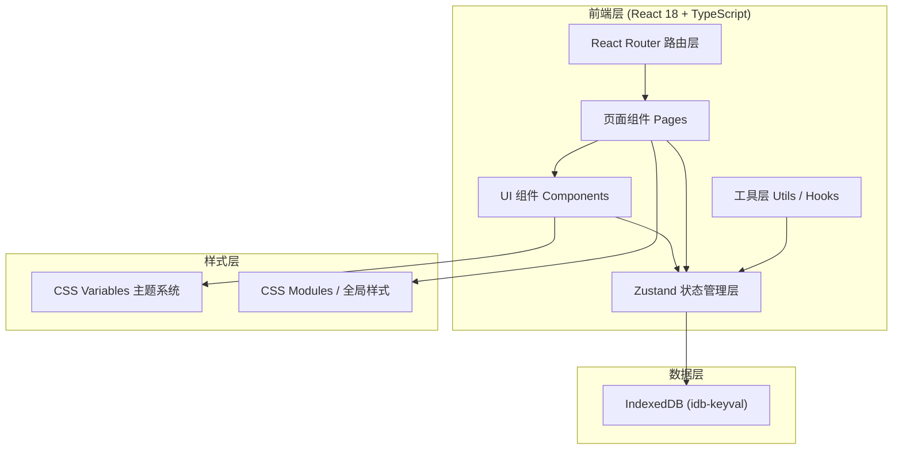
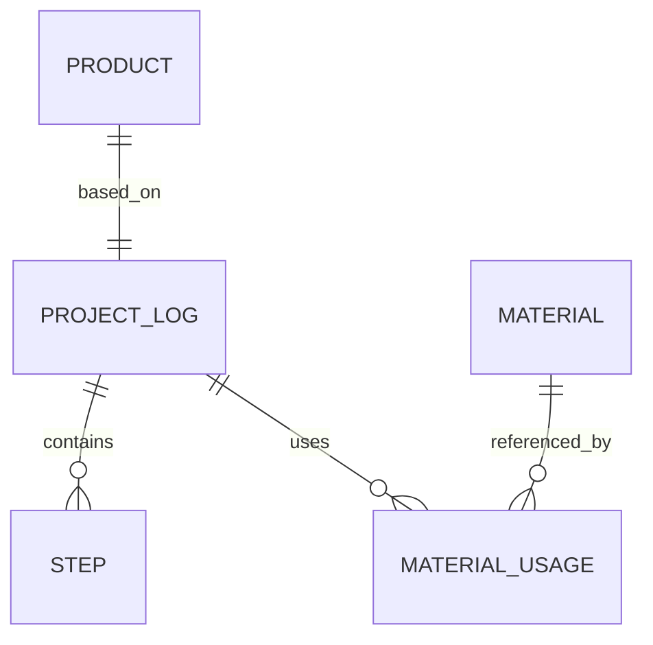

## 1. 架构设计



**架构说明：**
- 纯前端单页应用，无后端服务依赖
- IndexedDB 作为持久化存储，通过 idb-keyval 简化操作
- Zustand 管理全局状态，按业务域拆分为两个独立 Store
- 组件与 Store 采用单向数据流，组件通过 hooks 订阅状态

---

## 2. 技术选型说明

| 分类 | 技术 | 版本 | 用途说明 |
|------|------|------|---------|
| 构建工具 | Vite | 最新稳定版 | 快速冷启动、HMR 热更新 |
| 框架 | React | ^18.2.0 | UI 组件化开发 |
| 类型系统 | TypeScript | 最新稳定版 | 严格类型检查 |
| 路由 | react-router-dom | ^6.x | SPA 多页面路由管理 |
| 状态管理 | Zustand | 最新稳定版 | 轻量全局状态管理，支持持久化中间件 |
| 数据库 | IndexedDB + idb-keyval | 最新稳定版 | 浏览器本地持久化存储（含图片 Blob） |
| 工具库 | uuid | 最新稳定版 | 生成唯一 ID（日志、材料、步骤 ID） |
| 工具库 | date-fns | 最新稳定版 | 日期格式化、日期筛选处理 |
| 样式方案 | 原生 CSS + CSS Variables | - | 主题系统，零额外依赖，性能最优 |

---

## 3. 路由定义

| 路由路径 | 页面组件 | 用途 |
|---------|---------|------|
| `/` | 重定向至 `/showcase` | 默认进入作品展示架 |
| `/timeline/:projectId?` | TimelinePage | 创作记录时间线页，可选 projectId 参数查看指定日志 |
| `/materials` | MaterialsPage | 材料库存管理页 |
| `/showcase` | ShowcasePage | 作品展示架卡片墙 |
| `/product/:productId` | ProductDetail | 作品详情页，展示完整日志与材料统计 |

---

## 4. 数据模型设计

### 4.1 实体关系图



### 4.2 数据结构定义（TypeScript）

```typescript
// 难度等级类型
type DifficultyLevel = 'easy' | 'medium' | 'hard';

// 制作步骤
interface Step {
  id: string;                    // UUID
  projectId: string;             // 所属创作日志ID
  title: string;                 // 步骤标题
  description: string;           // 步骤文字说明
  imageData?: string;            // 图片 base64 数据 (JPG/PNG, ≤5MB)
  difficulty: DifficultyLevel;   // 难度标签
  order: number;                 // 步骤顺序（用于拖拽排序）
  createdAt: number;             // 步骤创建时间戳
}

// 创作日志
interface ProjectLog {
  id: string;                    // UUID
  title: string;                 // 作品名称
  coverImage?: string;           // 封面图 base64
  description: string;           // 作品简短描述
  startDate: number;             // 创作开始时间戳
  endDate?: number;              // 创作完成时间戳（完成后填入）
  isCompleted: boolean;          // 是否已完成（完成后同步至展示架）
  totalHours: number;            // 创作总耗时（小时）
  steps: Step[];                 // 包含的步骤列表
  materialUsages: MaterialUsage[]; // 使用的材料列表
}

// 材料条目（库存）
interface Material {
  id: string;                    // UUID
  name: string;                  // 材料名称
  quantity: number;              // 现有数量
  unit: string;                  // 计量单位（个、米、克、ml等）
  unitPrice: number;             // 单价（元）
  warningThreshold: number;      // 最低库存预警线
  createdAt: number;             // 创建时间戳
}

// 作品使用的材料记录
interface MaterialUsage {
  id: string;                    // UUID
  projectId: string;             // 所属创作日志ID
  materialId: string;            // 关联的材料ID
  materialName: string;          // 材料名称快照（材料被删时仍可显示）
  quantityUsed: number;          // 使用数量
  unit: string;                  // 当时的单位快照
  unitPrice: number;             // 当时的单价快照
}

// 展示架作品（由已完成的 ProjectLog 派生，额外展示字段）
interface Product {
  id: string;                    // 与 ProjectLog.id 相同
  title: string;                 // 作品名称
  coverImage?: string;           // 封面图
  description: string;           // 简短描述
  totalHours: number;            // 创作耗时
  totalCost: number;             // 材料总成本（计算得出）
  completedDate: number;         // 完成日期
}
```

### 4.3 IndexedDB 存储结构

使用 `idb-keyval` 的多 store 支持：

| Store 名称 | Key 类型 | Value 类型 | 说明 |
|-----------|---------|-----------|------|
| `projects` | string (UUID) | ProjectLog | 创作日志主表 |
| `materials` | string (UUID) | Material | 材料库存表 |

> 注：Step、MaterialUsage 作为嵌套对象存储在 ProjectLog 内部，减少关系查询复杂度。

---

## 5. 状态管理设计

### 5.1 useProjectStore (创作记录 + 材料库存)

```typescript
interface ProjectStoreState {
  // 状态
  projects: ProjectLog[];
  materials: Material[];
  currentProjectId: string | null;
  isLoading: boolean;
  
  // 创作日志 CRUD
  createProject: (data: Partial<ProjectLog>) => Promise<string>;
  updateProject: (id: string, data: Partial<ProjectLog>) => Promise<void>;
  deleteProject: (id: string) => Promise<void>;
  markProjectCompleted: (id: string) => Promise<void>;
  setCurrentProject: (id: string | null) => void;
  
  // 步骤 CRUD + 排序
  addStep: (projectId: string, step: Omit<Step, 'id' | 'order' | 'createdAt'>) => Promise<void>;
  updateStep: (projectId: string, stepId: string, data: Partial<Step>) => Promise<void>;
  deleteStep: (projectId: string, stepId: string) => Promise<void>;
  reorderSteps: (projectId: string, fromIndex: number, toIndex: number) => Promise<void>;
  
  // 材料 CRUD
  addMaterial: (data: Omit<Material, 'id' | 'createdAt'>) => Promise<string>;
  updateMaterial: (id: string, data: Partial<Material>) => Promise<void>;
  deleteMaterial: (id: string) => Promise<void>;
  
  // 材料使用记录
  addMaterialUsage: (projectId: string, usage: Omit<MaterialUsage, 'id' | 'projectId'>) => Promise<void>;
  removeMaterialUsage: (projectId: string, usageId: string) => Promise<void>;
  
  // 数据持久化
  hydrate: () => Promise<void>;  // 应用启动时从 IndexedDB 加载
}
```

### 5.2 useProductStore (作品展示架 - 独立模块)

```typescript
interface ProductStoreState {
  products: Product[];  // 由已完成的 ProjectLog 计算派生
  
  // 方法
  refreshProducts: () => void;  // 从 useProjectStore 获取数据重新计算
  getProductById: (id: string) => Product | undefined;
  getProductStats: (id: string) => {
    steps: Step[];
    materialUsages: MaterialUsage[];
    totalCost: number;
  } | null;
}
```

---

## 6. 文件结构

```
d:\P\tasks\auto58/
├── package.json
├── vite.config.js
├── tsconfig.json
├── index.html
└── src/
    ├── main.tsx                    # 应用入口
    ├── App.tsx                     # 根组件 + 路由配置
    ├── index.css                   # 全局样式 + CSS Variables 主题
    ├── types/
    │   └── index.ts                # 所有类型定义（Step, ProjectLog, Material 等）
    ├── utils/
    │   ├── db.ts                   # idb-keyval 初始化与封装
    │   ├── image.ts                # 图片压缩/校验工具
    │   └── format.ts               # 日期、金额格式化
    ├── store/
    │   ├── useProjectStore.ts      # 创作记录 + 材料库存状态
    │   └── useProductStore.ts      # 作品展示架状态（独立模块）
    ├── components/
    │   ├── Layout/
    │   │   ├── Navbar.tsx          # 导航栏（毛玻璃效果）
    │   │   └── Container.tsx       # 通用容器
    │   ├── Timeline/
    │   │   ├── Timeline.tsx        # 时间线主组件
    │   │   ├── TimelineStep.tsx    # 单个步骤卡片
    │   │   ├── StepForm.tsx        # 步骤新建/编辑表单
    │   │   └── FilterBar.tsx       # 日期筛选 + 关键词搜索栏
    │   ├── Materials/
    │   │   ├── MaterialTable.tsx   # 材料库存表格
    │   │   ├── MaterialForm.tsx    # 材料新建/编辑表单
    │   │   └── WarningRow.tsx      # 预警行样式
    │   ├── Showcase/
    │   │   ├── ProductCard.tsx     # 作品卡片
    │   │   └── CardGrid.tsx        # 卡片网格容器
    │   └── UI/
    │       ├── Button.tsx          # 通用按钮
    │       ├── Input.tsx           # 通用输入框
    │       ├── Modal.tsx           # 通用弹窗
    │       └── Tag.tsx             # 难度标签等
    └── pages/
        ├── TimelinePage.tsx        # 创作记录页
        ├── MaterialsPage.tsx       # 材料库存页
        ├── ShowcasePage.tsx        # 作品展示架页
        └── ProductDetail.tsx       # 作品详情页
```

---

## 7. 性能优化方案

| 目标 | 优化手段 |
|------|---------|
| 作品详情页加载 ≤300ms | 1) Zustand 内存缓存直接读取，跳过 IndexedDB<br>2) 图片懒加载 (loading="lazy")<br>3) 详情页组件无动态 import |
| 搜索筛选响应 ≤100ms | 1) 纯内存数组 filter/map，无需 IO<br>2) 搜索使用 useMemo 缓存结果<br>3) 防抖 debounce 10ms（近似实时） |
| 图片上传优化 | 1) 前端校验 5MB 大小限制<br>2) JPG/PNG 类型校验<br>3) 上传时可选压缩至 1920px 宽 |
| 渲染性能 | 1) 列表使用 React.memo 包裹项组件<br>2) 拖拽排序使用 requestAnimationFrame<br>3) CSS 动画走 GPU 合成层 (transform + opacity) |
| 首屏加载 | 1) 路由代码分割 (React.lazy 用于非首屏页)<br>2) IndexedDB 数据异步加载，不阻塞首屏渲染<br>3) 骨架屏 Skeleton 替代 loading 文字 |

---

## 8. 初始化脚本

```bash
# 进入项目目录
cd d:\P\tasks\auto58

# 使用 Vite 初始化 React + TypeScript 项目（模板覆盖到当前目录）
npm init vite-init@latest -y . "--" --template react-ts --force

# 安装用户指定依赖
npm install react-router-dom@6 zustand uuid idb-keyval date-fns

# 安装类型定义
npm install -D @types/uuid

# 启动开发服务器
npm run dev
```
