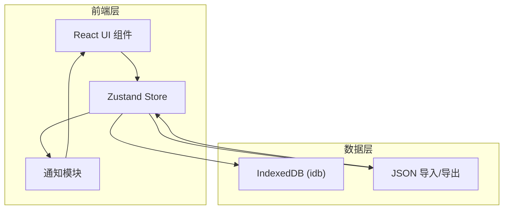
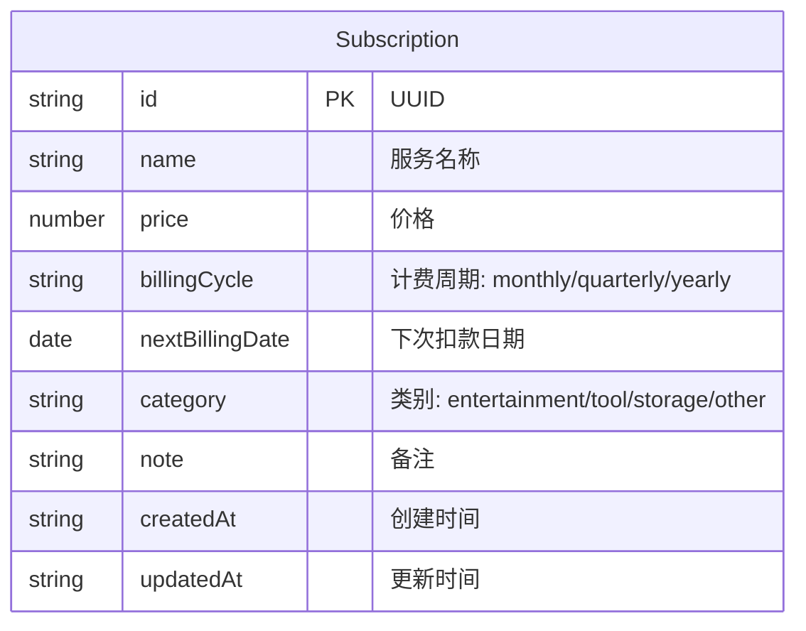

## 1. 架构设计



## 2. 技术说明
- 前端：React@18 + TypeScript + Vite
- 初始化工具：vite-init (react-ts模板)
- 状态管理：Zustand
- 日历组件：react-calendar（定制样式）
- 饼图组件：react-minimal-pie-chart
- 数据持久化：idb（IndexedDB封装）
- 唯一标识：uuid
- 图标：lucide-react
- 无后端服务，纯前端应用

## 3. 路由定义
| 路由 | 用途 |
|------|------|
| / | 主页面，包含订阅列表、日历、统计面板三栏布局 |

## 4. API定义
无后端API，所有数据通过IndexedDB在本地存储和读取。

## 5. 服务器架构图
无后端服务，纯前端应用。

## 6. 数据模型

### 6.1 数据模型定义



### 6.2 数据定义语言

```typescript
interface Subscription {
  id: string;
  name: string;
  price: number;
  billingCycle: 'monthly' | 'quarterly' | 'yearly';
  nextBillingDate: string;
  category: 'entertainment' | 'tool' | 'storage' | 'other';
  note: string;
  createdAt: string;
  updatedAt: string;
}

interface NotificationItem {
  id: string;
  subscriptionId: string;
  message: string;
  read: boolean;
  createdAt: string;
}
```

IndexedDB数据库名：`subtracker-db`
对象仓库：`subscriptions`（主键：id）、`notifications`（主键：id）

## 7. 文件结构

```
├── package.json
├── vite.config.ts
├── tsconfig.json
├── index.html
├── src/
│   ├── main.tsx
│   ├── App.tsx
│   ├── index.css
│   ├── modules/
│   │   ├── subscription/
│   │   │   ├── SubscriptionForm.tsx
│   │   │   └── SubscriptionCard.tsx
│   │   ├── calendar/
│   │   │   └── CalendarView.tsx
│   │   └── stats/
│   │       └── StatisticsPanel.tsx
│   ├── store/
│   │   └── subscriptionStore.ts
│   └── utils/
│       └── notification.ts
```
