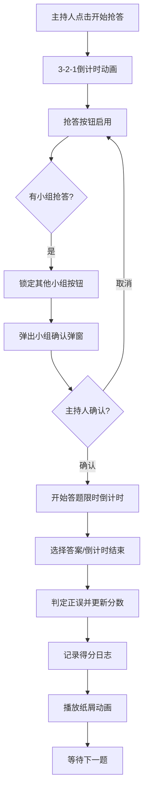

## 1. 产品概述

QuizBurst是一款面向课堂教学的在线抢答与计分应用，帮助老师在课堂大屏上主持趣味知识竞赛，支持实时出题、分组抢答和自动计分。

- 目标用户：中小学及高校教师、班级活动组织者
- 核心价值：提升课堂互动性，让知识竞赛更有趣、更公平
- 使用场景：班级主题班会、知识竞赛、复习课互动环节

## 2. 核心功能

### 2.1 用户角色

| 角色 | 登录方式 | 核心权限 |
|------|----------|----------|
| 主持人（老师） | 直接使用 | 创建题目、管理小组、控制比赛流程、查看得分日志 |

### 2.2 功能模块

1. **题目管理**：创建/编辑/删除单选题和判断题，设置限时和标签
2. **小组管理**：添加2-8个参赛小组，设置名称和颜色，支持拖拽排序
3. **抢答竞赛**：3-2-1倒计时动画、毫秒级抢答判定、答题限时倒计时
4. **计分系统**：自动计分、分数滚动动画、纸屑庆祝效果
5. **得分日志**：记录所有得分变化，支持按小组筛选

### 2.3 页面详情

| 页面名称 | 模块名称 | 功能描述 |
|-----------|-------------|---------------------|
| 主界面 | QuizPanel（主持人面板） | 当前题目展示、题目管理（增删改查）、比赛控制（开始抢答/下一题） |
| 主界面 | TeamBoard（小组积分板） | 小组卡片展示、分数滚动动画、抢答提示横幅、拖拽排序 |
| 主界面 | BuzzerPage（抢答区） | 大题目展示区、发光抢答按钮、3-2-1倒计时、小组确认弹窗 |
| 主界面 | 得分日志区 | 得分记录表格、按组筛选功能 |

## 3. 核心流程

### 3.1 抢答竞赛流程

主持人在控制面板点击"开始抢答" → 触发3-2-1倒计时动画 → 倒计时结束后抢答按钮启用 → 小组点击抢答按钮 → 系统锁定其他小组并弹出确认弹窗 → 主持人确认后开始答题倒计时 → 选择答案后判定正误 → 分数更新并记录日志 → 进入下一题

### 3.2 题目管理流程

主持人进入题目管理区 → 点击添加/编辑题目 → 选择题目类型（单选/判断）→ 填写题目内容和选项 → 设置正确答案、限时和标签 → 保存到IndexedDB

## 4. 用户界面设计

### 4.1 设计风格

- **主色调**：深色渐变背景（#1a1a2e → #16213e）
- **卡片风格**：白色半透明毛玻璃（backdrop-filter: blur(8px)）
- **强调色**：红色渐变抢答按钮（带呼吸脉冲动画）
- **字体**：Google Fonts 大号圆角字体用于标题
- **按钮**：胶囊形状选项按钮，悬停时加深并微幅上移

### 4.2 页面设计概览

| 页面区域 | 模块名称 | UI元素 |
|-----------|-------------|----------|
| 顶部 | TeamBoard | 彩色小组卡片、左侧色条、粗体大字号分数、滚动动画 |
| 左侧/中部 | QuizPanel | 毛玻璃卡片、题目列表、添加编辑表单、控制按钮 |
| 右侧/大屏区 | BuzzerPage | 大标题题目、胶囊选项、红色发光抢答按钮、倒计时 |
| 底部 | 得分日志 | 数据表格、筛选下拉、时间戳展示 |

### 4.3 响应式

- 桌面端优先，适配1024px到1920px横向屏幕
- 使用CSS Grid和Flexbox布局
- 小组卡片数量变化时自动调整宽度

### 4.4 动画效果

- 抢答按钮：呼吸脉冲动画（周期性缩放+发光）
- 分数变化：数字滚动动画
- 抢答成功：纸屑飘落动画（react-confetti）
- 按钮点击：收缩弹开触觉反馈
- 页面过渡：CSS transition与transform结合
