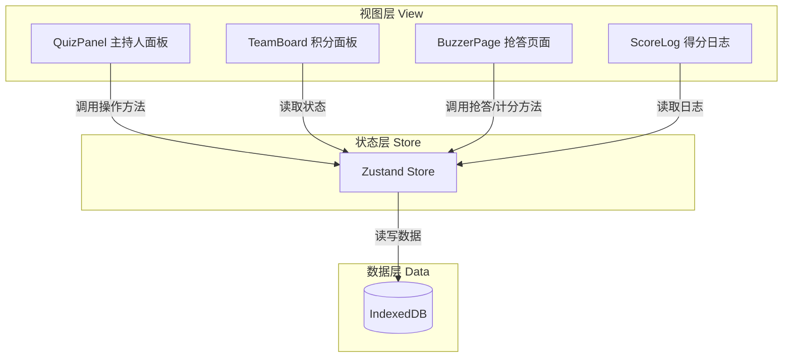

## 1. 架构设计

QuizBurst是一个纯前端单页应用，采用React + TypeScript构建，状态管理使用Zustand，数据持久化使用IndexedDB。



### 数据流方向
- 数据流向：用户操作 → 组件调用store方法 → 更新store状态 → 触发视图重渲染
- 持久化：store状态变化时自动同步到IndexedDB
- 初始化：应用启动时从IndexedDB加载数据到store

## 2. 技术栈说明

| 层级 | 技术选型 | 版本 | 用途 |
|------|----------|------|------|
| 构建工具 | Vite | latest | 快速开发构建 |
| 框架 | React | 18.x | UI框架 |
| 语言 | TypeScript | 5.x | 类型安全 |
| 状态管理 | Zustand | latest | 全局状态管理 |
| 路由 | react-router-dom | 6.x | 路由管理 |
| 数据存储 | idb-keyval | latest | IndexedDB封装 |
| 拖拽 | @dnd-kit/core | latest | 拖拽排序 |
|  | @dnd-kit/sortable | latest | 可排序列表 |
|  | @dnd-kit/utilities | latest | 拖拽工具函数 |
| 工具库 | uuid | latest | 生成唯一ID |
|  | date-fns | latest | 日期格式化 |
| 动画 | react-confetti | latest | 纸屑飘落效果 |

## 3. 文件结构

```
src/
├── types.ts              # 核心类型定义（被所有模块引用）
├── store.ts             # Zustand全局状态管理
├── hooks/
│   └── useCountdown.ts  # requestAnimationFrame倒计时hook
├── components/
│   ├── QuizPanel.tsx    # 主持人控制面板
│   ├── TeamBoard.tsx    # 小组积分面板
│   ├── BuzzerPage.tsx   # 抢答页面
│   └── ScoreLog.tsx     # 得分日志组件
├── App.tsx              # 主应用组件
├── main.tsx             # 入口文件
└── index.css            # 全局样式
```

### 模块依赖关系
- `types.ts`：零依赖，定义所有核心类型
- `store.ts`：依赖 `types.ts`、`idb-keyval`、`uuid`、`date-fns`
- `hooks/useCountdown.ts`：零依赖（纯hook）
- `components/QuizPanel.tsx`：依赖 `store.ts`、`types.ts`
- `components/TeamBoard.tsx`：依赖 `store.ts`、`types.ts`、`@dnd-kit/*`、`react-confetti`
- `components/BuzzerPage.tsx`：依赖 `store.ts`、`types.ts`、`hooks/useCountdown.ts`
- `components/ScoreLog.tsx`：依赖 `store.ts`、`types.ts`、`date-fns`
- `App.tsx`：依赖所有组件

## 4. 核心类型定义

### Question（题目）
- id: string
- type: 'single' | 'truefalse'（单选/判断题）
- content: string
- options: string[]（单选4个，判断2个）
- correctAnswer: number（正确答案索引）
- timeLimit: number（10-30秒）
- tags: string[]
- createdAt: number

### Team（小组）
- id: string
- name: string（最多10字）
- color: string（预设10色）
- score: number
- order: number（排序用）

### QuizSession（比赛状态）
- currentQuestionIndex: number
- phase: 'idle' | 'countdown' | 'buzzing' | 'answering' | 'result'
- buzzedTeamId: string | null
- isAnswerRevealed: boolean
- countdownStartTime: number | null

### ScoreLog（得分记录）
- id: string
- teamId: string
- teamName: string
- questionId: string
- questionContent: string
- scoreChange: number（+10/-5/0）
- timestamp: number
- result: 'correct' | 'wrong' | 'timeout'

## 5. 状态管理设计

### Store 状态分片
```
zustand store
├── questions: Question[]      # 题目列表
├── teams: Team[]           # 小组列表
├── session: QuizSession    # 当前比赛状态
├── scoreLogs: ScoreLog[] # 得分记录
├── actions
│   ├── 题目操作
│   │   ├── addQuestion
│   │   ├── updateQuestion
│   │   ├── deleteQuestion
│   ├── 小组操作
│   │   ├── addTeam
│   │   ├── updateTeam
│   │   ├── deleteTeam
│   │   └── reorderTeams
│   ├── 比赛控制
│   │   ├── startCountdown（开始3-2-1倒计时）
│   │   ├── startBuzzing（启用抢答）
│   │   ├── buzz（抢答）
│   │   ├── submitAnswer（提交答案）
│   │   ├── revealAnswer（显示答案）
│   │   ├── nextQuestion（下一题）
│   └── 数据持久化
│       ├── loadFromDB
│       └── saveToDB
```

## 6. 性能优化

### 抢答倒计时精度
- 使用 requestAnimationFrame 驱动倒计时
- 存储开始时间戳，每帧计算剩余时间
- 毫秒级精度显示
- 状态更新延迟 < 50ms

### IndexedDB 操作
- 异步读写，不阻塞主线程
- 批量更新时使用事务
- 初始加载使用节流避免频繁写入

## 7. 数据模型

### IndexedDB 存储结构
- `questions` 表：存储所有题目
- `teams` 表：存储小组信息
- `scoreLogs` 表：存储得分记录
- `session` 表：存储当前比赛状态（可选）
