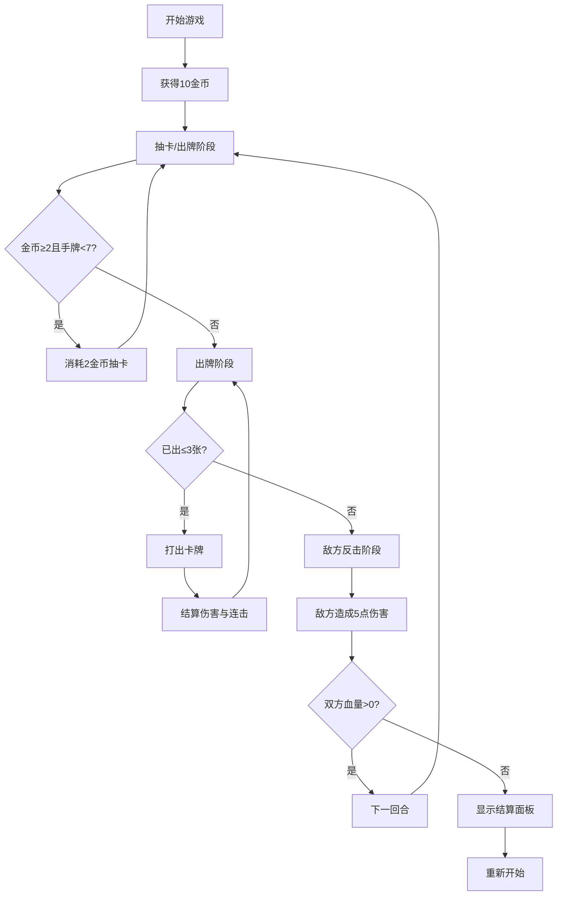

## 1. 产品概述

CardCascade是一款卡牌构筑与连锁战斗游戏，玩家通过抽取货币购买不同费用和效果的卡牌，在回合制战斗中依次出牌并触发连击效果造成额外伤害。游戏面向卡牌游戏爱好者，提供策略性与爽快感兼具的战斗体验。

## 2. 核心功能

### 2.1 用户角色

| 角色 | 注册方式 | 核心权限 |
|------|----------|----------|
| 玩家 | 无需注册，本地存档 | 完整游戏体验，包含抽卡、战斗、存档 |

### 2.2 功能模块

1. **主战斗界面**：棋盘渲染、敌方区域、卡牌放置区、血量条、回合信息
2. **卡牌商店**：卡牌池展示、抽卡按钮、金币显示
3. **手牌管理**：弧形手牌排列、悬停交互、选中出牌
4. **战斗系统**：回合制结算、连击链检测、伤害计算、动画反馈
5. **数据持久化**：游戏进度保存到IndexedDB

### 2.3 页面详情

| 页面名称 | 模块名称 | 功能描述 |
|-----------|-------------|---------------------|
| 主战斗界面 | 棋盘区域 | 半透明发光网格背景，展示双方血量、回合数、出牌区、连击提示 |
| 主战斗界面 | 商店区域 | 左侧垂直滚动展示20张可抽卡牌，抽卡按钮带金币消耗提示 |
| 主战斗界面 | 手牌区域 | 底部弧形排列手牌，悬停放大弹起，元素粒子效果，双击出牌 |
| 主战斗界面 | 结算面板 | 游戏结束时显示胜负结果，重新开始按钮 |

## 3. 核心流程

玩家进入游戏 → 获得初始10金币 → 消耗2金币抽卡（最多7张手牌）→ 出牌阶段（最多3张）→ 结算出牌效果和连击 → 敌方反击（固定5伤害）→ 下一回合 → 血量归零显示结算 → 重新开始

## 4. 用户界面设计

### 4.1 设计风格
- **主色调**：深蓝近黑星空渐变背景（#0a0e1a → #1a1f35）
- **卡牌渐变**：1费浅蓝（#4fc3f7 → #29b6f6）、2费紫色（#ba68c8 → #9c27b0）、3费金色（#ffd54f → #ffb300）
- **边框**：1px亮白边框，选中时金色发光描边
- **按钮**：圆角矩形，悬停发光，禁用时置灰抖动
- **字体**：使用Orbitron作为标题字体（游戏感），Roboto作为正文字体
- **图标**：使用lucide-react图标库

### 4.2 页面设计概览

| 页面名称 | 模块名称 | UI元素 |
|-----------|-------------|-------------|
| 主战斗界面 | 棋盘区域 | 半透明发光网格，敌方血量条（红色渐变），玩家血量条（蓝色渐变），回合数显示，放置区 |
| 主战斗界面 | 商店区域 | 左侧垂直滚动列表，卡牌缩小至70%，摇晃动画，抽卡按钮（带金币图标） |
| 主战斗界面 | 手牌区域 | 弧形排列，悬停上弹20px放大1.2倍，元素粒子飘散（红/蓝/紫/灰），抛物线出牌动画 |
| 主战斗界面 | 连击提示 | 连锁x2/x3缩放文字动画，全屏闪白，屏幕震动 |
| 主战斗界面 | 结算面板 | 居中模态框，胜负文字，重新开始按钮 |

### 4.3 响应式
- 桌面优先设计，适配1920x1080和1280x720分辨率
- 卡牌和UI元素按视口宽度等比缩放（使用vw单位）
- 最小支持宽度：1280px

### 4.4 动画与反馈
- 卡牌入场：翻转展开效果（背面→正面）
- 出牌动画：抛物线轨迹飞向棋盘中央
- 血量变化：红/蓝色数字缩放弹出
- 连击触发：全屏闪白 + 屏幕震动 + 连锁文字缩放
- 回合切换：棋盘背景暖黄↔冷蓝平滑过渡1.5秒
- 悬停效果：卡牌上弹、放大、元素粒子、边框发光
