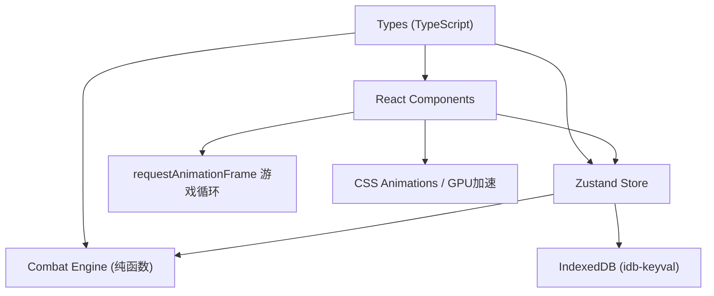

## 1. 架构设计



## 2. 技术描述

- **前端**：React@18 + TypeScript + Vite
- **状态管理**：Zustand
- **数据持久化**：IndexedDB (idb-keyval)
- **唯一ID**：uuid
- **初始化工具**：vite-init (react-ts模板)
- **构建工具**：Vite
- **性能**：CSS transform/opacity GPU加速，requestAnimationFrame游戏循环

## 3. 文件结构

```
auto62/
├── package.json
├── vite.config.js
├── tsconfig.json
├── index.html
└── src/
    ├── types.ts          # TypeScript接口与类型定义
    ├── store.ts          # Zustand状态管理
    ├── utils/
    │   └── combatEngine.ts  # 战斗引擎纯函数
    └── components/
        ├── GameBoard.tsx    # 战斗棋盘主组件
        └── Card.tsx         # 单张卡牌组件
```

## 4. 核心数据模型

### 4.1 TypeScript类型定义

```typescript
// 卡牌元素标签
type CardTag = '火焰' | '冰霜' | '暗影' | '物理';

// 卡牌接口
interface Card {
  id: string;
  name: string;
  cost: 1 | 2 | 3;
  attack: number;
  description: string;
  tag: CardTag;
}

// 玩家状态
interface Player {
  hp: number;
  maxHp: number;
  gold: number;
  hand: Card[];
  deck: Card[];
}

// 敌方状态
interface Enemy {
  hp: number;
  maxHp: number;
  attack: number;
  name: string;
}

// 连击链
interface ComboChain {
  tag: CardTag | null;
  count: number;
}

// 游戏状态
type GamePhase = 'draw' | 'play' | 'enemy' | 'ended';

interface GameState {
  player: Player;
  enemy: Enemy;
  turn: number;
  phase: GamePhase;
  cardsPlayedThisTurn: number;
  comboChain: ComboChain;
  cardPool: Card[];
  gameResult: 'win' | 'lose' | null;
  placedCards: Card[];
}
```

### 4.2 20张预设卡牌池

| 费用 | 卡牌名称 | 攻击力 | 标签 | 描述 |
|------|----------|--------|------|------|
| 1 | 火花弹 | 3 | 火焰 | 发射一颗小型火球 |
| 1 | 冰刺 | 3 | 冰霜 | 召唤尖锐冰刺 |
| 1 | 暗影爪 | 3 | 暗影 | 挥出暗影之爪 |
| 1 | 重击 | 3 | 物理 | 进行一次重击 |
| 1 | 燃烧弹 | 4 | 火焰 | 造成灼烧伤害 |
| 1 | 霜冻箭 | 4 | 冰霜 | 冰冻敌方 |
| 1 | 暗影匕首 | 4 | 暗影 | 投掷暗影匕首 |
| 1 | 盾击 | 4 | 物理 | 用盾牌攻击 |
| 2 | 烈焰风暴 | 6 | 火焰 | 召唤烈焰风暴 |
| 2 | 暴风雪 | 6 | 冰霜 | 召唤暴风雪 |
| 2 | 暗影冲击 | 6 | 暗影 | 释放暗影能量 |
| 2 | 破甲斩 | 6 | 物理 | 穿透护甲的斩击 |
| 2 | 火球术 | 7 | 火焰 | 发射大火球 |
| 2 | 冰霜新星 | 7 | 冰霜 | 冰霜爆发 |
| 2 | 虚空射线 | 7 | 暗影 | 虚空能量射线 |
| 2 | 连环拳 | 7 | 物理 | 连续出拳 |
| 3 | 陨石坠落 | 10 | 火焰 | 召唤陨石砸向敌人 |
| 3 | 绝对零度 | 10 | 冰霜 | 将敌人冰冻至绝对零度 |
| 3 | 深渊降临 | 10 | 暗影 | 深渊力量吞噬一切 |
| 3 | 毁灭打击 | 10 | 物理 | 造成毁灭性伤害 |

## 5. 状态管理（Zustand）

```typescript
interface GameStore extends GameState {
  // 抽卡
  drawCard: () => boolean;
  // 出牌
  playCard: (cardId: string) => boolean;
  // 结束出牌阶段
  endPlayPhase: () => void;
  // 敌方反击
  enemyAttack: () => void;
  // 开始新回合
  startNewTurn: () => void;
  // 重新开始
  restartGame: () => void;
  // 保存游戏
  saveGame: () => Promise<void>;
  // 加载游戏
  loadGame: () => Promise<boolean>;
}
```

## 6. 战斗引擎（纯函数）

```typescript
// 计算伤害（含连击加成）
calculateDamage(baseAttack: number, comboCount: number): number;

// 检测连击
detectCombo(lastTag: CardTag | null, currentTag: CardTag): ComboChain;

// 处理出牌效果
processCardPlay(state: GameState, card: Card): GameState;

// 处理敌方攻击
processEnemyAttack(state: GameState): GameState;

// 检查游戏结束
checkGameEnd(state: GameState): 'win' | 'lose' | null;
```

## 7. 性能要求

- 帧率：≥45FPS
- 战斗结算逻辑：单次≤6ms
- 动画：使用CSS transform和opacity实现GPU加速
- 响应式：vw单位实现等比缩放，适配1280-1920宽度
