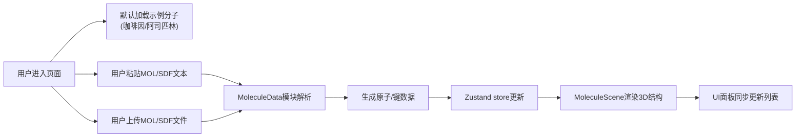
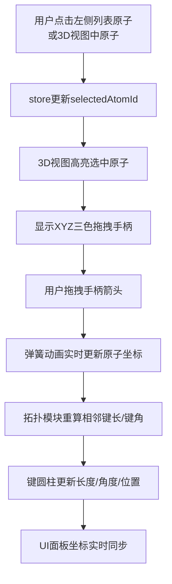
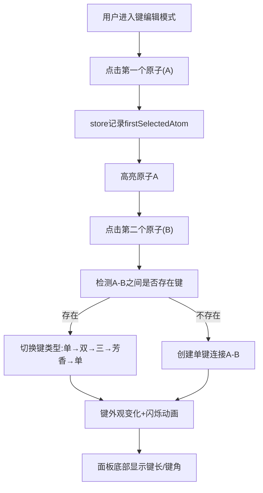

## 1. 产品概述
三维分子结构查看器与交互编辑器，为化学学习者和研究者提供浏览器端的小分子可视化与编辑工具。
- 核心目的：让用户在Web环境中直观地加载、查看、旋转和编辑小分子结构（如咖啡因、阿司匹林），降低化学结构学习门槛
- 目标用户：化学专业学生、教师、药物化学研究者、化学爱好者

## 2. 核心特性

### 2.1 功能模块
1. **3D分子渲染场景**：Three.js驱动的高性能3D视图，支持鼠标交互、光照系统、原子/键渲染
2. **原子列表面板**：左侧可折叠面板，展示分子中所有原子的详细信息与选中状态
3. **键编辑工具面板**：右侧面板，提供键类型切换、键长/键角实时显示
4. **导入/导出模块**：支持MOL/SDF格式文本的粘贴导入或文件上传，MOL格式导出下载
5. **交互编辑系统**：原子拖拽手柄（XYZ轴箭头）、弹簧动画平滑过渡、化学键自动重算

### 2.2 页面详情
| 页面名称 | 模块名称 | 功能描述 |
|-----------|-------------|---------------------|
| 主编辑器 | 3D渲染场景 | 深蓝-紫黑渐变背景、原子球体（碳灰/氧红/氮蓝/氢白）、半透明圆柱化学键、鼠标拖拽旋转/滚轮缩放/右键平移、FPS≥30 |
| 主编辑器 | 原子列表面板 | 毛玻璃半透明背景、可折叠、原子列表（编号/元素符号/坐标）、选中高亮联动3D视图、XYZ拖拽手柄 |
| 主编辑器 | 键编辑工具面板 | 键类型切换（单/双/三/芳香键）、点击两原子操作、键外观动态变化+闪烁动画、键长/键角实时显示 |
| 主编辑器 | 导入/导出栏 | MOL/SDF文本粘贴区、文件上传按钮、MOL导出下载、导入后自动渲染 |
| 主编辑器 | 原子标签 | 元素符号标签、始终面向相机、无衬线字体、白色半透明背景、悬停高亮 |

## 3. 核心流程

### 3.1 分子导入渲染流程

### 3.2 原子编辑交互流程

### 3.3 键编辑交互流程

## 4. 用户界面设计

### 4.1 设计风格
- **主色调**：深蓝（#0a0e27）→ 紫黑（#1a0a2e）径向渐变背景
- **强调色**：X轴红（#ff4757）、Y轴绿（#2ed573）、Z轴蓝（#1e90ff）、选中高亮金（#ffd700）
- **原子配色**：碳(#2d3436深灰)、氧(#e74c3c红)、氮(#3498db蓝)、氢(#ecf0f1白)
- **面板风格**：毛玻璃效果（backdrop-filter: blur(16px)）、半透明白色边框、rgba(255,255,255,0.06)背景
- **字体**：无衬线字体族（SF Pro Display, -apple-system, Segoe UI, sans-serif）
- **动效**：弹簧缓动(cubic-bezier(0.34, 1.56, 0.64, 1))、200-400ms过渡时长、键切换闪烁脉冲

### 4.2 页面设计概述
| 区域 | 模块名称 | UI元素 |
|-----------|-------------|-------------|
| 全屏背景 | 3D场景容器 | 径向渐变(中心亮→四角暗)、微光噪点叠加层、Canvas自适应窗口 |
| 左侧280px | 原子列表面板 | 折叠展开按钮(左上)、标题"原子列表"、搜索框、滚动原子列表项(编号徽章+元素符号圆标+坐标x3)、选中项金色边框发光 |
| 右侧300px | 键编辑面板 | 标题"键编辑器"、模式切换开关、键类型图例(单/双/三/芳香样式预览)、键长显示区(大号数字+单位Å)、键角显示区、操作提示文字 |
| 顶部居中 | 导入导出工具栏 | 文件上传按钮(带图标)、文本展开按钮、导出MOL按钮、重置视图按钮 |
| 原子上方 | 原子标签 | CSS2D/Sprite、元素符号2字符、半透明白底黑字圆角、悬停放大+不透明度提升 |
| 选中原子旁 | 拖拽手柄 | 三条锥体箭头(红X绿Y蓝Z)、悬停变粗发光、拖拽时跟随鼠标 |

### 4.3 响应式设计
- **桌面端（≥1280px）**：左右面板完全展开，3D场景居中
- **iPad横屏（768-1279px）**：左侧面板默认折叠（点击展开浮层），右侧面板宽度压缩至260px，字号减小1-2级，触摸手势优化（双指缩放、双指平移）
- **Canvas自适应**：监听resize事件，根据DPR调整渲染分辨率，平衡清晰度与性能
- **断点策略**：采用CSS媒体查询 + JS监听window.innerWidth组合方案

### 4.4 3D场景指导
- **环境与氛围**：深色宇宙/实验室风格，渐变背景模拟深空，营造科技感与沉浸感
- **光照设置**：
  - 环境光(AmbientLight)：强度0.4，色白，提供基础照明
  - 主方向光(DirectionalLight)：强度1.2，从右上前方(5,8,5)照射，开启阴影(shadowMapSize=1024)
  - 补光(PointLight×2)：强度0.5，分别位于左右两侧，消除死黑区域
- **相机设置**：PerspectiveCamera，fov=50，near=0.1，far=1000，初始位置(8,6,12)，lookAt原点
- **控制器**：OrbitControls改造版，支持左键旋转、滚轮缩放、右键/双指平移，damping=0.08阻尼效果，minDistance=3，maxDistance=50
- **合成与焦点**：原子为视觉焦点，选中原子通过emissive自发光+缩放突出，景深效果(可选后期)
- **交互动画**：拖拽原子使用弹簧插值动画（目标位置→当前位置按0.15系数每帧逼近），键切换使用opacity+scale脉冲动画300ms
- **性能预算**：单个分子原子数≤200，采用InstancedMesh优化原子渲染，帧率目标≥60FPS，最低≥30FPS
