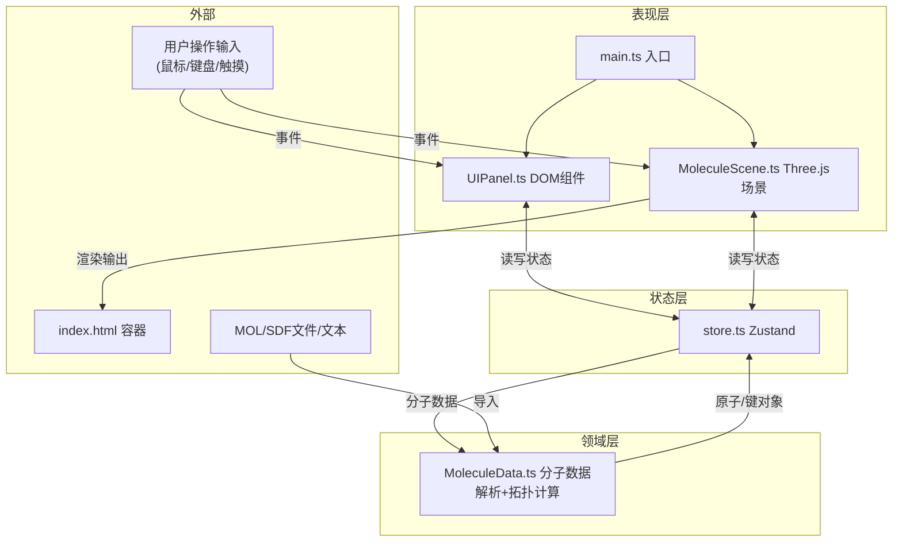
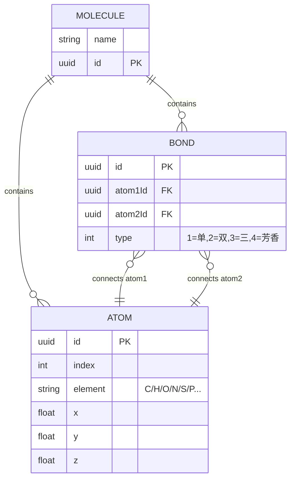

## 1. 架构设计



## 2. 技术描述
- **前端框架**：无（原生TypeScript模块化，不使用React/Vue，保持轻量以满足Three.js性能需求）
- **3D渲染引擎**：three@0.160.0（用户指定版本）
- **构建工具**：Vite@5（ESModule HMR，快速冷启动）
- **语言**：TypeScript@5（严格模式 strict:true）
- **状态管理**：zustand@4（轻量、跨模块通信、订阅更新）
- **辅助库**：uuid@9（生成原子/键唯一ID）
- **类型定义**：@types/three@0.160.0

## 3. 模块文件结构

```
auto64/
├── index.html                  # 全屏入口HTML，挂载#app与#canvas容器
├── package.json                # 依赖与脚本
├── tsconfig.json               # TS严格模式配置
├── vite.config.js              # Vite基础配置
└── src/
    ├── main.ts                 # 应用入口：场景+UI+store整合
    ├── MoleculeScene.ts        # Three.js场景管理类
    ├── MoleculeData.ts         # 分子解析与拓扑计算模块
    ├── store.ts                # Zustand全局状态
    └── UIPanel.ts              # DOM UI组件（左右面板）
```

### 各模块职责定义

#### 3.1 src/main.ts
- 创建Three.js Renderer并挂载到DOM
- 实例化MoleculeScene、初始化Zustand store默认数据
- 实例化UIPanel并传入store与scene引用
- 启动requestAnimationFrame主循环，调用scene.update()与render()
- 监听window.resize事件，调整渲染尺寸

#### 3.2 src/MoleculeScene.ts
```typescript
// 主要类
class MoleculeScene {
  scene: THREE.Scene
  camera: THREE.PerspectiveCamera
  renderer: THREE.WebGLRenderer
  controls: OrbitControls           // 自定义封装
  raycaster: THREE.Raycaster
  atomMeshes: Map<string, THREE.Mesh>  // atomId -> Mesh
  bondMeshes: Map<string, THREE.Group> // bondId -> Group(多圆柱)
  handleGroup: THREE.Group          // XYZ拖拽手柄
  selectedAtomId: string | null
  
  init(container: HTMLElement): void
  loadMolecule(atoms: AtomData[], bonds: BondData[]): void
  update(delta: number): void       // 弹簧动画、标签面向相机
  render(): void
  dispose(): void
  
  // 内部方法
  private createAtomMesh(element: string): THREE.Mesh
  private createBondCylinder(bond: BondData): THREE.Group
  private setupLights(): void
  private setupInteraction(): void   // 射线拾取、拖拽逻辑
  private showDragHandles(position: THREE.Vector3): void
  private hideDragHandles(): void
  private animateAtomTo(atomId: string, target: THREE.Vector3): void
}
```

#### 3.3 src/MoleculeData.ts
```typescript
// 类型定义
export interface AtomData {
  id: string
  index: number
  element: 'C' | 'H' | 'O' | 'N' | 'S' | 'P' | string
  x: number; y: number; z: number
}

export interface BondData {
  id: string
  atom1Id: string
  atom2Id: string
  type: 1 | 2 | 3 | 4  // 1单 2双 3三 4芳香
}

export interface MoleculeData {
  name: string
  atoms: AtomData[]
  bonds: BondData[]
}

// 主要API
export function parseMOL(text: string): MoleculeData
export function parseSDF(text: string): MoleculeData
export function toMOL(data: MoleculeData): string
export function calculateBondLength(a1: AtomData, a2: AtomData): number  // 埃
export function calculateBondAngle(
  center: AtomData, a1: AtomData, a2: AtomData
): number  // 度
export function findAdjacentAtoms(
  atomId: string, bonds: BondData[]
): string[]
export function recomputeBonds(
  atoms: AtomData[], threshold?: number
): BondData[]  // 基于距离阈值自动判断成键
```

#### 3.4 src/store.ts
```typescript
interface MoleculeStore {
  // 数据
  molecule: MoleculeData
  selectedAtomId: string | null
  bondEditMode: boolean
  firstBondAtomId: string | null
  selectedBondId: string | null
  
  // Actions
  setMolecule(mol: MoleculeData): void
  selectAtom(id: string | null): void
  updateAtomPosition(id: string, x:number,y:number,z:number): void
  toggleBondEditMode(): void
  setFirstBondAtom(id: string | null): void
  selectBond(id: string | null): void
  cycleBondType(bondId: string): void
  createBond(atom1Id: string, atom2Id: string, type?: 1|2|3|4): void
  importMOL(text: string): void
  exportMOL(): string
}

export const useMoleculeStore = create<MoleculeStore>((set, get) => ({ ... }))
```

#### 3.5 src/UIPanel.ts
```typescript
class UIPanel {
  container: HTMLElement
  store: typeof useMoleculeStore
  scene: MoleculeScene
  leftPanel: HTMLElement   // 原子列表
  rightPanel: HTMLElement  // 键编辑器
  atomListEl: HTMLElement
  bondInfoEl: HTMLElement
  
  constructor(root: HTMLElement, store, scene)
  build(): void            // 创建DOM结构+样式
  bindEvents(): void       // 监听store变化与用户输入
  updateAtomList(): void
  updateBondInfo(): void
  showToast(msg: string): void  // 导入成功/错误提示
  
  private createGlassPanel(...): HTMLElement
  private createAtomRow(atom: AtomData): HTMLElement
  private createBondTypeLegend(): HTMLElement
}
```

## 4. 数据模型

### 4.1 实体关系


### 4.2 元素配色表（内置于MoleculeScene.ts）
| 元素 | 十六进制 | RGB |
|------|----------|-----|
| C 碳 | #2d3436 | (45,52,54) |
| H 氢 | #ecf0f1 | (236,240,241) |
| O 氧 | #e74c3c | (231,76,60) |
| N 氮 | #3498db | (52,152,219) |
| S 硫 | #f1c40f | (241,196,15) |
| P 磷 | #e67e22 | (230,126,34) |
| 默认 | #9b59b6 | (155,89,182) |

### 4.3 原子半径表（用于球体半径比例）
| 元素 | 相对半径 | 视觉半径(Three.js单位) |
|------|----------|----------------------|
| H | 0.31 | 0.25 |
| C | 0.76 | 0.40 |
| N | 0.71 | 0.38 |
| O | 0.66 | 0.36 |
| S | 1.05 | 0.50 |
| P | 1.07 | 0.50 |

## 5. 关键算法与实现要点

### 5.1 MOL文件解析（V2000格式）
- 逐行读取，第4行获取原子数+键数（aaabbb...）
- 4+(1..aaa)行：坐标(x,y,z)、元素符号
- 4+aaa+(1..bbb)行：两原子序号（1基）、键类型
- 使用正则提取数字字段，原子index与id对应

### 5.2 多键圆柱布局
- 单键：1条居中圆柱
- 双键：2条平行圆柱，偏移±0.08Å，方向=键方向×世界上方向
- 三键：3条平行圆柱，偏移-0.12/0/+0.12Å
- 芳香键：虚线/波浪圆柱或交替单双键样式，半透明紫色
- 圆柱通过Matrix4.compose(位置+四元数旋转+缩放)放置

### 5.3 原子标签面向相机
- 使用CSS2DRenderer（three/examples/jsm/renderers/CSS2DRenderer）
- 每个原子对应一个CSS2DObject，内部div显示元素符号
- CSS2DRenderer自动处理Billboarding（始终面向相机）

### 5.4 射线拾取
- 鼠标事件归一化到NDC坐标(-1,1)
- Raycaster.setFromCamera()发射射线
- 与atomMeshes.values()做intersectObjects
- 命中最近的mesh即为选中原子

### 5.5 弹簧动画（原子拖拽）
```typescript
// 每帧更新:
currentPos.lerp(targetPos, 0.15)  // 线性插值模拟弹簧
// velocity用于回弹，简化版可用lerp + damping
```

### 5.6 键切换闪烁动画
```css
@keyframes bondFlash {
  0%   { opacity: 0.3; scale: 0.9; }
  40%  { opacity: 1.0; scale: 1.15; }
  100% { opacity: 0.85; scale: 1.0; }
}
```

## 6. 性能保障策略
1. **InstancedMesh（可选优化）**：同元素原子使用InstancedMesh批量绘制
2. **材质共享**：同元素原子共享同一MeshStandardMaterial实例
3. **DPR限制**：renderer.setPixelRatio(Math.min(window.devicePixelRatio, 2))
4. **隐藏剔除**：拖拽手柄未选中时.visible=false
5. **矩阵自动更新**：静态物体设置matrixAutoUpdate=false
6. **FPS监测**：main循环每100帧计算平均FPS，低于25时自动降级DPR至1
