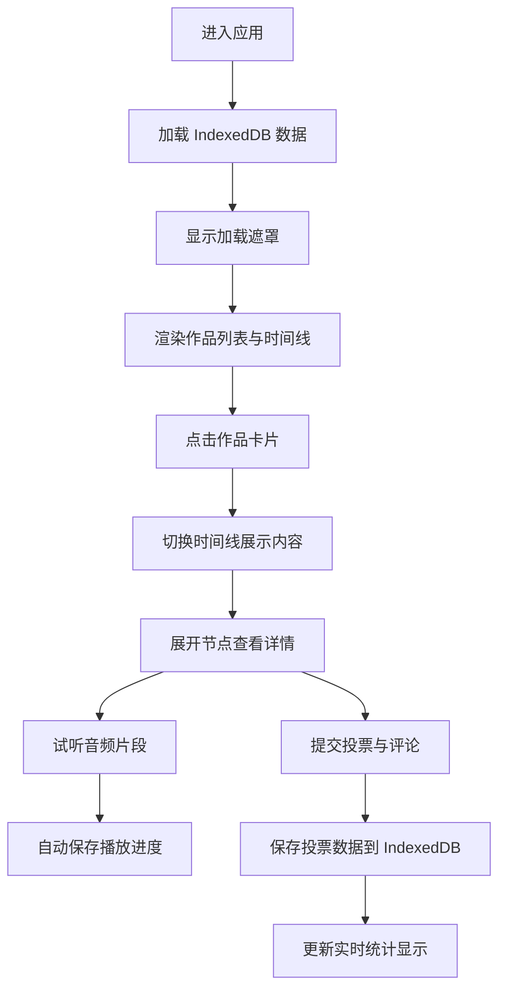

# TrackTales 产品需求文档

## 1. 产品概述

TrackTales 是一款面向小型独立乐队的歌曲创作历程管理与粉丝互动应用。乐迷可以追踪每首歌的创作历程、试听预览音频片段，并对未发布 demo 进行投票反馈，帮助乐队了解粉丝喜好。

- **核心价值**：拉近乐队与粉丝的距离，让粉丝参与到音乐创作过程中
- **目标用户**：独立乐队及其粉丝群体
- **解决问题**：提供透明的创作过程展示渠道，收集粉丝反馈数据

## 2. 核心功能

### 2.1 用户角色

| 角色 | 注册方式 | 核心权限 |
|------|----------|----------|
| 粉丝用户 | 无需注册，本地存储 | 浏览作品时间线、试听音频、提交投票与评论 |

### 2.2 功能模块

1. **作品时间线**：纵向时间轴展示歌曲创作历程里程碑
2. **音频试听**：30秒以内音频预览片段播放
3. **投票反馈**：五星评分与评论系统
4. **作品列表与过滤**：左侧边栏歌曲卡片网格与筛选
5. **数据持久化**：IndexedDB 本地存储与状态恢复

### 2.3 页面详情

| 页面名称 | 模块名称 | 功能描述 |
|----------|----------|----------|
| 主页面 | 左侧作品列表 | 卡片网格展示所有作品封面，支持状态和日期范围过滤 |
| 主页面 | 右侧时间线 | 纵向时间轴展示选中歌曲的创作里程碑事件 |
| 时间线节点 | 详情卡片 | 展开显示创作描述、日期、状态标签、试听按钮、投票组件 |
| 音频播放器 | 播放控制 | 波形进度条、播放/暂停、圆形滑块旋钮、淡入淡出切换 |
| 投票组件 | 评分交互 | 五颗星评分、波浪式填满动画、评论输入、实时统计 |

## 3. 核心流程

用户进入应用 → 加载 IndexedDB 中存储的数据 → 显示加载遮罩 → 左侧展示作品列表 → 点击作品卡片 → 右侧时间线展示该歌曲创作历程 → 展开节点卡片查看详情 → 点击播放试听音频 → 提交评分与评论 → 数据自动保存到 IndexedDB

## 4. 用户界面设计

### 4.1 设计风格

- **主背景色**：深灰蓝 `#1a1a2e`
- **卡片背景**：半透明深紫灰色 `rgba(38, 38, 60, 0.9)`
- **文字主色**：浅灰白 `#e0e0e0`
- **强调色**：琥珀金 `#ffb347`（按钮、链接、评分星星）
- **草稿状态**：灰色渐变胶囊标签
- **已发布状态**：琥珀色渐变胶囊标签
- **圆角**：统一 12px
- **视觉效果**：毛玻璃背景、微弱阴影、渐变虚线连接

### 4.2 页面设计概述

| 页面名称 | 模块名称 | UI 元素 |
|----------|----------|---------|
| 主页面 | 左侧边栏 | 固定宽度 260px、卡片网格、筛选控件、悬停上浮效果 |
| 主页面 | 右侧内容区 | 自适应宽度、纵向时间轴、节点卡片、渐变虚线 |
| 时间线节点 | 节点卡片 | 可展开/收起、放大动画、状态胶囊、试听按钮 |
| 音频播放器 | 播放控件 | 波形进度条、淡蓝色脉冲光晕、圆形滑块旋钮 |
| 投票组件 | 评分星星 | 悬停放大、波浪式填色动画、计数滚动动画 |
| 评论区 | 评论气泡 | 底部弹入动画、气泡样式、200字限制 |

### 4.3 响应式

- 桌面端（>768px）：左右布局，左侧边栏 260px 固定宽度
- 移动端（≤768px）：左侧边栏折叠为底部导航栏，时间线改为横向卡片滑动
- 触摸优化：按钮尺寸增大，手势滑动支持

### 4.4 动画与交互

- 卡片展开：中心放大，周围节点缩小透明化
- 播放切换：淡出旧音频，淡入新音频
- 评分动画：星星波浪式依次填满
- 计数更新：数字向上滚动动画
- 评论出现：从底部弹入
- 过滤切换：交叉淡入淡出过渡
- 加载遮罩：旋转音符图标，缩放消失
