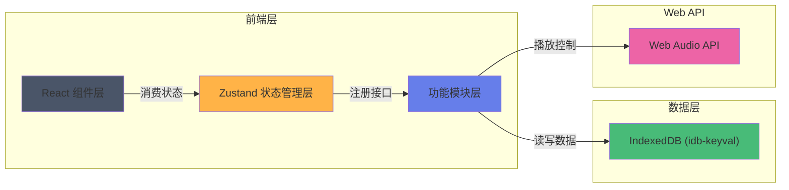
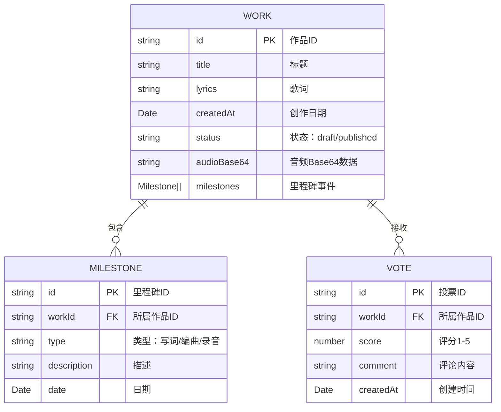

# TrackTales 技术架构文档

## 1. 架构设计



## 2. 技术描述

- **前端框架**：React@18 + TypeScript + Vite
- **状态管理**：zustand
- **数据存储**：IndexedDB（idb-keyval）
- **路由**：react-router-dom@6
- **工具库**：uuid、date-fns
- **音频处理**：Web Audio API
- **样式方案**：CSS Modules / 内联样式（按需）
- **构建工具**：Vite

## 3. 路由定义

| 路由 | 用途 |
|------|------|
| `/` | 主页，展示作品列表与时间线 |
| `/song/:id` | 歌曲详情页，展示指定歌曲时间线 |

## 4. 文件结构与模块关系

```
src/
├── modules/
│   ├── works/
│   │   ├── WorksManager.ts        # 作品数据管理（增删改查）
│   │   └── WorksTimeline.tsx      # 时间线展示组件
│   ├── audio/
│   │   └── AudioPlayer.ts         # 音频播放模块（Web Audio API）
│   └── vote/
│       └── VoteManager.ts         # 投票数据管理
├── store/
│   └── useAppStore.ts             # Zustand 全局状态
├── utils/
│   └── constants.ts               # 常量定义
├── components/
│   ├── Sidebar.tsx                # 左侧边栏
│   ├── SongCard.tsx               # 歌曲卡片
│   ├── TimelineNode.tsx           # 时间线节点
│   ├── AudioPlayerUI.tsx          # 音频播放器 UI
│   ├── StarRating.tsx             # 星级评分组件
│   └── LoadingMask.tsx            # 加载遮罩
├── pages/
│   └── HomePage.tsx               # 主页
├── App.tsx                        # 应用根组件
└── main.tsx                       # 入口文件
```

### 模块调用关系与数据流向

```
WorksTimeline.tsx (UI)
    ↓ 读取作品列表
WorksManager.ts (数据层)
    ↓ 读写
Zustand Store
    ↓ 持久化
IndexedDB (idb-keyval)

WorksTimeline.tsx
    ↓ 调用播放/暂停
AudioPlayer.ts (Web Audio API)
    ↓ 返回播放状态/进度
WorksTimeline.tsx

WorksTimeline.tsx
    ↓ 提交投票
VoteManager.ts (数据层)
    ↓ 计算统计/持久化
Zustand Store + IndexedDB
    ↓ 更新统计结果
WorksTimeline.tsx
```

## 5. 数据模型

### 5.1 数据模型定义



### 5.2 IndexedDB 存储结构

| Store 名称 | Key | Value 类型 | 说明 |
|------------|-----|------------|------|
| works | id | Work | 作品数据 |
| votes | id | Vote | 投票记录 |
| appState | key | any | 应用状态（最后查看的歌曲等） |

## 6. 性能约束

- **IndexedDB 读取**：首次加载 500ms 内完成
- **动画帧率**：时间线滚动和展开动画 ≥ 45FPS
- **音频切换**：播放切换延迟 ≤ 200ms
- **数据同步**：状态变更即时更新 UI

## 7. 初始化数据

应用首次启动时，预置 3-5 首示例歌曲数据，包含：
- 不同创作状态（草稿/已发布）
- 多个里程碑事件
- Base64 编码的短音频片段
- 若干投票记录用于展示统计效果
