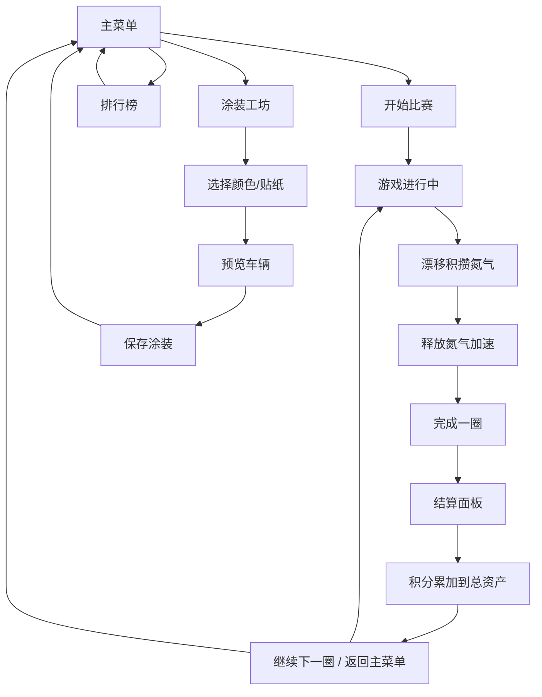
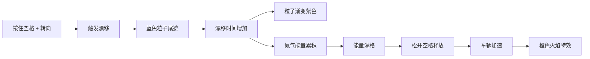

## 1. 产品概述

DriftCraft 是一款 2D 俯视视角的赛车漂移与自定义涂装游戏。玩家在蜿蜒的山路上驾驶卡丁车，通过精准的漂移过弯积累氮气加速，并用比赛赚取的积分自由定制车辆外观。

- **核心玩法**：漂移积攒氮气 → 释放氮气加速 → 完成圈数获取积分 → 积分解锁涂装
- **目标用户**：休闲游戏玩家、赛车游戏爱好者
- **产品价值**：提供爽快的漂移手感和丰富的自定义涂装系统，满足玩家竞技与个性化需求

## 2. 核心功能

### 2.1 功能模块

1. **主菜单**：霓虹紫色卡片布局，包含开始比赛、涂装工坊、排行榜三个入口
2. **游戏场景**：俯视赛道、车辆控制、漂移机制、氮气加速、粒子特效
3. **结算面板**：圈速统计、漂移积分、氮气使用次数、积分结算
4. **涂装工坊**：8 种基础颜色、4 种贴纸图案、车辆 360° 预览
5. **排行榜**：历史最佳圈速排名
6. **数据持久化**：使用 IndexedDB 保存涂装、积分、排行榜数据

### 2.2 页面详情

| 页面名称 | 模块名称 | 功能描述 |
|---------|---------|---------|
| 主菜单 | 动态背景 | 深蓝到紫红循环流动的渐变背景 |
| 主菜单 | 菜单卡片 | 霓虹紫色圆角卡片，三个功能入口，弹性缩放开机动画 |
| 游戏场景 | 赛道渲染 | 蜿蜒灰色柏油路、深绿色草地、红白路肩 |
| 游戏场景 | 车辆控制 | WASD 控制移动，空格键触发漂移 |
| 游戏场景 | 漂移系统 | 蓝色渐变紫色粒子尾迹，按时长累积氮气 |
| 游戏场景 | 氮气加速 | 弧形光晕能量条，释放时橙色火焰特效 |
| 结算面板 | 统计面板 | 毛玻璃半透明背景，显示圈速、积分、氮气次数 |
| 涂装工坊 | 车辆预览 | 可鼠标拖拽旋转的车辆预览图 |
| 涂装工坊 | 颜色选择 | 8 种基础颜色，即时更新车辆外观 |
| 涂装工坊 | 贴纸选择 | 4 种贴纸图案（火焰纹、闪电、骷髅、星形） |
| 排行榜 | 排名列表 | 历史最佳圈速排名展示 |

## 3. 核心流程

### 3.1 游戏主流程

### 3.2 漂移与氮气机制

## 4. 用户界面设计

### 4.1 设计风格

- **主色调**：霓虹紫（#9333ea）、深靛蓝（#1e1b4b）、橙色火焰（#f97316）
- **辅助色**：森林绿（#166534）、路肩红（#ef4444）、路肩白（#ffffff）
- **字体**：Orbitron（标题/数字）、Inter（正文）
- **按钮风格**：圆角胶囊按钮，霓虹发光边框，hover 时弹性缩放
- **视觉风格**：赛博朋克 + 霓虹风格，深色森林主题赛道
- **动效风格**：流畅过渡动画（< 200ms）、粒子特效、光晕效果

### 4.2 页面设计概览

| 页面名称 | 模块名称 | UI 元素 |
|---------|---------|---------|
| 主菜单 | 背景 | 动态渐变流动效果（深蓝→紫红） |
| 主菜单 | 标题 | DriftCraft 霓虹发光 LOGO |
| 主菜单 | 卡片组 | 三个紫色圆角卡片，含图标和标题，弹性缩放开机动画 |
| 游戏场景 | HUD | 左上角圈数/时间，下方氮气弧形能量条 |
| 游戏场景 | 赛道 | 灰色柏油路 + 深绿草地 + 红白路肩 |
| 游戏场景 | 车辆 | 白色卡丁车，漂移时蓝色尾迹，氮气时橙色火焰 |
| 结算面板 | 面板 | 毛玻璃效果，圆角，居中显示 |
| 结算面板 | 数据 | 大字号数字，动画计数效果 |
| 涂装工坊 | 布局 | 左侧车辆预览，右侧选项面板 |
| 涂装工坊 | 颜色区 | 8 个圆形颜色选择器，选中时发光边框 |
| 涂装工坊 | 贴纸区 | 4 个贴纸缩略图，点击切换 |

### 4.3 响应式设计

- **设计优先**：Desktop-first，针对 1920×1080 和 1280×720 优化
- **画布适配**：Canvas 等比缩放，保持游戏画面比例
- **UI 适配**：使用 CSS 变量和响应式单位，在两种分辨率下完美适配
- **触控优化**：桌面端键盘操作，无需触控适配

### 4.4 性能要求

- **帧率**：游戏循环稳定 30FPS 以上
- **粒子数量**：漂移粒子不超过 100 个，避免卡顿
- **涂装切换**：动画延迟不大于 100ms
- **内存管理**：粒子对象池复用，避免频繁 GC
