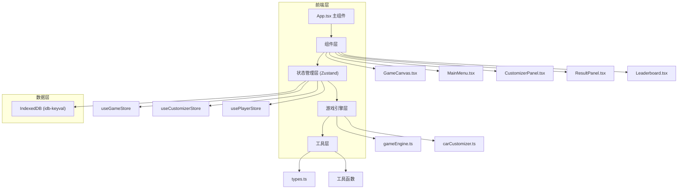
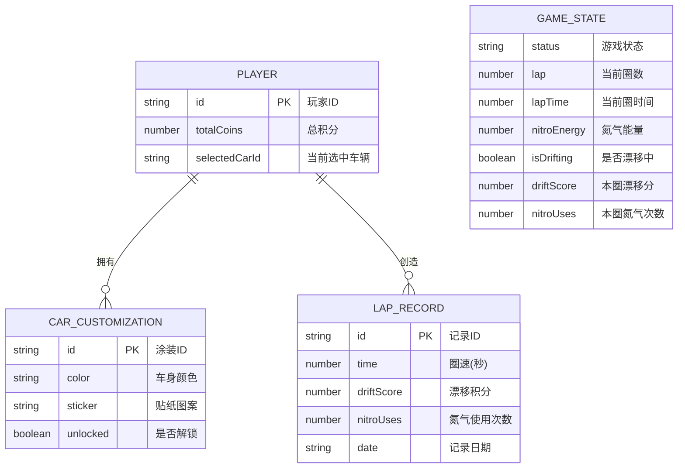

## 1. 架构设计



## 2. 技术描述

### 2.1 核心技术栈

| 分类 | 技术选型 | 版本 | 说明 |
|------|---------|------|------|
| 构建工具 | Vite | latest | 快速开发构建 |
| 框架 | React | 18 | UI 框架 |
| 语言 | TypeScript | latest | 类型安全 |
| 状态管理 | Zustand | latest | 轻量级状态管理 |
| 数据持久化 | idb-keyval | latest | IndexedDB 封装 |
| 唯一ID | uuid | latest | 生成唯一标识 |
| 样式 | CSS Modules / 内联样式 | - | 组件样式 |

### 2.2 关键技术决策

1. **Canvas 2D 渲染**：使用 HTML5 Canvas 绘制游戏场景，性能优于 DOM 操作
2. **requestAnimationFrame**：游戏主循环使用 RAF，确保流畅动画
3. **对象池模式**：粒子系统使用对象池复用，减少 GC 压力
4. **Zustand 状态分片**：按游戏、涂装、玩家数据分 store，避免单点臃肿
5. **IndexedDB 持久化**：使用 idb-keyval 简化 IndexedDB 操作
6. **物理简化**：2D 俯视赛车物理，简化为速度、转向、摩擦力模型

## 3. 页面路由

| 路径 | 组件 | 说明 |
|------|------|------|
| / | MainMenu | 主菜单 |
| /game | GameCanvas | 游戏场景 |
| /customize | CustomizerPanel | 涂装工坊 |
| /leaderboard | Leaderboard | 排行榜 |

> 注：使用 React Router 或简单的状态切换实现页面导航

## 4. 数据模型

### 4.1 数据实体



### 4.2 IndexedDB 存储结构

| Store 名称 | Key | 存储内容 |
|-----------|-----|---------|
| player | 'player' | 玩家数据（总积分、当前涂装） |
| customizations | id | 所有解锁的涂装配置 |
| lapRecords | id | 圈速记录 |

## 5. 核心模块说明

### 5.1 gameEngine.ts

游戏引擎核心，负责：
- 车辆物理模拟（速度、加速度、转向、摩擦力）
- 漂移检测与氮气累积计算
- 粒子系统管理（生成、更新、回收）
- 赛道碰撞检测
- 圈数判定

### 5.2 carCustomizer.ts

涂装管理模块，负责：
- 颜色与贴纸选项管理
- 涂装数据验证
- 涂装应用与预览
- 解锁状态管理

### 5.3 GameCanvas.tsx

游戏渲染组件：
- Canvas 初始化与尺寸适配
- 赛道绘制（路、草地、路肩）
- 车辆绘制（车身、贴纸、轮胎）
- 粒子特效绘制
- HUD 绘制（圈数、时间、氮气条）
- 输入事件处理（键盘监听）

### 5.4 CustomizerPanel.tsx

涂装工坊组件：
- 车辆预览（Canvas 绘制可旋转车辆）
- 颜色选择器
- 贴纸选择器
- 预览旋转交互（鼠标拖拽）

## 6. 文件结构

```
src/
├── types.ts              # 类型定义
├── App.tsx               # 主组件
├── main.tsx              # 入口文件
├── index.css             # 全局样式
├── store/
│   ├── useGameStore.ts   # 游戏状态
│   ├── useCustomizerStore.ts  # 涂装状态
│   └── usePlayerStore.ts      # 玩家数据
├── engine/
│   ├── gameEngine.ts     # 游戏引擎
│   └── carCustomizer.ts  # 涂装逻辑
├── components/
│   ├── GameCanvas.tsx    # 游戏画布
│   ├── MainMenu.tsx      # 主菜单
│   ├── CustomizerPanel.tsx   # 涂装面板
│   ├── ResultPanel.tsx   # 结算面板
│   └── Leaderboard.tsx   # 排行榜
└── utils/
    ├── db.ts             # IndexedDB 封装
    └── helpers.ts        # 工具函数
```
