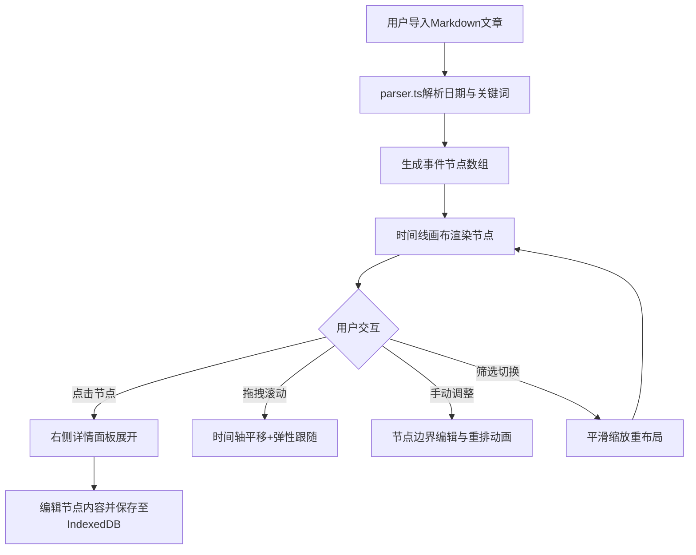

## 1. 产品概述

面向独立博客作者的交互式时间线文章重组工具，解决传统线性阅读难以把握事件脉络、多篇章间关联不直观的痛点。通过智能解析Markdown文章中的日期和关键词，自动拆解为事件节点并以可交互时间线视图呈现，支持多文章关联对比，帮助读者快速理解事件发展脉络。

- 目标用户：独立博客作者、内容创作者、技术文档维护者
- 核心价值：将线性文本转化为可交互的时间叙事，提升长文阅读效率与理解深度

## 2. 核心功能

### 2.1 功能模块

1. **文章导入与解析页**：Markdown文本粘贴/文件上传、智能解析、节点编辑
2. **时间线画布页**：横向时间轴、事件节点可视化、拖拽交互、详情展开
3. **多文章关联视图**：多文章合并时间线、筛选切换、全局排序

### 2.2 页面详情

| 页面名称 | 模块名称 | 功能描述 |
|---------|---------|---------|
| 主界面 | 左侧功能区面板 | 文章导入按钮（渐变填充+悬停扫光）、已导入文章列表、筛选下拉器，毛玻璃效果，宽280px |
| 主界面 | 中央时间线画布 | 横向时间轴（浅灰渐变实线）、圆形节点徽章（蓝/绿/橙三色）、半透明弧形虚线连接、拖拽滚动、弹性跟随动画 |
| 主界面 | 右侧详情面板 | 选中节点完整原文展示、渐入展开动画、编辑与重新保存功能 |
| 主界面 | 顶部筛选器 | 文章筛选下拉、单篇/全部切换、切换时平滑缩放重布局（300ms/30FPS） |

## 3. 核心流程

用户导入Markdown文章 → 系统解析日期标记与关键词 → 自动拆解为事件节点 → 横向时间轴渲染节点 → 用户点击节点查看详情 → 用户可拖拽调整节点 → 导入多篇文章后切换关联视图

## 4. 用户界面设计

### 4.1 设计风格

- 主背景色：#F8F9FA（浅灰白）
- 时间轴线色：#DEE2E6（浅灰）
- 节点徽章色：#4A90D9（里程碑/蓝）、#27AE60（成果/绿）、#E67E22（迭代/橙）
- 选中强调色：#FF6B6B（珊瑚红）
- 字体：标题使用 Noto Serif SC（衬线体），正文使用 Noto Sans SC（无衬线体）
- 布局：三栏式，左侧功能面板 + 中央画布 + 右侧详情
- 按钮风格：圆角8px，文章导入按钮使用渐变填充
- 动效风格：弹性缓动、渐入渐出、过渡时长150-300ms

### 4.2 页面设计概览

| 页面名称 | 模块名称 | UI元素 |
|---------|---------|--------|
| 主界面 | 左侧功能区 | 毛玻璃背景（backdrop-filter: blur）、渐变导入按钮、文章列表卡片、筛选下拉 |
| 主界面 | 中央时间线 | 横向灰线、圆形徽章（直径28px）、弧形虚线连接、节点悬浮卡片 |
| 主界面 | 右侧详情面板 | 白色卡片、从上到下渐入动画、编辑按钮、原文Markdown渲染 |

### 4.3 响应式设计

- **≥1200px**：完整三栏布局，左侧面板常驻
- **768-1200px**：隐藏左侧面板，改为顶部可折叠菜单，时间线画布全宽
- **<768px**：纵向堆叠布局，节点卡片缩小为紧凑卡片，时间轴改为纵向

### 4.4 性能要求

- 5000字文章解析后时间线渲染 ≤ 800ms
- 动画帧率稳定 ≥ 30FPS
- 节点重排过渡 ≤ 300ms
- 节点识别精度 ≥ 85%
