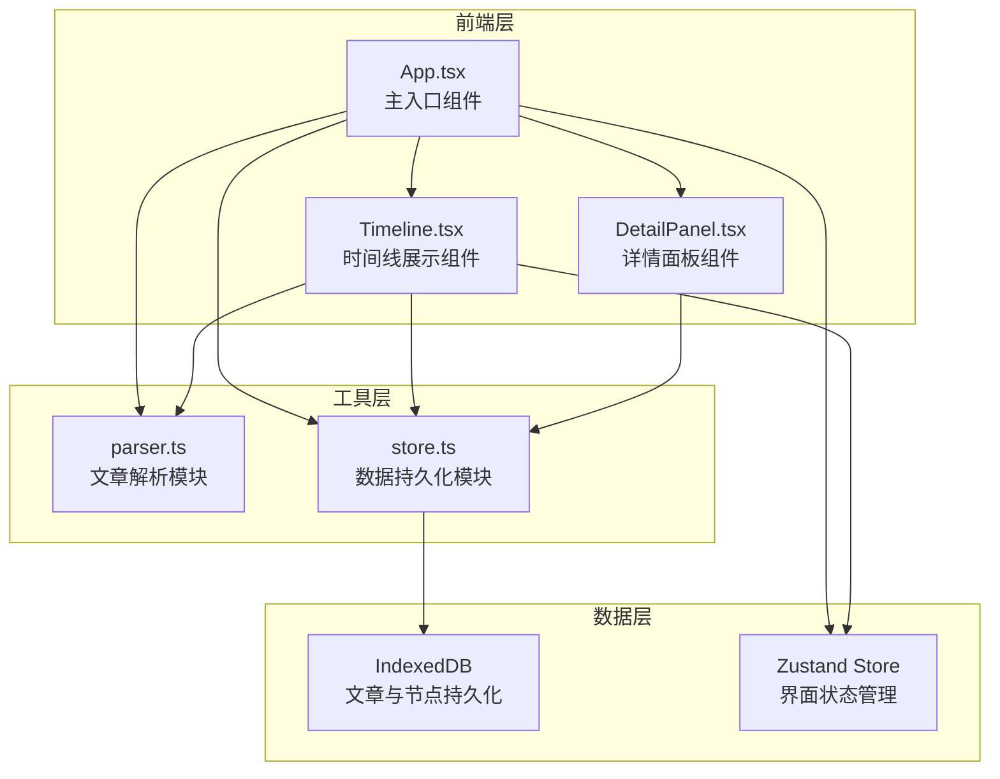
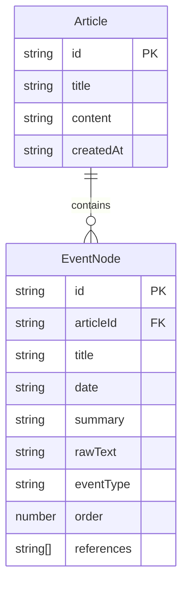

## 1. 架构设计

## 2. 技术说明

- 前端：React@18 + TypeScript + Vite
- 状态管理：Zustand（界面状态、时间线布局状态）
- 数据持久化：IndexedDB（通过 idb-keyval 封装）
- 样式方案：CSS Modules + CSS Variables
- Markdown解析：marked
- 日期处理：date-fns
- 唯一标识：uuid
- 初始化工具：vite-init（react-ts 模板）

## 3. 路由定义

本项目为单页面应用，无路由切换，所有功能集成在同一页面内。

| 路由 | 用途 |
|------|------|
| / | 主界面，包含文章导入、时间线、详情面板 |

## 4. 数据模型

### 4.1 数据模型定义

### 4.2 数据定义

**Article 数据结构：**
- id: string（uuid生成）
- title: string（文章标题）
- content: string（原始Markdown文本）
- createdAt: string（导入时间 ISO格式）

**EventNode 数据结构：**
- id: string（uuid生成）
- articleId: string（关联文章ID）
- title: string（节点标题）
- date: string（事件日期，YYYY-MM-DD格式）
- summary: string（事件摘要）
- rawText: string（原文片段）
- eventType: 'milestone' | 'achievement' | 'iteration'（事件类型）
- order: number（排序序号）
- references: string[]（引用的其他节点ID）

### 4.3 Zustand Store 结构

**界面状态：**
- selectedNodeId: string | null（当前选中节点）
- activeArticleFilter: string | 'all'（文章筛选）
- leftPanelCollapsed: boolean（左侧面板折叠状态）
- detailPanelOpen: boolean（详情面板展开状态）

**时间线布局状态：**
- scrollOffset: number（水平滚动偏移）
- zoomLevel: number（缩放级别）
- nodePositions: Map<string, {x: number, y: number}>（节点位置映射）

## 5. 文件组织

| 文件路径 | 职责 |
|---------|------|
| src/tools/parser.ts | 接收Markdown文本，解析日期和关键词切割事件节点，返回节点数组 |
| src/tools/store.ts | 管理IndexedDB操作：saveArticle、loadArticle、getAllEvents |
| src/components/Timeline.tsx | 渲染横向时间轴和事件节点，处理拖拽滚动、点击展开 |
| src/components/DetailPanel.tsx | 展示选中节点完整原文，支持编辑和重新保存 |
| src/App.tsx | 组装左侧面板、时间线和详情面板，管理导入和筛选的顶层状态 |
| src/types.ts | 全局类型定义 |

## 6. 关键算法

### 6.1 文章解析算法

1. 使用正则匹配日期标记（YYYY-MM-DD、YYYY年MM月DD日等格式）
2. 扫描关键词（发布、达成、里程碑、完成、上线、发布等）确定事件类型
3. 以日期标记为分割点将文章切分为段落
4. 每个段落提取标题（首个标题行或日期行）、摘要（前100字）、原文片段
5. 按日期排序生成节点数组
6. 扫描段落间的引用关系（"如前文所述"、"参见"等）建立连接

### 6.2 多文章合并算法

1. 收集所有文章的EventNode
2. 按date字段进行全局时间排序
3. 为每篇文章分配不同颜色的标签条
4. 保留文章归属信息用于筛选
