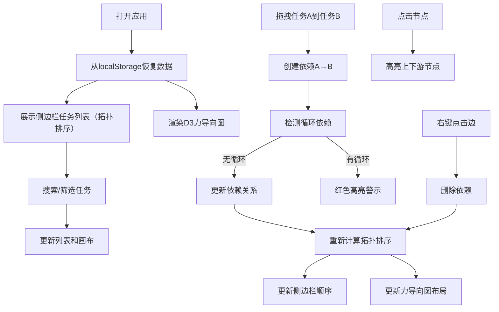

## 1. 产品概述

任务依赖看板应用，通过可视化图形展示任务之间的前置依赖关系，支持拖拽调整依赖来动态更新任务排期。帮助项目管理者直观理解任务依赖链，优化项目排期。

- 核心功能：任务卡片管理、依赖关系可视化编辑、拓扑排序自动计算、任务筛选搜索、本地持久化存储
- 目标用户：项目经理、团队负责人、需要管理复杂任务依赖的个人用户
- 产品价值：降低任务排期复杂度，避免循环依赖，提高项目管理效率

## 2. 核心功能

### 2.1 用户角色

| 角色 | 注册方式 | 核心权限 |
|------|----------|----------|
| 普通用户 | 无需注册，本地使用 | 创建/编辑/删除任务，管理依赖关系，筛选搜索，数据持久化 |

### 2.2 功能模块

1. **侧边栏任务管理**：任务列表展示、新增/编辑/删除任务、搜索过滤、状态筛选、拓扑排序展示
2. **力导向图画布**：D3力导向图展示任务节点和依赖边、节点拖拽定位、边删除
3. **依赖关系管理**：拖拽创建依赖、右键删除依赖、循环依赖检测与警示
4. **交互高亮系统**：节点点击高亮上下游、悬停效果、状态颜色区分
5. **数据持久化**：localStorage存储、一键清空重置

### 2.3 页面详情

| 页面名称 | 模块名称 | 功能描述 |
|-----------|-------------|---------------------|
| 主页面 | 侧边栏 | 任务卡片列表、搜索框、筛选按钮、新增/重置按钮 |
| 主页面 | 力导向图画布 | D3力导向图渲染、节点拖拽、边交互、箭头标记 |
| 主页面 | 任务卡片 | 名称编辑、状态切换、截止日期设置、删除按钮、拖拽起点 |

## 3. 核心流程

用户打开应用 → 从localStorage恢复数据（首次访问加载示例数据） → 在侧边栏查看拓扑排序的任务列表 → 通过搜索/筛选定位任务 → 拖拽任务卡片到另一卡片创建依赖 → 画布实时更新力导向图 → 系统自动计算拓扑排序并更新侧边栏顺序 → 发现循环依赖时红色高亮警示 → 点击节点查看上下游依赖链 → 右键删除不需要的依赖 → 所有操作自动保存到localStorage

## 4. 用户界面设计

### 4.1 设计风格

- 主背景：深灰（#1a1a2e）到藏蓝（#16213e）的线性渐变
- 主题色：青色（#0f9b8e）作为主色调，用于边框、箭头、交互高亮
- 辅助色：蓝色（#3b82f6）用于下游节点高亮，橙色（#f97316）用于上游节点高亮，红色（#ef4444）用于循环依赖警示
- 卡片样式：半透明磨砂玻璃效果（background: rgba(255,255,255,0.05)，backdrop-filter: blur(10px)），1px青色边框，8px圆角
- 按钮：悬停时缩放1.05倍，颜色加深，平滑过渡动画
- 字体：选用具有现代感的无衬线字体，标题加粗，正文适中

### 4.2 页面设计概述

| 页面名称 | 模块名称 | UI元素 |
|-----------|-------------|-------------|
| 主页面 | 侧边栏 | 磨砂玻璃背景、30%宽度、可拖拽调整、顶部搜索框、筛选按钮组、任务卡片列表（可滚动）、底部操作按钮 |
| 主页面 | 分割线 | 3px宽度、悬停高亮、可横向拖拽调整比例 |
| 主页面 | 画布区域 | 70%宽度、SVG力导向图、节点为圆角矩形、边为带箭头的曲线、右键菜单 |
| 主页面 | 任务卡片 | 任务名称（可编辑）、状态标签（颜色区分）、截止日期、删除按钮、拖拽手柄 |

### 4.3 响应式

- 桌面端（>768px）：侧边栏与画布3:7分割，可拖拽调整宽度
- 移动端（≤768px）：侧边栏折叠为顶部工具栏，画布全屏显示，任务列表通过抽屉方式展示

### 4.4 动画与交互

- 节点拖拽：弹性过渡动画（cubic-bezier(0.34, 1.56, 0.64, 1)）
- 按钮悬停：transform: scale(1.05) + 颜色加深
- 力导向图：节点碰撞检测，自然斥力布局
- 高亮效果：平滑的颜色过渡动画（0.3s ease）
- 边删除：淡出动画效果
