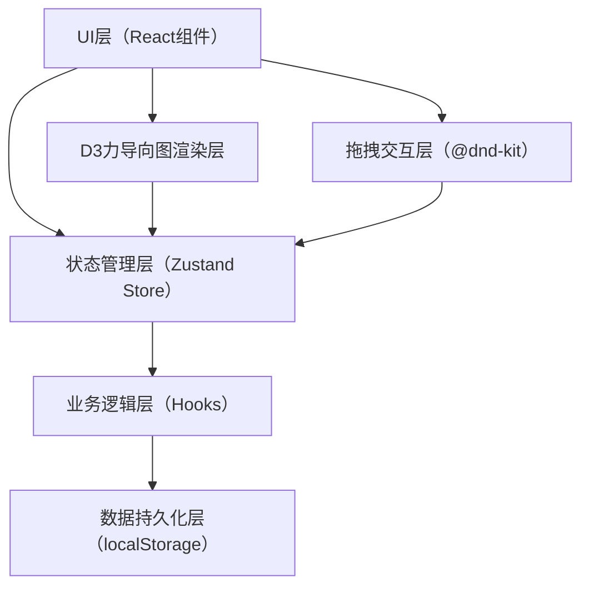
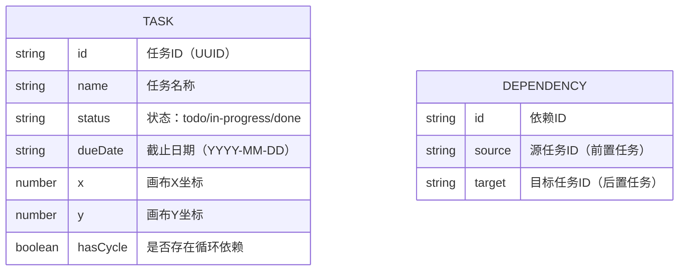

## 1. 架构设计



## 2. 技术描述

- 前端框架：React@18 + TypeScript
- 构建工具：Vite 5.x
- 状态管理：Zustand（自定义useTaskStore Hook）
- 拖拽库：@dnd-kit/core + @dnd-kit/sortable
- 图形库：d3-force（力导向图布局）
- 唯一ID：uuid
- 样式方案：纯CSS + CSS变量主题系统
- 数据持久化：localStorage

## 3. 项目文件结构

```
auto7/
├── package.json              # 项目依赖配置
├── vite.config.js            # Vite构建配置
├── tsconfig.json             # TypeScript配置
├── index.html                # HTML入口文件
└── src/
    ├── main.tsx              # 应用入口
    ├── App.tsx               # 根组件
    ├── styles.css            # 全局样式
    ├── components/
    │   ├── TaskCard.tsx      # 任务卡片组件
    │   └── DependencyGraph.tsx # 依赖图组件
    └── hooks/
        └── useTaskStore.ts   # 任务状态管理Hook
```

## 4. 数据模型

### 4.1 数据结构定义



### 4.2 TypeScript类型定义

```typescript
type TaskStatus = 'todo' | 'in-progress' | 'done';

interface Task {
  id: string;
  name: string;
  status: TaskStatus;
  dueDate: string;
  x: number;
  y: number;
  hasCycle?: boolean;
}

interface Dependency {
  id: string;
  source: string;
  target: string;
}

interface TaskStore {
  tasks: Task[];
  dependencies: Dependency[];
  highlightedTaskId: string | null;
  searchQuery: string;
  statusFilter: 'all' | TaskStatus;
  // 操作方法
  addTask: (task: Omit<Task, 'id' | 'x' | 'y'>) => void;
  updateTask: (id: string, updates: Partial<Task>) => void;
  deleteTask: (id: string) => void;
  addDependency: (source: string, target: string) => void;
  removeDependency: (id: string) => void;
  topologicalSort: () => Task[];
  detectCycles: () => string[];
  getDownstreamTasks: (taskId: string) => string[];
  getUpstreamTasks: (taskId: string) => string[];
  setHighlightedTask: (id: string | null) => void;
  setSearchQuery: (query: string) => void;
  setStatusFilter: (filter: 'all' | TaskStatus) => void;
  resetAll: () => void;
  loadFromStorage: () => void;
  saveToStorage: () => void;
}
```

## 5. 核心算法

### 5.1 拓扑排序算法（Kahn算法）

1. 计算每个节点的入度
2. 将入度为0的节点加入队列
3. 依次取出节点，减少其相邻节点的入度
4. 若相邻节点入度变为0，加入队列
5. 若最终输出节点数小于总节点数，说明存在环

### 5.2 循环依赖检测

1. 使用DFS遍历，维护访问状态（未访问/访问中/已访问）
2. 若遇到"访问中"的节点，说明存在环
3. 回溯时标记为"已访问"
4. 返回所有参与环的节点ID

### 5.3 上下游节点查找

- 下游节点（依赖当前任务的任务）：从当前节点出发，沿着依赖边方向BFS遍历
- 上游节点（当前任务依赖的任务）：从当前节点出发，逆着依赖边方向BFS遍历

## 6. 关键技术点

### 6.1 D3力导向图配置

- forceManyBody：节点间斥力（-300）
- forceLink：边的张力（0.6），距离（150）
- forceCollide：节点碰撞检测（半径80）
- forceCenter：画布中心引力
- d3.drag：节点拖拽行为

### 6.2 @dnd-kit拖拽配置

- DndContext包裹整个应用
- useDraggable：TaskCard作为拖拽源
- 拖拽结束时检测是否在另一个TaskCard上释放
- 若是，创建source→target的依赖关系

### 6.3 localStorage持久化

- 监听store变化，自动序列化保存
- 应用初始化时从localStorage反序列化恢复
- 提供resetAll方法清空数据

### 6.4 性能优化

- 拓扑排序使用记忆化（memoize），仅在依赖关系变化时重新计算
- D3力导向图在节点数>50时降低动画帧率
- React.memo优化TaskCard和DependencyGraph组件重渲染
- 使用requestAnimationFrame确保动画流畅
