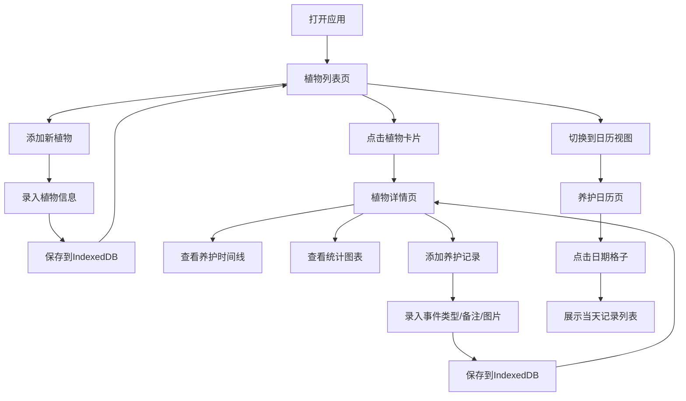

## 1. 产品概述

PlantDiary 是一款面向园艺爱好者的植物养护日志管理应用，帮助用户记录和追踪每盆植物的浇水、施肥、日照等养护事件，以及生长照片和状态变化。
产品旨在为植物爱好者提供系统化的养护管理工具，通过可视化的日历和时间线，让养护工作更加科学和有条理。

## 2. 核心功能

### 2.1 用户角色
| 角色 | 注册方式 | 核心权限 |
|------|----------|----------|
| 普通用户 | 无需注册，本地数据存储 | 添加/编辑/删除植物档案、记录养护事件、查看日历和统计 |

### 2.2 功能模块
1. **植物列表页**：植物卡片网格展示、添加新植物、排序筛选
2. **植物详情页**：植物档案信息、养护时间线、生长统计图表、新增养护记录
3. **养护日历页**：月历视图展示养护记录、日期记录详情弹窗

### 2.3 页面详情
| 页面名称 | 模块名称 | 功能描述 |
|----------|----------|----------|
| 植物列表页 | 植物卡片网格 | 以圆角阴影卡片展示植物，包含名称、品种、最近养护时间，左上角品种图标 |
| 植物列表页 | 添加植物表单 | 弹窗表单录入植物名称、品种、购入日期、照片 |
| 植物详情页 | 档案信息卡 | 展示植物完整档案，支持编辑和删除操作 |
| 植物详情页 | 养护时间线 | 垂直时间线展示养护记录，按日期倒序排列，支持新增记录 |
| 植物详情页 | 统计图表 | 浇水频率柱状图、关键词频次折线图 |
| 养护日历页 | 月历视图 | 按月份展示，日期格子根据记录数量渐变背景色 |
| 养护日历页 | 记录详情弹窗 | 点击日期展开当天所有养护记录列表 |

## 3. 核心流程

用户打开应用后，首先看到植物列表页面，可浏览所有已添加的植物卡片。点击植物卡片进入详情页，查看该植物的完整养护历史和生长统计，也可添加新的养护记录。用户还可切换到日历视图，以月历形式查看所有植物的养护记录分布。

## 4. 用户界面设计

### 4.1 设计风格
- 主色调：柔和自然绿 `#5B8C5A`，浅米色背景 `#F5F0E8`
- 按钮风格：圆角胶囊按钮，主色填充，hover时有轻微上浮效果
- 字体：标题使用「Lora」衬线字体，正文使用「Inter」无衬线字体
- 布局风格：卡片式布局，充足留白，自然层次感
- 图标风格：线性简约图标，浇水用蓝色水滴💧、施肥用橙色颗粒🧡

### 4.2 页面设计概述
| 页面名称 | 模块名称 | UI元素 |
|----------|----------|----------|
| 植物列表页 | 顶部导航 | Logo、页面切换标签（列表/日历）、添加植物按钮 |
| 植物列表页 | 卡片网格 | 响应式网格（桌面3列、平板2列、手机1列），卡片阴影hover效果 |
| 植物详情页 | 时间线 | 垂直布局，左侧圆形操作图标标记，绿色虚线连接，hover卡片上浮 |
| 植物详情页 | 图表区域 | Recharts 渲染的柱状图和折线图，配色与主题一致 |
| 养护日历页 | 月历网格 | 7列布局，日期格子背景色渐变，点击扩散动画 |

### 4.3 响应式
- 桌面端：三栏布局，侧边导航 + 主内容区 + 详情面板
- 平板端：双栏布局，导航合并到顶部，主内容 + 详情
- 手机端：单栏布局，底部Tab切换，所有内容垂直堆叠
- 交互反馈：所有按钮和可点击元素在100ms内给出视觉反馈

### 4.4 动效设计
- 页面加载：卡片依次淡入（staggered fade-in）
- 卡片hover：向上偏移4px，阴影加深，过渡时间200ms
- 时间线记录：滚动进入视口时从左侧滑入
- 日历弹窗：从点击格子中心向外扩散展开（scale + opacity）
- 表单提交：成功后轻微缩放反馈
