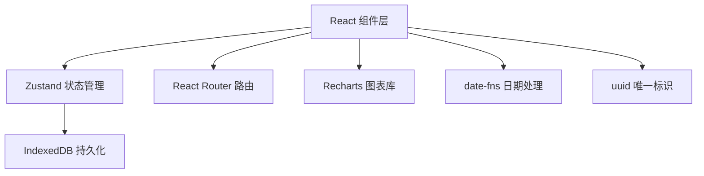
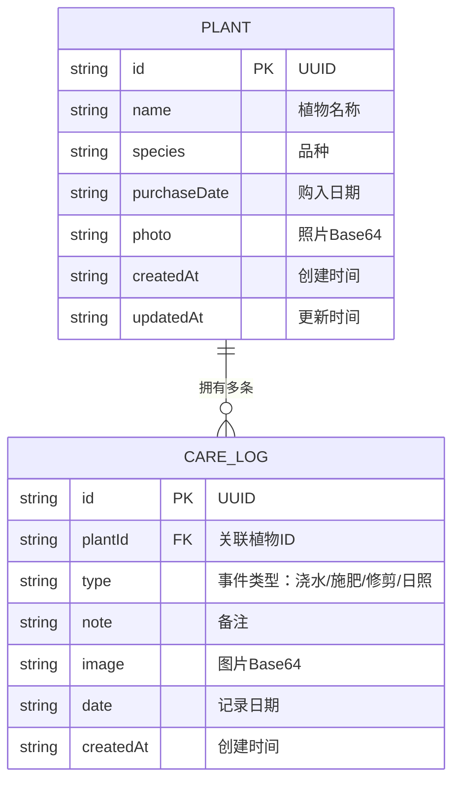

## 1. 架构设计



## 2. 技术描述
- 前端框架：React@18 + TypeScript + Vite
- 状态管理：Zustand
- 数据持久化：IndexedDB（idb-keyval）
- 路由：react-router-dom@6
- 图表：Recharts
- 工具库：date-fns、uuid
- 样式：CSS Modules + CSS Variables

## 3. 路由定义
| 路由 | 用途 |
|------|------|
| / | 植物列表页（首页） |
| /plant/:id | 植物详情页 |
| /calendar | 养护日历页 |

## 4. 数据模型

### 4.1 数据模型定义



### 4.2 类型定义

```typescript
interface Plant {
  id: string;
  name: string;
  species: string;
  purchaseDate: string;
  photo?: string;
  createdAt: string;
  updatedAt: string;
}

interface CareLog {
  id: string;
  plantId: string;
  type: 'water' | 'fertilize' | 'prune' | 'sunlight';
  note?: string;
  image?: string;
  date: string;
  createdAt: string;
}

interface PlantStore {
  plants: Plant[];
  careLogs: CareLog[];
  loading: boolean;
  // Actions
  fetchPlants: () => Promise<void>;
  addPlant: (plant: Omit<Plant, 'id' | 'createdAt' | 'updatedAt'>) => Promise<void>;
  updatePlant: (id: string, updates: Partial<Plant>) => Promise<void>;
  deletePlant: (id: string) => Promise<void>;
  addCareLog: (log: Omit<CareLog, 'id' | 'createdAt'>) => Promise<void>;
  deleteCareLog: (id: string) => Promise<void>;
  getCareLogsByPlant: (plantId: string) => CareLog[];
  getCareLogsByDate: (date: string) => CareLog[];
}
```

## 5. 文件结构

```
src/
├── App.tsx                    # 根组件，路由配置
├── main.tsx                   # 入口文件
├── index.css                  # 全局样式，CSS变量
├── types/
│   └── index.ts               # TypeScript 类型定义
├── store/
│   └── plantStore.ts          # Zustand 状态管理
├── components/
│   ├── layout/
│   │   ├── Header.tsx         # 顶部导航
│   │   └── Layout.tsx         # 布局容器
│   ├── PlantList.tsx          # 植物列表
│   ├── PlantCard.tsx          # 植物卡片
│   ├── PlantDetail.tsx        # 植物详情
│   ├── CalendarView.tsx       # 日历视图
│   ├── CareTimeline.tsx       # 养护时间线
│   ├── CareLogItem.tsx        # 单条养护记录
│   ├── AddPlantModal.tsx      # 添加植物弹窗
│   ├── AddCareLogModal.tsx    # 添加养护记录弹窗
│   ├── DateRecordsModal.tsx   # 日期记录详情弹窗
│   └── charts/
│       ├── WateringChart.tsx  # 浇水频率柱状图
│       └── KeywordChart.tsx   # 关键词折线图
└── utils/
    ├── db.ts                  # IndexedDB 封装
    ├── image.ts               # 图片处理工具
    └── date.ts                # 日期处理工具
```

## 6. 性能优化策略

1. **IndexedDB 操作优化**：批量读写，使用异步操作避免阻塞主线程
2. **列表虚拟化**：养护记录超过100条时启用虚拟滚动
3. **图片优化**：Base64图片压缩存储，缩略图按需生成
4. **状态选择器**：Zustand 使用 selector 避免不必要重渲染
5. **React.memo**：对纯展示组件使用 memo 优化
6. **懒加载**：图表组件和模态框使用 React.lazy 按需加载

## 7. 数据流向

```
用户操作 → 页面组件 → Zustand Store → IndexedDB
                ↑                      ↓
                └──────────────────────┘
                  数据更新后同步到组件
```
