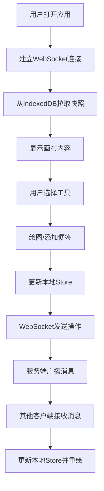

## 1. 产品概述

SketchSync 是一款多人实时协作白板应用，让分散在不同地点的团队成员能够同时在画布上绘图、添加便签和批注，所有操作自动实时同步。

- 核心价值：打破地理限制，提供沉浸式协作绘图体验，支持远程团队头脑风暴、设计评审和在线教学
- 目标用户：远程团队、设计工作室、教育机构、敏捷开发团队

## 2. 核心功能

### 2.1 用户角色

| 角色 | 注册方式 | 核心权限 |
|------|----------|----------|
| 协作用户 | 加入房间即可 | 绘图、添加便签、编辑元素、撤销重做 |

### 2.2 功能模块

1. **主画布**：HTML Canvas 渲染，支持缩放、拖拽、多元素渲染
2. **工具栏**：铅笔、矩形、便签、橡皮擦、颜色选择器、撤销重做
3. **实时同步**：WebSocket 消息广播，操作秒级同步
4. **便签系统**：黄色半透明便签，支持文本编辑和拖拽
5. **元素操作**：选中、移动、删除、框选
6. **撤销重做**：最近 5 步操作回退与恢复
7. **连接状态**：实时显示连接状态指示灯

### 2.3 页面详情

| 页面名称 | 模块名称 | 功能描述 |
|----------|----------|----------|
| 白板主页 | 顶部工具栏 | 工具切换、颜色选择、撤销重做按钮 |
| 白板主页 | 主画布区域 | Canvas 绘图、元素渲染、交互操作 |
| 白板主页 | 连接状态指示 | 右上角呼吸灯效果的连接状态 |
| 白板主页 | 便签组件 | 可编辑文本的黄色便签，支持拖拽 |

## 3. 核心流程

用户打开应用 → 建立 WebSocket 连接 → 从 IndexedDB 拉取画布快照 → 选择绘图工具 → 在画布上绘制/添加便签 → 操作通过 WebSocket 广播 → 其他客户端接收并更新本地状态 → 渲染更新

## 4. 用户界面设计

### 4.1 设计风格

- **主色调**：浅米色画布 (#F5F0E8)，明亮色系工具色板
- **强调色**：#FF6B6B、#4ECDC4、#45B7D1 等 12 种预设颜色
- **便签色**：黄色半透明 (RGBA 255,255,0,0.85)
- **按钮风格**：毛玻璃半透明效果，圆角，悬停上浮 3px
- **字体**：现代无衬线字体，清晰易读
- **布局**：顶部细长工具栏 + 中央画布 + 右上角连接指示灯
- **动效**：便签淡入放大、删除缩小淡出、工具按钮悬停浮动、连接灯呼吸脉冲

### 4.2 页面设计概述

| 页面名称 | 模块名称 | UI 元素 |
|----------|----------|---------|
| 白板主页 | 顶部工具栏 | 毛玻璃背景、工具图标按钮、颜色选择网格、撤销重做按钮 |
| 白板主页 | 主画布 | 浅米色背景、Canvas 元素、平滑曲线渲染 |
| 白板主页 | 便签组件 | 黄色半透明方块、文本区域、拖拽交互 |
| 白板主页 | 选中状态 | 蓝色控制点、蓝色半透明选框 |
| 白板主页 | 连接指示灯 | 绿色/红色圆点、2s 呼吸脉冲动画 |

### 4.3 响应式设计

- **桌面端（≥768px）**：顶部水平工具栏，完整按钮文字
- **移动端（<768px）**：底部固定工具栏，图标模式（36x36px），画布自适应缩放
- **触摸优化**：增大点击区域，支持触摸绘图

### 4.4 性能指标

- 画布渲染帧率：≥30 FPS（500 个元素同时存在）
- 端到端同步延迟：≤800ms
- 初始加载时间：≤2s
