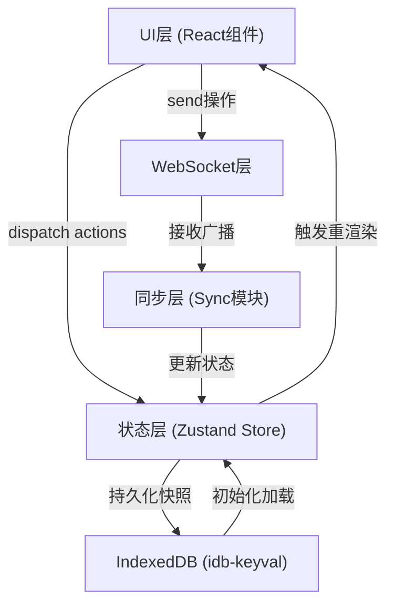

## 1. 架构设计



## 2. 技术栈说明

- **前端框架**：React@18 + TypeScript
- **构建工具**：Vite
- **状态管理**：Zustand
- **实时通信**：原生 WebSocket API（无第三方库）
- **数据持久化**：IndexedDB + idb-keyval
- **唯一 ID 生成**：uuid
- **画布渲染**：HTML5 Canvas 2D API
- **样式方案**：CSS Modules / 内联样式（无 Tailwind，按需求定制毛玻璃效果）

## 3. 项目结构

```
src/
├── websocket.ts      # WebSocket连接管理与消息收发
├── store.ts          # Zustand状态仓库
├── sync.ts           # 同步协调模块
├── canvas.tsx        # 主画布组件
├── toolbar.tsx       # 工具栏组件
├── stickynote.tsx    # 便签组件
├── main.tsx          # 入口文件
└── index.css         # 全局样式
```

## 4. 核心模块说明

### 4.1 WebSocket 模块 (websocket.ts)

**功能**：管理 WebSocket 连接生命周期，提供消息收发接口

**接口**：
- `connect(url: string): void` - 建立连接
- `send(data: CanvasOperation): void` - 发送操作消息
- `onMessage(callback: (msg: CanvasOperation) => void): () => void` - 注册消息监听
- `getStatus(): ConnectionStatus` - 获取连接状态

**消息类型**：
```typescript
interface CanvasOperation {
  type: 'add' | 'update' | 'delete' | 'snapshot' | 'undo' | 'redo';
  id: string;
  payload: CanvasElement | CanvasElement[];
  timestamp: number;
  clientId: string;
}
```

### 4.2 状态仓库 (store.ts)

**状态**：
- `elements: CanvasElement[]` - 画布元素列表
- `currentTool: ToolType` - 当前工具
- `currentColor: string` - 当前颜色
- `connectionStatus: 'connected' | 'disconnected' | 'connecting'` - 连接状态
- `selectedIds: string[]` - 选中元素ID列表
- `undoStack: CanvasOperation[]` - 撤销栈（最多5步）
- `redoStack: CanvasOperation[]` - 重做栈

**Actions**：
- `addElement(element: CanvasElement)` - 添加元素
- `updateElement(id: string, updates: Partial<CanvasElement>)` - 更新元素
- `deleteElement(id: string)` - 删除元素
- `setTool(tool: ToolType)` - 设置工具
- `setColor(color: string)` - 设置颜色
- `selectElement(id: string, multi?: boolean)` - 选中元素
- `clearSelection()` - 清除选中
- `undo()` - 撤销
- `redo()` - 重做
- `setConnectionStatus(status)` - 设置连接状态
- `loadSnapshot(elements: CanvasElement[])` - 加载快照

### 4.3 同步模块 (sync.ts)

**功能**：协调 WebSocket 消息与本地状态，处理冲突合并

**核心逻辑**：
- 监听 WebSocket 消息，解析后调用 store action
- 本地操作时通过 WebSocket 广播
- 连接恢复时从 IndexedDB 拉取快照
- 处理操作幂等性（通过操作 ID 去重）

### 4.4 画布组件 (canvas.tsx)

**功能**：Canvas 渲染与交互

**渲染内容**：
- 铅笔线条（贝塞尔曲线平滑）
- 矩形（边框/填充）
- 便签（委托给 StickyNote 组件或直接 Canvas 绘制）
- 选中控制点
- 选框（Shift+拖拽）

**交互处理**：
- 鼠标按下/移动/释放事件
- 拖拽绘图
- 元素选中与拖拽移动
- 框选（Shift 键）

### 4.5 工具栏组件 (toolbar.tsx)

**功能**：工具选择与颜色选择

**工具按钮**：
- 铅笔、矩形、便签、橡皮擦、选择
- 撤销、重做按钮
- 12 色调色板

### 4.6 便签组件 (stickynote.tsx)

**功能**：黄色半透明便签的渲染与交互

**特性**：
- 220x220px 尺寸
- 双击进入编辑模式（最多 200 字）
- 拖拽移动
- 淡入放大动画
- 缩小淡出删除动画

## 5. 数据模型

### 5.1 画布元素类型

```typescript
type ElementType = 'pencil' | 'rectangle' | 'stickyNote';

interface BaseElement {
  id: string;
  type: ElementType;
  x: number;
  y: number;
  color: string;
  createdAt: number;
  updatedAt: number;
}

interface PencilElement extends BaseElement {
  type: 'pencil';
  points: { x: number; y: number }[];
  lineWidth: number;
}

interface RectangleElement extends BaseElement {
  type: 'rectangle';
  width: number;
  height: number;
  filled: boolean;
  lineWidth: number;
}

interface StickyNoteElement extends BaseElement {
  type: 'stickyNote';
  width: number;
  height: number;
  text: string;
}

type CanvasElement = PencilElement | RectangleElement | StickyNoteElement;
```

### 5.2 IndexedDB 存储

- **Key**：`canvas_snapshot`
- **Value**：`CanvasElement[]` 序列化 JSON
- **更新时机**：每次操作后异步写入
- **读取时机**：应用初始化 / 连接恢复

## 6. 性能优化策略

1. **Canvas 渲染优化**：
   - 使用 requestAnimationFrame 批量渲染
   - 脏矩形局部重绘（可选）
   - 离屏 Canvas 缓存静态元素

2. **状态更新优化**：
   - Zustand selector 避免不必要重渲染
   - 元素浅比较优化

3. **WebSocket 优化**：
   - 操作节流/合并（快速连续操作打包发送）
   - 二进制协议优化（可选，先 JSON）

4. **IndexedDB 优化**：
   - 防抖写入，避免频繁 IO
   - 快照增量更新
