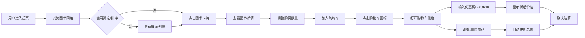

## 1. 产品概述
BookNook是一个小型独立书店的在线展示与购书平台，将线下藏书搬到线上，方便顾客远程浏览和自助下单购书。
- 主要目标：为独立书店提供线上展示窗口，支持图书浏览、分类筛选、详情查看、购物车结算等核心购书流程
- 目标用户：喜欢独立书店氛围的读者，希望足不出户即可浏览和购买实体书

## 2. 核心功能

### 2.1 功能模块
1. **图书列表页**：图书卡片网格展示、分类筛选面板、价格/时间排序
2. **图书详情页**：大图展示、完整描述、库存状态、同类推荐、数量选择、加入购物车
3. **购物车侧栏**：商品列表、数量调整、删除商品、优惠码输入、总价计算
4. **导航栏**：品牌Logo、购物车图标（实时显示商品数量）

### 2.3 页面详情
| 页面名称 | 模块名称 | 功能描述 |
|-----------|-------------|---------------------|
| 图书列表页 | 筛选面板 | 按类别（小说/科技/艺术/生活）筛选，按价格区间/上架时间排序 |
| 图书列表页 | 卡片网格 | 展示封面缩略图、书名、作者、价格，hover上浮阴影效果 |
| 图书详情页 | 详情展示 | 左图右文布局，大图、完整描述、库存状态显示 |
| 图书详情页 | 同类推荐 | 根据相同类别推荐3-5本图书 |
| 图书详情页 | 购买操作 | 数量选择器（+/-按钮）、加入购物车按钮（带涟漪效果） |
| 购物车侧栏 | 商品管理 | 调整数量、删除商品、显示单项小计 |
| 购物车侧栏 | 优惠结算 | 输入优惠码BOOK10享九折，实时显示优惠金额和折后总价 |
| 导航栏 | 购物车入口 | 图标显示总商品数，点击打开侧栏抽屉（右侧滑入动画） |

## 3. 核心流程
用户进入首页 → 浏览图书网格 → 通过左侧筛选面板按类别/排序过滤 → 点击图书卡片进入详情页 → 选择购买数量 → 点击加入购物车 → 点击顶部购物车图标打开侧栏 → 查看/调整购物车商品 → 输入优惠码BOOK10享受折扣 → 确认总价完成购书流程

## 4. 用户界面设计

### 4.1 设计风格
- **主色调**：暖棕色系（木质书架氛围），主色 #8B5A2B（深胡桃木），辅色 #D2B48C（浅橡木），点缀色 #C0392B（书签红）
- **背景**：浅色木纹纹理背景，营造书房/书店氛围
- **按钮样式**：圆角矩形（8px），木纹按钮带边框，hover时轻微上浮，点击涟漪效果
- **字体**：衬线字体用于标题（如 Playfair Display），无衬线字体用于正文（如 Noto Sans SC）
- **布局风格**：左右分栏（左侧200px固定筛选面板，右侧流式卡片网格）
- **图标风格**：线性简约图标，木质色调统一

### 4.2 页面设计概述
| 页面名称 | 模块名称 | UI元素 |
|-----------|-------------|-------------|
| 图书列表页 | 筛选面板 | 固定200px宽度，类别标签按钮组，排序下拉选择器，木纹边框 |
| 图书列表页 | 卡片网格 | CSS Grid布局，卡片带圆角和木纹边框，hover上浮+阴影过渡300ms |
| 图书详情页 | 主内容区 | 左图右文50/50分栏，淡入滑动入场动画，同类推荐水平滚动卡片 |
| 购物车侧栏 | 抽屉面板 | 固定右侧，宽度420px，translateX滑入动画400ms ease-out，半透明遮罩背景 |
| 导航栏 | 顶栏 | 固定顶部，木纹背景，Logo左对齐，购物车图标右对齐，徽标显示数量 |

### 4.3 响应式
- **桌面端（≥1024px）**：标准左右分栏布局，左侧筛选面板固定200px
- **平板端（768-1023px）**：筛选面板宽度收窄至160px，卡片列数调整为2-3列
- **移动端（<768px）**：筛选面板折叠为顶部弹出式菜单，卡片单列布局，购物车侧栏宽度90vw

### 4.4 动效设计
- 页面切换：路由切换时淡入+向上滑动10px过渡300ms
- 卡片hover：translateY(-4px) + box-shadow增强，300ms ease-out
- 购物车抽屉：从右侧translateX(100%)→0，配合遮罩淡入，400ms
- 按钮涟漪：点击位置径向扩散半透明圆形，300ms线性淡出
- 数量变化：数字变化时轻微缩放回弹效果
