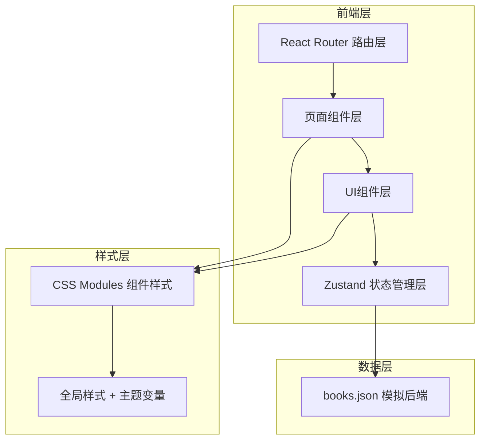
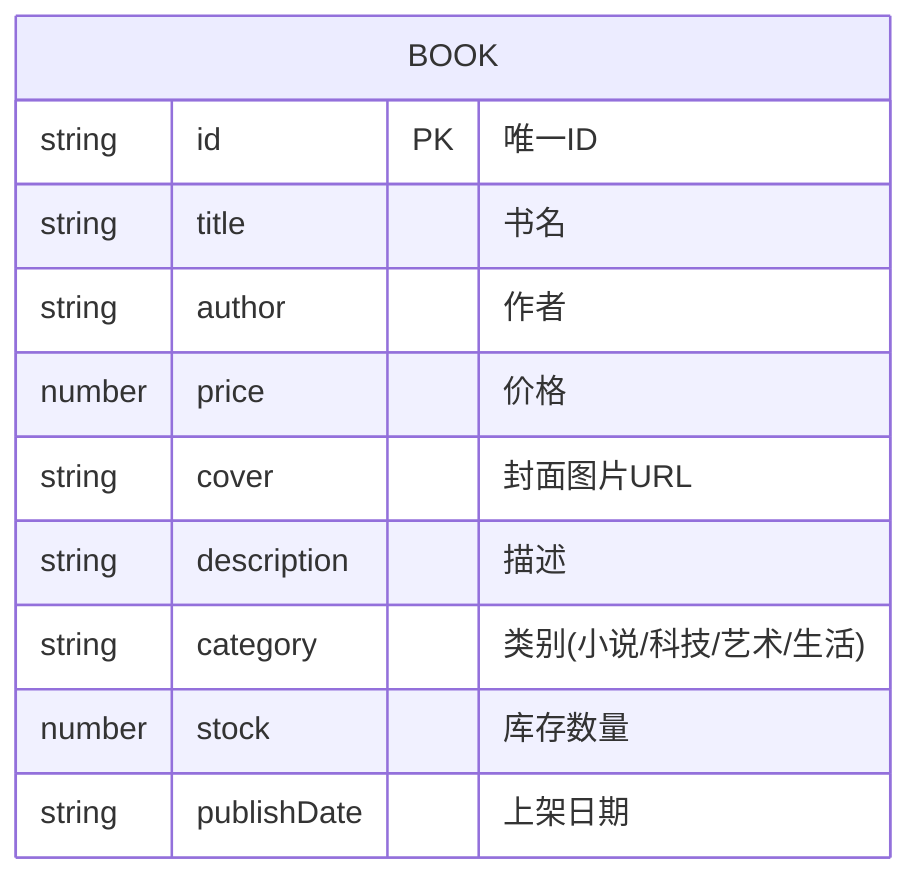

## 1. 架构设计



**数据流说明：**
1. `books.json` → `booksStore.ts`：应用初始化时加载图书数据到Zustand状态
2. `booksStore.ts` → 各页面组件：组件通过selector订阅状态，获取图书列表、购物车数据
3. 页面组件 → `booksStore.ts`：用户操作（加入购物车、调整数量、删除商品、应用优惠码）调用store的action方法更新状态
4. 状态更新 → 组件重渲染：Zustand自动通知订阅组件更新UI

**文件调用关系：**
- `main.tsx` → 挂载 `App.tsx`，配置 `BrowserRouter`
- `App.tsx` → 定义路由：`/` → `BookList.tsx`，`/book/:id` → `BookDetail.tsx`，渲染 `Navbar` 组件
- `BookList.tsx` → 使用 `booksStore` 获取 `books/filter/sortBy`，调用 `setFilter/setSortBy`，渲染 `BookCard` 列表
- `BookDetail.tsx` → 使用 `useParams` 获取ID，通过 `booksStore` 获取 `getBookById/recommendedBooks/addToCart`
- `booksStore.ts` → 导入 `books.json`，管理 `books/cart/filter/sortBy/discount` 状态和相关actions
- `Navbar.tsx` → 使用 `booksStore` 获取 `cartTotalCount`，控制 `CartDrawer` 显示

## 2. 技术描述
- **前端框架**：React@18 + React DOM@18
- **构建工具**：Vite（vite.config.js 配置React插件）
- **类型系统**：TypeScript（tsconfig.json严格模式 + ESNext模块）
- **路由**：react-router-dom@6
- **状态管理**：zustand
- **唯一ID生成**：uuid（购物车项唯一标识）
- **样式方案**：CSS Modules + 全局CSS变量主题
- **后端模拟**：本地JSON文件（src/data/books.json）

## 3. 路由定义
| 路由路径 | 页面组件 | 用途 |
|-------|---------|------|
| `/` | BookList.tsx | 图书列表首页，展示所有图书，支持筛选排序 |
| `/book/:id` | BookDetail.tsx | 图书详情页，展示完整信息和购买操作 |

## 4. 类型定义
```typescript
// 图书实体
interface Book {
  id: string;
  title: string;
  author: string;
  price: number;
  cover: string;
  description: string;
  category: '小说' | '科技' | '艺术' | '生活';
  stock: number;
  publishDate: string;
}

// 购物车项
interface CartItem {
  id: string;           // uuid生成的购物车项ID
  bookId: string;
  quantity: number;
}

// 筛选条件
type Category = '全部' | '小说' | '科技' | '艺术' | '生活';
type SortBy = 'default' | 'price-asc' | 'price-desc' | 'date-desc';

// 优惠码
interface Discount {
  code: string;
  rate: number;         // 0.9 表示九折
  applied: boolean;
}

// Zustand Store
interface BooksStore {
  books: Book[];
  cart: CartItem[];
  filter: Category;
  sortBy: SortBy;
  discount: Discount;
  
  // Actions
  setFilter: (f: Category) => void;
  setSortBy: (s: SortBy) => void;
  getBookById: (id: string) => Book | undefined;
  getFilteredBooks: () => Book[];
  getRecommendedBooks: (id: string) => Book[];
  addToCart: (bookId: string, qty: number) => void;
  updateCartItemQty: (itemId: string, qty: number) => void;
  removeFromCart: (itemId: string) => void;
  clearCart: () => void;
  applyDiscount: (code: string) => { success: boolean; message: string };
  cartTotalCount: () => number;
  cartSubtotal: () => number;
  cartDiscountAmount: () => number;
  cartTotal: () => number;
}
```

## 5. 数据模型

### 5.1 图书数据结构


### 5.2 books.json 示例数据（10本）
包含4个类别各2-3本图书，每本包含完整字段，价格范围25-128元，库存5-100本不等。
