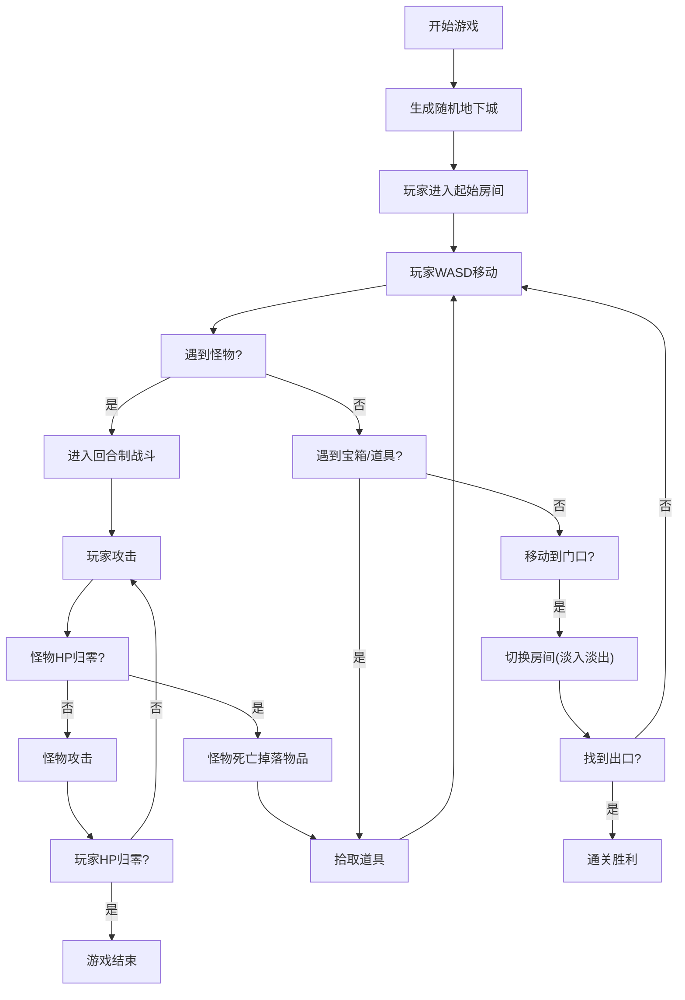

## 1. 产品概述

复古像素风Rogue-like地下城探险游戏，在浏览器中实现完整的地牢探索体验，无需后端依赖，纯前端自包含运行。玩家通过键盘操控角色在随机生成的地下城中探索、战斗、收集道具，体验每次都不同的冒险乐趣。

- 核心价值：浏览器即开即玩的轻量级Rogue-like游戏，程序化生成保证重玩价值
- 目标用户：复古游戏爱好者、休闲玩家、像素风格爱好者

## 2. 核心功能

### 2.1 用户角色

| 角色 | 注册方式 | 核心权限 |
|------|----------|----------|
| 玩家 | 无需注册，直接开始 | 完整游戏体验：探索、战斗、收集道具 |

### 2.2 功能模块

1. **程序化地图生成系统**：随机生成4x4房间网格地下城，房间间走廊连通
2. **玩家控制系统**：WASD移动、回合制战斗、HP管理
3. **怪物AI系统**：巡逻模式、追踪模式、战斗逻辑
4. **道具系统**：红药水恢复HP、金币收集、宝箱掉落
5. **UI渲染系统**：像素风格界面、血条、小地图、动画效果

### 2.3 页面详情

| 页面名称 | 模块名称 | 功能描述 |
|---------|----------|----------|
| 游戏主界面 | 游戏画布 | 16位像素风格地下城场景，玩家角色、怪物、道具实时渲染 |
| 游戏主界面 | UI层 | 左上角血条、右上角金币计数、左下角房间坐标、右下角小地图 |
| 游戏主界面 | 战斗界面 | 回合制战斗显示，伤害浮动动画，屏幕边缘红色闪烁 |
| 游戏主界面 | 过渡效果 | 房间切换淡入淡出、道具拾取动画、怪物死亡动画 |

## 3. 核心流程

## 4. 用户界面设计

### 4.1 设计风格

- **主色调**：深灰(#3a3a3a)、米色(#d4c8a8)、暗红(#8b2500)、金色(#d4af37)
- **背景色**：纯黑(#000000)
- **像素风格**：16位复古像素风，硬边色块，无抗锯齿
- **字体**：Press Start 2P（Google Fonts加载的像素字体）
- **按钮风格**：像素化边框，纯色填充，悬停时颜色加深
- **布局风格**：游戏画布居中，四周黑色背景带内阴影

### 4.2 页面设计概览

| 页面名称 | 模块名称 | UI元素 |
|---------|----------|--------|
| 游戏主界面 | 游戏画布 | 像素瓦片地图、玩家精灵(2帧行走动画)、怪物精灵、道具精灵、走廊连接 |
| 游戏主界面 | 血条UI | 左上角HP条，从绿色渐变到红色，像素风格边框 |
| 游戏主界面 | 金币UI | 右上角金币图标+数字，拾取时金币飘入动画 |
| 游戏主界面 | 房间坐标 | 左下角显示当前房间坐标如[2,3] |
| 游戏主界面 | 小地图 | 右下角4x4网格，已访问亮色、未探索暗色、当前房间白色闪烁边框 |
| 游戏主界面 | 战斗效果 | 伤害数字浮动、屏幕边缘红色闪烁、红色光晕爆发(喝药水) |

### 4.3 响应式

- 游戏画布固定尺寸，居中显示
- 背景自适应填充剩余空间
- 无移动端触控优化，面向桌面键盘操作

### 4.4 动画效果

- 玩家/怪物行走：2帧腿交替动画，每步0.3秒
- 房间切换：0.5秒淡入淡出过渡
- 怪物死亡：尸体停留2秒后消失
- 金币拾取：金币飘向计数器，带旋转缩放动画
- 喝药水：红色光晕爆发动画
- 伤害显示：随机浮动动画
- 小地图当前房间：白色边框闪烁
