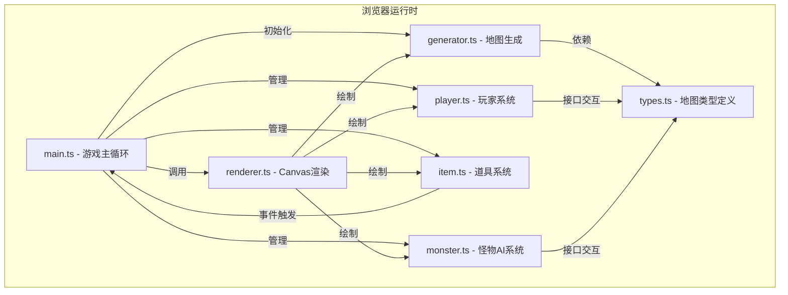

## 1. 架构设计



## 2. 技术选型

- **前端框架**：原生TypeScript + HTML5 Canvas（无第三方游戏引擎）
- **构建工具**：Vite
- **语言**：TypeScript (严格模式，target ES2020)
- **字体**：Google Fonts - Press Start 2P
- **性能**：requestAnimationFrame游戏循环，目标30FPS以上

## 3. 文件组织结构

```
d:\P\tasks\auto81\
├── package.json
├── vite.config.js
├── tsconfig.json
├── index.html
└── src/
    ├── map/
    │   ├── types.ts      # MapData、Room、TileType等类型定义
    │   └── generator.ts  # 随机地下城生成算法
    ├── game/
    │   ├── player.ts     # 玩家状态、移动、战斗、HP管理
    │   ├── monster.ts    # 怪物AI：巡逻、追踪、战斗
    │   ├── item.ts       # 道具类型、生成、拾取、事件
    │   └── renderer.ts   # Canvas绘制所有游戏元素
    └── main.ts           # 游戏入口、主循环、输入处理
```

## 4. 数据模型定义

### 4.1 地图相关类型

```typescript
enum TileType {
  WALL = 0,
  FLOOR = 1,
  CORRIDOR = 2,
  DOOR = 3,
}

interface Room {
  x: number;           // 房间在网格中的x坐标(0-3)
  y: number;           // 房间在网格中的y坐标(0-3)
  gridX: number;       // 房间在地图瓦片的起始x
  gridY: number;       // 房间在地图瓦片的起始y
  width: number;       // 房间宽度(瓦片数)
  height: number;      // 房间高度(瓦片数)
  type: 'normal' | 'chest' | 'exit' | 'start';
  visited: boolean;
  monsters: Monster[];
  items: Item[];
  corridors: { north?: boolean; south?: boolean; east?: boolean; west?: boolean };
}

interface MapData {
  width: number;       // 总地图宽度(瓦片数)
  height: number;      // 总地图高度(瓦片数)
  tileSize: number;    // 每个瓦片像素大小
  tiles: TileType[][]; // 二维瓦片数组
  rooms: Room[];       // 所有房间列表
  gridSize: number;    // 房间网格大小(4)
  roomSize: number;    // 每个房间大小(10)
}
```

### 4.2 玩家类型

```typescript
interface Player {
  x: number;           // 像素x坐标
  y: number;           // 像素y坐标
  gridX: number;       // 当前瓦片x
  gridY: number;       // 当前瓦片y
  roomX: number;       // 当前房间网格x
  roomY: number;       // 当前房间网格y
  hp: number;
  maxHp: number;
  gold: number;
  attack: number;      // 基础攻击力
  direction: 'up' | 'down' | 'left' | 'right';
  isMoving: boolean;
  moveProgress: number; // 0-1 移动进度
  moveFromX: number;
  moveFromY: number;
  moveToX: number;
  moveToY: number;
  animFrame: number;   // 动画帧 0或1
  animTimer: number;
}
```

### 4.3 怪物类型

```typescript
interface Monster {
  id: string;
  x: number;
  y: number;
  gridX: number;
  gridY: number;
  hp: number;
  maxHp: number;
  attack: number;
  type: 'slime' | 'skeleton' | 'bat';
  state: 'patrol' | 'chase' | 'dead';
  patrolPath: { x: number; y: number }[];
  patrolIndex: number;
  patrolDirection: 1 | -1;
  moveSpeed: number;   // 比玩家稍慢
  moveProgress: number;
  moveFromX: number;
  moveFromY: number;
  moveToX: number;
  moveToY: number;
  animFrame: number;
  deathTimer: number;  // 尸体消失计时器
  roomX: number;
  roomY: number;
}
```

### 4.4 道具类型

```typescript
enum ItemType {
  POTION = 'potion',
  GOLD = 'gold',
  CHEST = 'chest',
}

interface Item {
  id: string;
  type: ItemType;
  x: number;
  y: number;
  gridX: number;
  gridY: number;
  value: number;       // 药水恢复量/金币数量
  collected: boolean;
  animOffset: number;  // 浮动动画偏移
}
```

## 5. 核心算法

### 5.1 地图生成算法

1. 创建4x4房间网格，每个房间10x10瓦片
2. 使用深度优先搜索(DFS)生成连通走廊，确保所有房间连通
3. 随机选择2个房间作为宝箱房间，1个房间作为出口房间
4. 标记起始房间(左上角)
5. 生成走廊连接相邻房间

### 5.2 游戏主循环

1. 使用 requestAnimationFrame 驱动
2. 固定时间步长更新逻辑(约33ms/帧，30FPS)
3. 渲染阶段插值平滑显示
4. 处理键盘输入状态

### 5.3 战斗系统

1. 玩家移动到怪物相邻瓦片触发战斗
2. 回合制：玩家先攻，怪物后攻
3. 伤害计算：基础攻击力 + 随机浮动(1-3)
4. 怪物死亡后掉落物品，尸体停留2秒

## 6. 性能优化

- 仅渲染当前房间及相邻走廊
- 对象池复用怪物和道具
- Canvas 离屏缓冲预渲染瓦片地图
- 动画帧率与逻辑帧率分离
