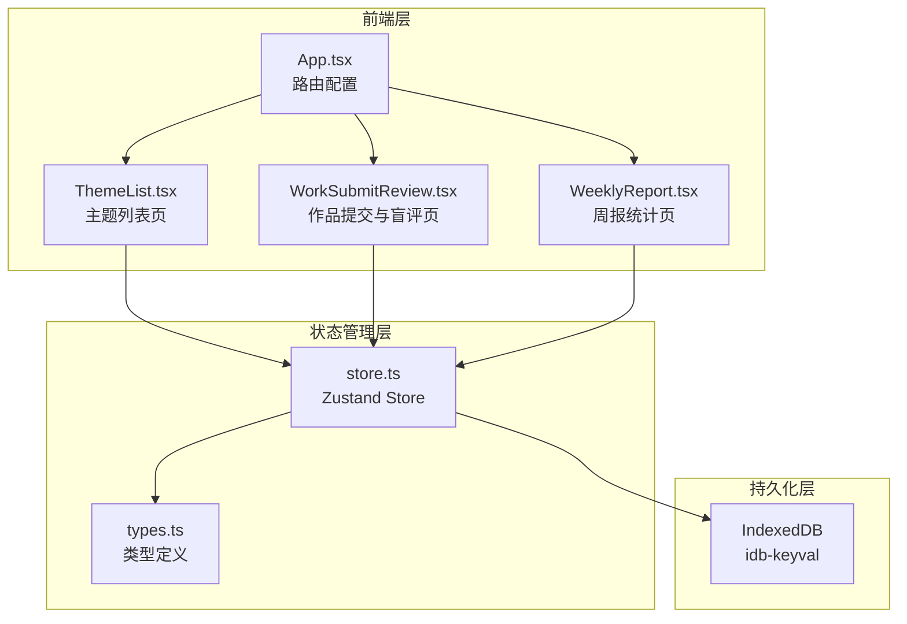
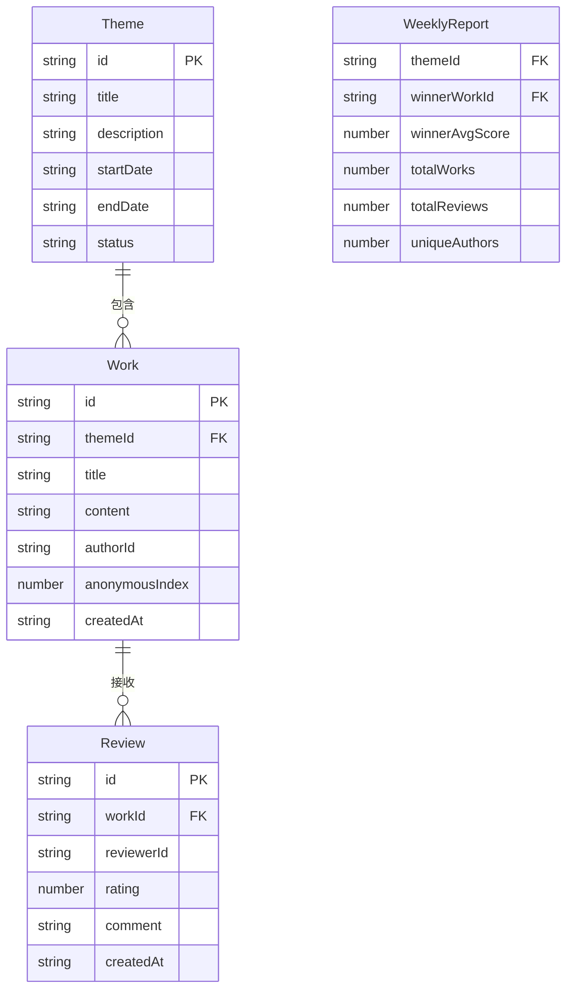

## 1. 架构设计



## 2. 技术说明

- 前端：React@18 + TypeScript + Vite
- 初始化工具：vite-init（react-ts模板）
- 状态管理：Zustand
- 持久化：IndexedDB（idb-keyval）
- 路由：react-router-dom@6
- 后端：无（纯前端应用）
- 数据库：IndexedDB（浏览器本地存储）

## 3. 路由定义

| 路由 | 用途 |
|------|------|
| / | 主题列表页，展示所有历史主题 |
| /theme/:id | 作品提交和盲评页，左右分栏布局 |
| /report | 周报统计页，评选结果和统计概览 |

## 4. API定义

无后端API，所有数据通过Zustand store管理，IndexedDB持久化。

## 5. 数据模型

### 5.1 数据模型定义



### 5.2 数据定义

- **Theme**：id(uuid), title, description, startDate(ISO), endDate(ISO), status('open'|'closed')
- **Work**：id(uuid), themeId, title, content(≤2000字), authorId(uuid匿名), anonymousIndex(序号), createdAt
- **Review**：id(uuid), workId, reviewerId(uuid匿名), rating(1-5整数), comment(≤200字), createdAt
- **WeeklyReport**：themeId, winnerWorkId, winnerAvgScore, totalWorks, totalReviews, uniqueAuthors

## 6. 文件调用关系与数据流向

```
index.html → src/main.tsx → src/App.tsx
                              ├── src/pages/ThemeList.tsx ← store.themes
                              ├── src/pages/WorkSubmitReview.tsx ← store.works, store.reviews
                              └── src/pages/WeeklyReport.tsx ← store.themes, store.works, store.reviews

src/store.ts ←→ idb-keyval (IndexedDB 持久化)
src/types.ts → 被所有模块导入使用
```

数据流向说明：
1. 用户操作页面组件 → 调用store actions → 更新Zustand状态 → 同步写入IndexedDB
2. 页面组件从store读取状态 → 渲染UI
3. WeeklyReport仅读取数据，通过calculateWeeklyWinner计算统计结果，不修改store
