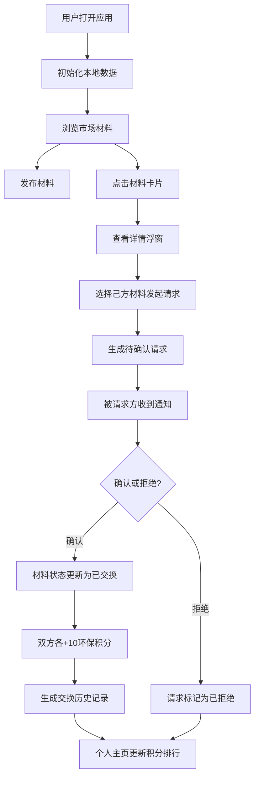

## 1. 产品概述

CraftSwap是一个面向小型社区手工艺人团体的在线"以物易物"材料交换平台，帮助手工艺人之间交换闲置的制作材料、分享创意灵感，并通过环保积分系统记录每一次交换的"环保足迹"。

- 核心目的：建立无现金的手工艺材料流通生态，减少材料浪费，促进社区交流
- 解决问题：手工艺人常有余材料闲置，购买新材料成本高，缺乏便捷的交换渠道
- 目标用户：小型社区内的手工艺爱好者、手工创作者
- 市场价值：推动可持续消费理念，建立手工艺人社区凝聚力

## 2. 核心功能

### 2.1 用户角色
| 角色 | 注册方式 | 核心权限 |
|------|---------|---------|
| 普通用户 | 本地匿名身份生成 | 发布材料、发起交换、查看积分、确认/拒绝请求 |
| 管理员 | 特殊标识用户 | 额外拥有一键确认/拒绝所有请求的权限 |

### 2.2 功能模块
1. **市场首页**：瀑布流卡片展示、材料搜索筛选、卡片动效
2. **材料发布**：表单填写材料信息、损耗程度设置、期望交换物描述
3. **交换请求**：发起请求、查看请求状态、取消请求
4. **请求管理**：待处理请求列表、确认/拒绝操作、状态流转
5. **交换历史**：时间线展示、积分记录、动画效果
6. **个人主页**：发布材料管理、积分排行榜、交换记录摘要

### 2.3 页面详情
| 页面名称 | 模块名称 | 功能描述 |
|---------|---------|---------|
| 市场首页 | 导航栏 | 品牌标识、页面切换、搜索框、汉堡菜单（移动端） |
| 市场首页 | 筛选栏 | 类别筛选下拉、搜索输入框 |
| 市场首页 | 卡片网格 | 瀑布流布局、材料卡片、悬停动效、缩放搜索动效 |
| 材料详情浮窗 | 材料信息 | 材料详情展示、损耗进度条、期望交换物 |
| 材料详情浮窗 | 交换面板 | 选择己方材料、发起请求按钮 |
| 请求管理页 | 待处理清单 | 收到的请求列表、批量操作、确认/拒绝按钮 |
| 交换历史页 | 时间线 | 已完成交换记录、淡入动画、环保积分展示 |
| 个人主页 | 材料列表 | 已发布的材料、状态标签、删除操作 |
| 个人主页 | 积分排行 | 柱状图展示、徽章系统、数字滚动动画 |
| 个人主页 | 请求摘要 | 发出/收到的请求状态统计 |
| 发布材料页 | 表单模块 | 名称、类别、损耗程度滑块、期望交换物、提交按钮 |

## 3. 核心流程

### 用户发布材料流程
用户进入发布页面 → 填写材料信息（名称/类别/损耗程度/期望交换物）→ 提交 → 材料进入市场列表 → IndexedDB持久化

### 发起交换流程
浏览市场 → 点击目标材料卡片 → 弹出详情浮窗 → 选择己方闲置材料 → 点击"发起请求" → 生成待确认请求 → 通知被请求方

### 确认交换流程
被请求方查看待处理请求 → 点击确认/拒绝 → 确认后双方材料状态更新为"已交换" → 双方各获得10环保积分 → 生成交换历史记录 → 数据持久化

### 查看环保足迹流程
进入个人主页 → 查看总积分 → 浏览积分排行榜 → 查看交换历史时间线 → 每次交换记录对应获得的积分

## 4. 用户界面设计

### 4.1 设计风格
- **设计理念**：自然环保 + 手工艺质感，传达可持续生活方式
- **主色调**：草绿色 `#4CAF50`（代表环保、自然）
- **辅助色**：橡木棕 `#8D6E63`（代表手工艺、温暖）、天空蓝 `#4FC3F7`（代表清新、希望）
- **背景色**：浅米色 `#F5F0E1`（温暖的纸张质感）
- **按钮风格**：环保绿渐变 `linear-gradient(135deg, #4CAF50, #81C784)`，圆角8px，悬停时轻微上浮
- **字体**：标题使用衬线字体（如Playfair Display）传达手工艺感，正文使用现代无衬线字体（如Noto Sans SC）保证可读性
- **布局风格**：卡片式布局，圆角24px，木质纹理背景模拟，柔和阴影
- **图标风格**：线性风格图标，配合自然元素（叶子、循环、手工工具等）
- **动效风格**：平滑过渡（0.3s ease-out）、毛玻璃效果、卡片悬停上浮、缩放搜索动效、数字滚动动画

### 4.2 页面设计概述
| 页面名称 | 模块名称 | UI元素 |
|---------|---------|--------|
| 市场首页 | 导航栏 | 绿蓝渐变背景、品牌Logo、导航链接、搜索框、移动端汉堡菜单 |
| 市场首页 | 筛选栏 | 类别下拉选择器、搜索输入框（带放大镜图标） |
| 市场首页 | 卡片网格 | 瀑布流3列布局（平板2列，手机2列）、浅米色卡片、木质纹理、圆角24px |
| 材料卡片 | 卡片内容 | 材料名称、类别标签、损耗程度渐变进度条（右上角）、期望交换物摘要 |
| 材料卡片 | 交互状态 | 悬停时阴影加深 + 上移2px（0.3s ease-out）、点击缩放动效 |
| 详情浮窗 | 浮窗样式 | 毛玻璃背景（backdrop-filter: blur(16px)）、右滑入动画、圆角16px |
| 详情浮窗 | 内容区 | 大图展示、详细描述、完整损耗进度条、期望交换物列表、交换请求面板 |
| 请求面板 | 面板内容 | 己方材料下拉选择、确认按钮、取消按钮 |
| 请求管理页 | 列表项 | 请求方材料、被请求方材料、状态标签（待确认/已完成/已拒绝）、操作按钮组 |
| 交换历史页 | 时间线 | 垂直线条连接、圆形节点、淡入动画（staggered）、每项包含时间、材料、积分 |
| 个人主页 | 积分区域 | 大字号总积分、数字滚动动画、柱状图排行榜、徽章展示 |
| 个人主页 | 材料列表 | 网格展示已发布材料、状态标签（可交换/已交换）、删除按钮 |
| 发布表单 | 表单元素 | 输入框、下拉选择、损耗滑块（0-100%）、文本域、提交按钮 |
| 全局弹窗 | 通知弹窗 | 中心放大出现 → 消失动画、成功（绿色勾选）/失败（红色叉号）状态 |

### 4.3 响应式设计
- **桌面端（≥1200px）**：瀑布流3列布局，完整导航栏
- **平板端（768px-1199px）**：瀑布流2列布局，简化导航
- **手机端（<768px）**：瀑布流2列布局，汉堡菜单导航，按钮尺寸增大便于触控
- **触控优化**：所有可点击元素最小44x44px，滑动操作支持，输入框自动适配软键盘

### 4.4 性能设计
- 虚拟滚动：卡片列表支持100-200条数据流畅滚动，保持50FPS以上
- 状态更新优化：每次增删改操作重新渲染时间≤100ms
- 本地存储：IndexedDB异步读写，不阻塞主线程
- 动画优化：使用transform和opacity属性实现硬件加速动画
