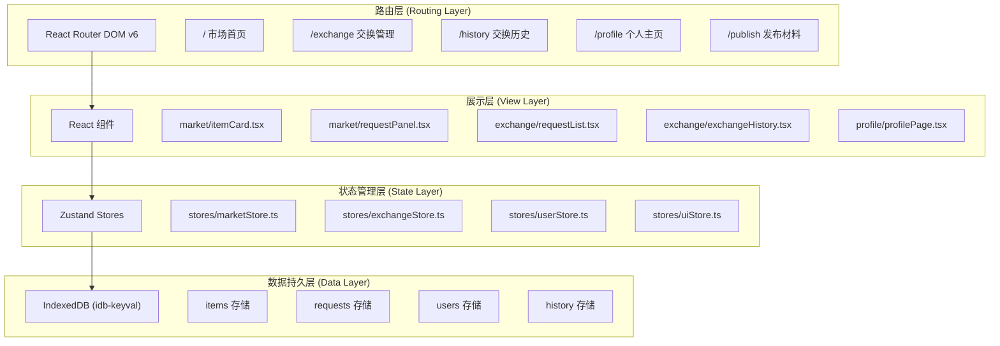
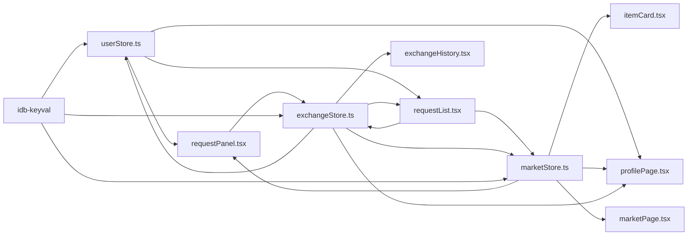
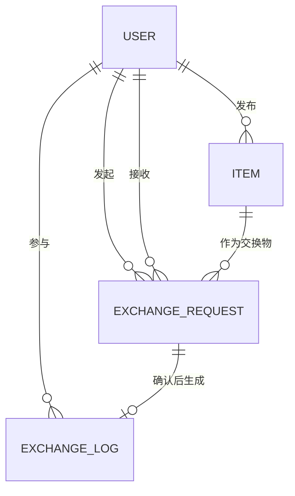

## 1. 架构设计



## 2. 技术描述

- **前端框架**：React@18 + TypeScript + Vite
- **状态管理**：Zustand（轻量级、高性能）
- **路由管理**：react-router-dom@6
- **数据持久化**：idb-keyval（IndexedDB封装库）
- **唯一标识**：uuid
- **样式方案**：CSS Modules + CSS Variables（用户指定无Tailwind依赖）
- **构建工具**：Vite（极速开发体验）
- **后端**：无（纯前端应用，数据本地存储）
- **数据库**：IndexedDB（浏览器本地存储）

### 2.1 核心技术选型理由
- **Zustand**：极简API、无需Provider包裹、天然支持按需订阅，完美适配性能约束要求
- **idb-keyval**：基于Promise的IndexedDB轻量封装，异步读写不阻塞主线程
- **Vite**：原生ES Modules支持，热更新速度快，开发体验佳
- **TypeScript严格模式**：类型安全，减少运行时错误，提升代码可维护性

## 3. 目录结构与文件职责

```
src/
├── types/              # 类型定义
│   └── index.ts        # 全局类型定义
├── stores/             # 状态管理
│   ├── marketStore.ts  # 市场材料状态
│   ├── exchangeStore.ts# 交换请求状态
│   ├── userStore.ts    # 用户信息状态
│   └── uiStore.ts      # UI交互状态（弹窗、动画等）
├── modules/            # 业务模块
│   ├── market/         # 市场模块
│   │   ├── itemCard.tsx
│   │   ├── requestPanel.tsx
│   │   └── marketPage.tsx
│   ├── exchange/       # 交换模块
│   │   ├── requestList.tsx
│   │   └── exchangeHistory.tsx
│   └── profile/        # 个人中心模块
│       └── profilePage.tsx
├── components/         # 通用组件
│   ├── Layout.tsx      # 布局组件
│   ├── Navbar.tsx      # 导航栏
│   ├── Modal.tsx       # 弹窗组件
│   ├── Toast.tsx       # 通知组件
│   └── ProgressBar.tsx # 进度条组件
├── hooks/              # 自定义Hooks
│   ├── useAnimatedNumber.ts  # 数字滚动动画
│   └── useVirtualScroll.ts   # 虚拟滚动
├── utils/              # 工具函数
│   ├── db.ts           # IndexedDB操作封装
│   └── mock.ts         # Mock数据生成
├── styles/             # 全局样式
│   ├── variables.css   # CSS变量定义
│   ├── animations.css  # 动画关键帧
│   └── global.css      # 全局样式
├── App.tsx             # 根组件
├── main.tsx            # 入口文件
└── vite-env.d.ts       # Vite类型声明
```

## 4. 数据流向与调用关系

### 4.1 模块调用关系图


### 4.2 核心数据流说明

1. **材料发布流程**：
   - `publishPage.tsx` → 调用 `marketStore.addItem()` → 写入 `idb-keyval` → 更新市场列表

2. **发起交换请求**：
   - `itemCard.tsx` → 传递 `itemId` 给父组件 → `requestPanel.tsx` 读取 `userStore` 获取己方材料 → 调用 `exchangeStore.createRequest()` → 写入 `idb-keyval`

3. **确认/拒绝请求**：
   - `requestList.tsx` → 调用 `exchangeStore.confirmRequest()` 或 `rejectRequest()` → 更新请求状态 → 确认时同步调用 `marketStore.updateItemStatus()` → 调用 `userStore.addPoints()` → 所有变更持久化到 `idb-keyval`

4. **查看环保足迹**：
   - `profilePage.tsx` → 组合读取 `userStore`（积分）、`marketStore`（发布的材料）、`exchangeStore`（交换历史）→ 渲染页面

## 5. 路由定义

| 路由路径 | 页面组件 | 功能描述 |
|---------|---------|---------|
| `/` | `MarketPage` | 市场首页，瀑布流展示所有可交换材料 |
| `/exchange` | `ExchangePage` | 待处理交换请求列表 |
| `/history` | `HistoryPage` | 交换历史时间线 |
| `/profile` | `ProfilePage` | 个人主页，积分排行、发布材料管理 |
| `/publish` | `PublishPage` | 发布新的可交换材料 |

## 6. 数据模型

### 6.1 实体关系图


### 6.2 数据类型定义

```typescript
// 用户类型
interface User {
  id: string;
  name: string;
  avatar: string;
  ecoPoints: number;
  createdAt: number;
  isAdmin: boolean;
}

// 材料类型
interface Item {
  id: string;
  ownerId: string;
  name: string;
  category: string;
  description: string;
  wearLevel: number; // 0-100 百分比
  desiredExchange: string;
  status: 'available' | 'exchanged' | 'pending';
  createdAt: number;
  imageUrl?: string;
}

// 交换请求类型
interface ExchangeRequest {
  id: string;
  requesterId: string;
  responderId: string;
  offeredItemId: string;
  requestedItemId: string;
  status: 'pending' | 'confirmed' | 'rejected' | 'cancelled';
  createdAt: number;
  updatedAt: number;
}

// 交换历史记录
interface ExchangeLog {
  id: string;
  requestId: string;
  user1Id: string;
  user2Id: string;
  item1Id: string;
  item2Id: string;
  pointsEarned: number;
  completedAt: number;
}

// 材料类别枚举
type ItemCategory = '布料' | '线材' | '纸张' | '木材' | '金属' | '皮革' | '其他';
```

### 6.3 IndexedDB 存储键设计

| 存储键 | 数据类型 | 说明 |
|-------|---------|------|
| `currentUser` | `User` | 当前登录用户 |
| `users` | `User[]` | 所有用户列表 |
| `items` | `Item[]` | 所有材料列表 |
| `requests` | `ExchangeRequest[]` | 所有交换请求 |
| `exchangeLogs` | `ExchangeLog[]` | 所有交换历史 |

## 7. 性能优化方案

### 7.1 列表渲染性能
- **虚拟滚动**：使用 `useVirtualScroll` Hook 实现卡片列表虚拟渲染，仅渲染可视区域内的卡片
- **记忆化渲染**：使用 `React.memo` 包装 `itemCard` 组件，避免不必要的重渲染
- **按需订阅**：Zustand store 使用 selector 精确订阅需要的状态片段

### 7.2 状态更新优化
- **批量更新**：使用 Zustand 的批量更新功能减少重渲染次数
- **Immutable 更新**：确保所有状态更新都是不可变的，便于 React 进行浅比较
- **防抖搜索**：搜索输入使用 300ms 防抖，避免频繁过滤

### 7.3 动画性能
- **硬件加速**：所有动画使用 `transform` 和 `opacity` 属性，触发 GPU 加速
- **will-change**：对即将进行动画的元素添加 `will-change` 提示
- **避免布局抖动**：动画过程中避免触发 reflow

## 8. Store 方法定义

### 8.1 marketStore
```typescript
interface MarketStore {
  items: Item[];
  searchQuery: string;
  selectedCategory: ItemCategory | 'all';
  
  // Actions
  addItem: (item: Omit<Item, 'id' | 'createdAt' | 'status'>) => Promise<void>;
  removeItem: (itemId: string) => Promise<void>;
  updateItemStatus: (itemId: string, status: Item['status']) => Promise<void>;
  setSearchQuery: (query: string) => void;
  setSelectedCategory: (category: ItemCategory | 'all') => void;
  getFilteredItems: () => Item[];
}
```

### 8.2 exchangeStore
```typescript
interface ExchangeStore {
  requests: ExchangeRequest[];
  
  // Actions
  createRequest: (data: Omit<ExchangeRequest, 'id' | 'status' | 'createdAt' | 'updatedAt'>) => Promise<void>;
  confirmRequest: (requestId: string) => Promise<void>;
  rejectRequest: (requestId: string) => Promise<void>;
  cancelRequest: (requestId: string) => Promise<void>;
  getPendingRequestsForUser: (userId: string) => ExchangeRequest[];
  getRequestsByUser: (userId: string) => ExchangeRequest[];
}
```

### 8.3 userStore
```typescript
interface UserStore {
  currentUser: User | null;
  users: User[];
  exchangeLogs: ExchangeLog[];
  
  // Actions
  initUser: () => Promise<void>;
  addPoints: (userId: string, points: number) => Promise<void>;
  getUserRankings: () => User[];
  getExchangeLogsForUser: (userId: string) => ExchangeLog[];
}
```

## 9. 初始化数据策略

应用启动时执行以下初始化流程：
1. 从 IndexedDB 读取所有存储数据
2. 若无数据，生成 mock 数据（100-200 条材料、多个用户、若干历史记录）
3. 初始化当前用户（若无则创建匿名用户）
4. 将所有数据加载到对应 store 中
5. 完成后渲染应用

## 10. 无障碍与兼容性

- **语义化 HTML**：使用正确的 HTML5 标签
- **键盘导航**：所有交互元素支持 Tab 键导航和 Enter/Space 触发
- **ARIA 标签**：为动态内容和复杂组件添加适当的 ARIA 属性
- **颜色对比度**：确保文本与背景的对比度符合 WCAG AA 标准
- **浏览器支持**：Chrome/Edge/Firefox/Safari 最新两个版本
