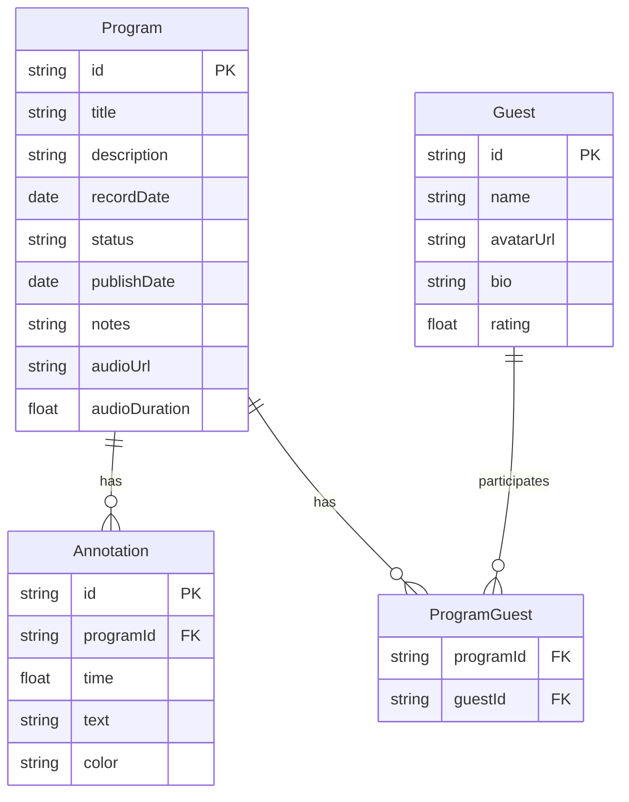

## 1. 架构设计

```mermaid
flowchart TB
    subgraph "前端层"
        "React 18 + TypeScript"
        "Zustand 状态管理"
        "React Router DOM 6"
    end
    subgraph "数据层"
        "IndexedDB (idb-keyval)"
    end
    subgraph "音频处理层"
        "Web Audio API"
    end
    "React 18 + TypeScript" --> "Zustand 状态管理"
    "Zustand 状态管理" --> "IndexedDB (idb-keyval)"
    "React 18 + TypeScript" --> "Web Audio API"
```

## 2. 技术说明

- **前端**：React@18 + TypeScript + Vite
- **初始化工具**：vite-init (react-ts 模板)
- **后端**：无（纯前端应用）
- **数据库**：IndexedDB，使用 idb-keyval 封装
- **状态管理**：Zustand
- **路由**：react-router-dom@6
- **音频处理**：Web Audio API + HTML5 Audio Element
- **唯一标识**：uuid

## 3. 路由定义

| 路由 | 用途 |
|------|------|
| / | 节目看板主页，展示所有节目卡片 |
| /program/:id | 节目详情页，含进度条、倒计时、音频播放器与标注 |
| /guests | 嘉宾管理页，卡片网格展示所有嘉宾 |
| /guest/:id | 嘉宾详情页，统计环与关联节目列表 |
| /preview/:id | 公开预览页面，深色主题预告页 |

## 4. API定义

无后端API，所有数据通过IndexedDB本地持久化，通过Zustand store统一管理读写。

## 5. 数据模型

### 5.1 数据模型定义



### 5.2 数据定义

**Program 类型**：
```typescript
interface Program {
  id: string;
  title: string;
  description: string;
  recordDate: string;
  status: 'draft' | 'recording' | 'editing' | 'published';
  publishDate: string;
  notes: string;
  audioUrl: string | null;
  audioDuration: number;
  guestIds: string[];
  annotations: Annotation[];
}
```

**Annotation 类型**：
```typescript
interface Annotation {
  id: string;
  time: number;
  text: string;
  color: string;
}
```

**Guest 类型**：
```typescript
interface Guest {
  id: string;
  name: string;
  avatarUrl: string | null;
  bio: string;
  rating: number;
  color: string;
}
```

## 6. 文件结构

```
├── package.json
├── vite.config.js
├── tsconfig.json
├── index.html
├── src/
│   ├── main.tsx
│   ├── App.tsx
│   ├── store/
│   │   └── index.ts
│   ├── pages/
│   │   ├── ProgramBoard.tsx
│   │   ├── ProgramDetail.tsx
│   │   ├── GuestManager.tsx
│   │   ├── GuestDetail.tsx
│   │   └── PreviewPage.tsx
│   ├── components/
│   │   ├── Sidebar.tsx
│   │   ├── CountdownTimer.tsx
│   │   ├── ProgressBar.tsx
│   │   ├── AudioPlayer.tsx
│   │   ├── AnnotationPin.tsx
│   │   ├── StatRing.tsx
│   │   ├── ConfirmDialog.tsx
│   │   └── ConfettiEffect.tsx
│   └── utils/
│       └── audioUtils.ts
```
