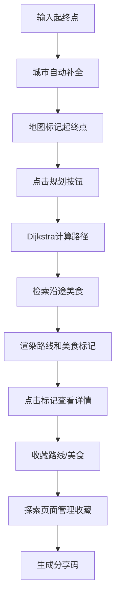

## 1. 产品概述

RoadRecipe是一款智能旅行路线规划与沿途美食推荐应用，用户输入起点和终点后自动生成最佳行车路线，并在地图上标注沿途的推荐餐馆和特色小吃，支持保存和分享美食旅行路线。

- 主要功能：智能路线规划、沿途美食发现、收藏管理、路线分享
- 目标用户：自驾旅行爱好者、美食探索者
- 产品价值：将旅行路线规划与美食发现结合，打造一站式美食旅行体验

## 2. 核心功能

### 2.1 用户角色

| 角色 | 注册方式 | 核心权限 |
|------|----------|----------|
| 普通用户 | 无需注册 | 路线规划、美食浏览、收藏管理、路线分享 |

### 2.2 功能模块

1. **路线规划页面**：起终点输入表单、自动补全、路线计算、地图渲染
2. **美食探索页面**：收藏路线列表、途经美食标记、搜索筛选
3. **收藏管理页面**：已收藏路线卡片、美食网格展示、删除管理

### 2.3 页面详情

| 页面名称 | 模块名称 | 功能描述 |
|----------|----------|----------|
| 路线规划页面 | 输入表单模块 | 起点终点输入、模糊匹配自动补全、规划按钮 |
| 路线规划页面 | 地图展示模块 | Leaflet地图渲染、起点终点标记、路线折线绘制、美食标记 |
| 美食探索页面 | 路线列表模块 | 收藏路线卡片展示、缩略地图、起终点摘要、距离和餐馆数量 |
| 美食探索页面 | 餐馆网格模块 | 美食卡片网格、评分展示、特色标签、悬浮效果 |
| 收藏管理页面 | 路线管理模块 | 左滑删除、滑动擦除动画 |
| 路线详情 | 分享模块 | 6位分享码生成、剪贴板复制、成功提示动画 |

## 3. 核心流程

用户在路线规划页面输入起点和终点，系统自动匹配城市并在地图标记；点击规划按钮后，Dijkstra算法计算最短路径，同时检索沿途50公里内的美食数据；地图上渲染路线和美食标记，用户点击标记查看详情并收藏；在探索页面管理收藏的路线和美食，可生成分享码分享给他人。

## 4. 用户界面设计

### 4.1 设计风格

- **主色调**：深灰到墨蓝的径向渐变背景（#1a1a2e → #16213e）
- **强调色**：蓝色（#4a9eff）→ 紫色（#a855f7）渐变
- **辅助色**：橙色（#f97316）用于美食标记
- **卡片样式**：半透明毛玻璃效果（backdrop-filter: blur(8px)，rgba(255,255,255,0.08)背景）
- **圆角**：16px面板圆角，8px按钮圆角
- **字体**：展示字体使用Orbitron（科技感），正文字体使用Inter（现代清晰）
- **图标**：lucide-react图标库，统一线性风格

### 4.2 页面设计概述

| 页面名称 | 模块名称 | UI元素 |
|----------|----------|--------|
| 路线规划页面 | 输入表单 | 左侧半透明面板、渐变聚焦下划线、下拉自动补全 |
| 路线规划页面 | 地图标记 | 蓝色起点/红色终点标记、波纹扩散动画、橙色刀叉美食标记 |
| 路线规划页面 | 路线折线 | 3px宽蓝紫渐变折线、1.5秒流动虚线动画、途经城市标签 |
| 美食探索页面 | 路线卡片 | 缩略小地图、起终点摘要、距离和餐馆数、左滑删除动画 |
| 美食探索页面 | 美食卡片 | 网格布局、星级评分、特色标签、悬浮阴影效果 |
| 通用 | 底部导航 | 固定底部、三个页面切换、中心展开下划线动画 |
| 通用 | 弹窗提示 | 毛玻璃信息卡、金色星级动画、收藏旋转反馈、底部上升成功提示 |

### 4.3 响应式设计

- Desktop-first设计，主布局左侧25%表单面板+右侧75%地图区域
- 平板端切换为顶部表单+底部地图布局
- 移动端全屏地图，表单以抽屉形式从底部滑出
- 触摸优化：增大点击热区（最小44x44px），支持触摸滑动手势

### 4.4 动画与交互

- 标记出现：从中心向外扩散的波纹动画（1秒）
- 路线绘制：从起点向终点流动的虚线动画（1.5秒）
- 弹窗显示：缩放淡入（0.2s ease-out）
- 标记悬停：scale 1.15放大（0.2s ease-out）
- 收藏按钮：点击后360度旋转动画（0.3s）
- 导航切换：下划线从中心向两侧展开（0.3s）
- 成功提示：从底部上升淡入（0.4s cubic-bezier(0.34, 1.56, 0.64, 1)）
- 星级显示：金色五角星按评分逐个点亮动画
