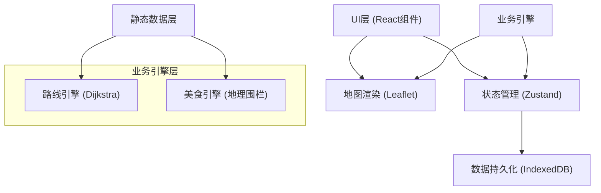

## 1. 架构设计



## 2. 技术描述

- **前端框架**：React@18 + TypeScript + Vite@5
- **地图渲染**：Leaflet@1.9 + react-leaflet@4
- **状态管理**：Zustand@4
- **数据持久化**：idb-keyval@6 (IndexedDB封装)
- **工具库**：uuid@9 (唯一ID生成)
- **图标库**：lucide-react@0.294
- **样式方案**：原生CSS + CSS变量，不使用Tailwind（用户未指定）

## 3. 路由定义

| 路由 | 页面组件 | 用途 |
|------|----------|------|
| / | PlanPage | 路线规划主页面 |
| /explore | ExplorePage | 美食探索与收藏管理 |
| /favorites | FavoritesPage | 收藏详情页面 |

## 4. 数据模型

### 4.1 TypeScript类型定义

```typescript
// 坐标点
interface GeoPoint {
  lat: number;
  lng: number;
  name?: string;
}

// 城市数据
interface City {
  id: string;
  name: string;
  lat: number;
  lng: number;
  province: string;
}

// 餐馆数据
interface Restaurant {
  id: string;
  name: string;
  lat: number;
  lng: number;
  rating: number; // 1-5
  tags: string[]; // 如麻辣、甜品、面食
  signatureDishes: string[];
  city: string;
}

// 路线数据
interface Route {
  id: string;
  origin: GeoPoint;
  destination: GeoPoint;
  path: GeoPoint[];
  distance: number; // 公里
  restaurants: Restaurant[];
  createdAt: number;
  shareCode?: string;
}

// 应用状态
interface AppState {
  currentRoute: Route | null;
  savedRoutes: Route[];
  favoriteRestaurants: Restaurant[];
  origin: GeoPoint | null;
  destination: GeoPoint | null;
  isPlanning: boolean;
}
```

### 4.2 城市数据

预存20+个城市的经纬度数据，用于地理围栏匹配和路线计算。

## 5. 文件结构

```
auto88/
├── package.json
├── vite.config.js
├── tsconfig.json
├── index.html
└── src/
    ├── App.tsx
    ├── main.tsx
    ├── index.css
    ├── pages/
    │   ├── PlanPage.tsx
    │   ├── ExplorePage.tsx
    │   └── FavoritesPage.tsx
    ├── engine/
    │   ├── routeEngine.ts
    │   └── foodEngine.ts
    ├── components/
    │   ├── maps/
    │   │   ├── MapContainer.tsx
    │   │   ├── FoodMarker.tsx
    │   │   └── RoutePolyline.tsx
    │   ├── layout/
    │   │   ├── BottomNav.tsx
    │   │   └── SidePanel.tsx
    │   └── ui/
    │       ├── AutocompleteInput.tsx
    │       ├── StarRating.tsx
    │       └── Toast.tsx
    ├── data/
    │   ├── routeStore.ts
    │   ├── foodData.ts
    │   └── cityData.ts
    └── types/
        └── index.ts
```

## 6. 核心算法

### 6.1 简化版Dijkstra算法

- 输入：起点和终点经纬度
- 数据结构：城市节点图，节点间距离为Haversine距离
- 输出：最短路径坐标数组和总距离估算

### 6.2 地理围栏美食匹配

- 计算路径上每个点50公里范围内的餐馆
- 使用Haversine公式计算两点距离
- 去重后返回匹配的餐馆列表

## 7. 性能要求

- 地图渲染帧率：≥30fps
- 路线计算+美食匹配总响应时间：≤2秒
- 页面切换延迟：≤500ms
- 收藏列表加载时间：≤300ms

## 8. 动画实现方案

- CSS关键帧动画：波纹、流动虚线、上升提示
- CSS transition：悬停放大、弹窗淡入
- requestAnimationFrame：路径流动效果
- 状态驱动动画：星级评分点亮序列
