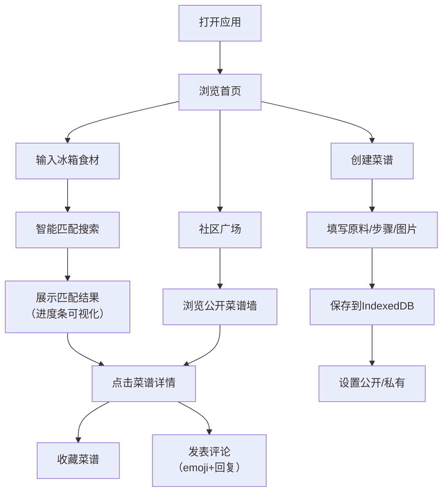

## 1. 产品概述

家庭食谱管理分享平台，帮助每个家庭记录私房菜秘诀、与亲友分享，并根据冰箱剩余食材智能推荐菜品。

- 核心目标：为家庭提供便捷的菜谱管理、食材智能匹配和社区分享功能
- 目标用户：热爱烹饪、希望传承家庭食谱的家庭用户
- 产品价值：数字化保存家庭美食记忆，减少食材浪费，促进美食文化交流

## 2. 核心功能

### 2.1 用户角色

| 角色 | 注册方式 | 核心权限 |
|------|----------|----------|
| 普通用户 | 本地注册（模拟） | 创建/编辑/删除菜谱、搜索匹配、浏览社区、收藏菜谱、发表评论 |

### 2.2 功能模块

1. **菜谱管理模块**：创建菜谱、编辑菜谱、删除菜谱、菜谱列表、标签筛选、时间筛选
2. **智能搜索模块**：食材输入、匹配度计算、进度条可视化、排序展示
3. **社区广场模块**：公开菜谱卡片墙、菜谱详情页、收藏功能、实时评论系统

### 2.3 页面详情

| 页面名称 | 模块名称 | 功能描述 |
|----------|----------|----------|
| 首页 | 导航栏 | Logo、页面切换（我的菜谱/社区广场）、用户信息 |
| 首页 | 食材搜索区 | 多食材输入框、搜索按钮、热门食材快捷标签 |
| 首页 | 搜索结果区 | 匹配度进度条、菜谱卡片列表、按匹配度排序 |
| 首页 | 我的菜谱区 | 菜谱创建按钮、标签筛选器、时间筛选器、菜谱卡片网格 |
| 菜谱详情页 | 菜谱信息区 | 菜名、成品图、原料清单、步骤说明、标签、烹饪时间 |
| 菜谱详情页 | 互动区 | 收藏按钮、收藏数显示、公开/私有切换 |
| 菜谱详情页 | 评论区 | 评论列表、评论输入框、emoji选择器、回复嵌套、实时更新 |
| 社区广场 | 卡片墙 | 瀑布流布局、菜谱卡片（菜名+标签+缩略图+作者）、悬停动画 |
| 创建菜谱 | 表单区 | 菜名输入、原料增删、步骤编辑、图片上传、标签选择、时间设置 |

## 3. 核心流程

### 3.1 用户使用主流程

用户打开应用 → 浏览首页推荐菜谱 → 输入冰箱食材 → 系统匹配并展示推荐菜谱（带匹配度进度条） → 点击菜谱查看详情 → 收藏菜谱/发表评论 → 切换到社区广场浏览公开菜谱 → 创建自己的私房菜谱

## 4. 用户界面设计

### 4.1 设计风格

- **主色调**：暖橘色（#FF8C42）搭配米白色背景（#FFF9F2）
- **辅助色**：深棕色（#5D4037）用于文字，浅橘色（#FFB988）用于渐变和高亮
- **按钮风格**：圆角胶囊形按钮，渐变填充，悬停时轻微放大+阴影加深
- **字体**：标题使用 "Noto Serif SC" 衬线体（温馨优雅），正文使用 "Noto Sans SC" 无衬线体（清晰易读）
- **卡片设计**：圆角16px，轻微投影（box-shadow: 0 2px 12px rgba(255,140,66,0.12)），悬停时向上浮起6px + 阴影放大
- **图标风格**：Lucide 线性图标，暖橘色填充

### 4.2 页面设计概览

| 页面名称 | 模块名称 | UI元素 |
|----------|----------|--------|
| 首页 | 导航栏 | 渐变背景、Logo（厨师帽图标）、导航标签切换动画 |
| 首页 | 搜索区 | 大型圆角输入框、聚焦时橘色边框发光动画、食材标签气泡 |
| 首页 | 结果列表 | 匹配度进度条（橘色渐变填充）、菜谱卡片悬停浮起、交错入场动画 |
| 首页 | 菜谱网格 | 响应式多列布局、卡片圆角阴影、图片懒加载占位 |
| 详情页 | 信息区 | 大图顶部展示、原料图标列表、步骤序号卡片、标签云朵 |
| 详情页 | 评论区 | 评论气泡淡入动画、嵌套缩进、emoji面板弹出、实时消息提示 |
| 社区广场 | 卡片墙 | 瀑布流布局、图片错峰加载、骨架屏占位、悬停浮起 |

### 4.3 响应式设计

- **桌面端（≥1024px）**：3-4列瀑布流卡片，侧边筛选栏
- **平板端（768-1023px）**：2列布局，顶部筛选器
- **移动端（<768px）**：单列瀑布流，底部导航，搜索框置顶

### 4.4 动效细节

1. **卡片悬停**：`translateY(-6px)` + `box-shadow` 过渡（200ms ease-out）
2. **搜索框聚焦**：`border-color` 渐变 + `box-shadow: 0 0 0 3px rgba(255,140,66,0.2)`（150ms）
3. **评论淡入**：`opacity: 0 → 1` + `translateY(8px) → 0`（300ms ease，stagger延迟）
4. **匹配进度条**：宽度从0动画到目标值（400ms ease-out，带轻微回弹）
5. **页面切换**：内容区左右滑动过渡（250ms）
